# 🌱 TerraWeek Challenge – Day 1
## Introduction to Infrastructure as Code (IaC) & Terraform Basics

📅 **Date:** 12 July 2026

Welcome to **Day 1** of my **TerraWeek Challenge**! 🚀

Today was all about building a strong foundation by understanding **Infrastructure as Code (IaC)**, learning why it has become an essential DevOps practice, installing **Terraform**, and creating my very first infrastructure using Terraform—without needing a cloud account.

---

# 📚 Learning Objectives

By the end of Day 1, I was able to:

- Understand what Infrastructure as Code (IaC) is.
- Learn why Terraform is one of the most popular IaC tools.
- Install and configure Terraform.
- Understand the Terraform workflow.
- Learn important Terraform terminologies.
- Provision my first infrastructure locally.
- Destroy the infrastructure safely.
- Explore OpenTofu and Terraform Lock File.

---

# 📖 What is Infrastructure as Code (IaC)?

Infrastructure as Code (IaC) is the practice of managing and provisioning infrastructure using code instead of manually configuring resources through graphical user interfaces such as AWS Console or Azure Portal.

Instead of clicking through dozens of pages to create virtual machines, storage buckets, or networking resources, everything is defined inside code files that can be executed repeatedly.

## Why do we need IaC?

Traditional infrastructure management has several disadvantages:

- Manual deployments are slow.
- Human errors are common.
- Every engineer may configure infrastructure differently.
- Reproducing environments becomes difficult.
- Disaster recovery takes longer.
- Infrastructure changes are difficult to track.

IaC solves these problems by making infrastructure:

- Repeatable
- Version Controlled
- Automated
- Consistent
- Easy to Review
- Easy to Scale

For example, instead of manually creating an AWS EC2 instance every time, we can write a Terraform configuration once and deploy the same infrastructure whenever needed.

---

# 🌍 What is Terraform?

Terraform is an **Infrastructure as Code (IaC)** tool developed by **HashiCorp**.

It allows developers and DevOps engineers to define infrastructure using a declarative language called **HCL (HashiCorp Configuration Language)**.

Terraform automatically figures out the changes required to reach the desired state of the infrastructure.

Unlike many cloud-specific tools, Terraform works across multiple platforms such as:

- AWS
- Azure
- Google Cloud
- Kubernetes
- Docker
- GitHub
- Cloudflare
- DigitalOcean
- VMware
- Many more...

---

# ⭐ Why is Terraform so Popular?

Terraform has become one of the industry standards because it offers:

- Declarative configuration
- Multi-cloud support
- Large provider ecosystem
- Reusable modules
- Infrastructure versioning
- State management
- CI/CD integration
- Huge community support

---

# ⚖️ Terraform vs Other Infrastructure Tools

| Tool | Comparison |
|------|------------|
| **Terraform** | Multi-cloud Infrastructure as Code using HCL. |
| **OpenTofu** | Open-source community fork of Terraform with similar syntax and features. |
| **Pulumi** | Uses programming languages like Python, Go, JavaScript, and C# instead of HCL. |
| **CloudFormation** | AWS-native IaC service limited to AWS ecosystem. |
| **Ansible** | Primarily used for configuration management rather than infrastructure provisioning. |

---

# 🛠 Installing Terraform

I installed the latest version of Terraform using the official HashiCorp installation guide.

## Verify Installation

```bash
terraform version
```

### Output

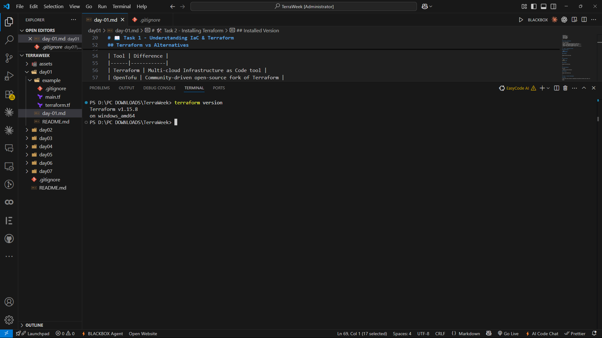

---

## Terraform Help

```bash
terraform -help
```

This command displays all available Terraform commands and their descriptions.

### Output

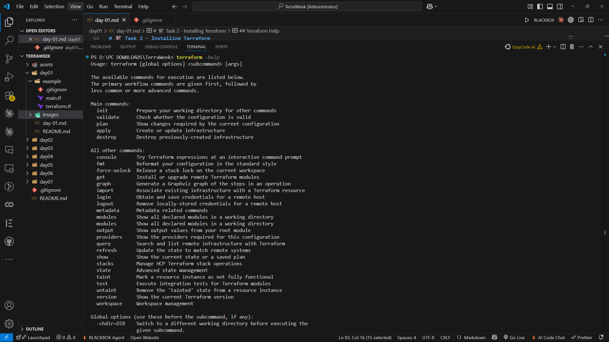

---

## VS Code Extension

To improve the development experience, I installed the official **HashiCorp Terraform Extension** in VS Code.

Features include:

- Syntax Highlighting
- Auto Completion
- Formatting
- Validation
- IntelliSense

### Screenshot

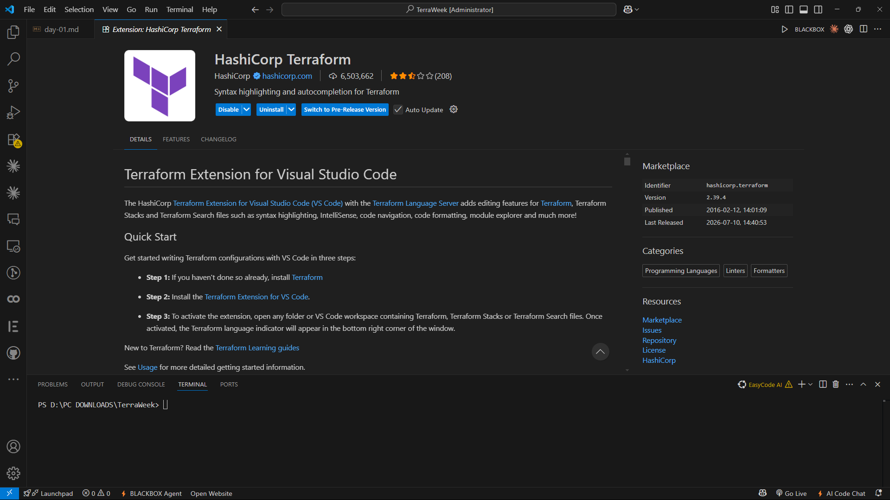

---

# 📘 Important Terraform Terminologies

## 1️⃣ Provider

A Provider is a plugin that enables Terraform to communicate with a specific platform or service.

Examples include:

- AWS
- Azure
- Docker
- GitHub
- Kubernetes

Example:

```hcl
provider "aws" {
  region = "ap-south-1"
}
```

---

## 2️⃣ Resource

A Resource represents an actual piece of infrastructure managed by Terraform.

Examples include:

- EC2 Instance
- S3 Bucket
- Local File
- Docker Container

Example:

```hcl
resource "local_file" "example" {
  filename = "hello.txt"
  content  = "Hello Terraform"
}
```

---

## 3️⃣ State

Terraform stores information about the infrastructure it manages inside a **terraform.tfstate** file.

This allows Terraform to compare:

- Current Infrastructure
- Desired Infrastructure

and calculate only the required changes.

---

## 4️⃣ Plan

Before making any changes, Terraform generates an execution plan.

This helps verify:

- Resources to create
- Resources to update
- Resources to delete

Command:

```bash
terraform plan
```

---

## 5️⃣ HCL

HCL stands for **HashiCorp Configuration Language**.

It is a human-readable language specifically designed for writing Terraform configuration files.

Example:

```hcl
resource "random_pet" "name" {
  length = 2
}
```

---

## 6️⃣ Module

Modules are reusable Terraform configurations.

Instead of writing the same code repeatedly, modules allow infrastructure to be packaged and reused.

Example:

```hcl
module "network" {
  source = "./modules/network"
}
```

---

# 🚀 My First Terraform Project

The starter project uses the **local** and **random** providers, meaning no cloud account or credentials are required.

---

# 🔄 Terraform Workflow

Terraform follows a simple workflow:

```
Write Configuration (.tf)

        ↓

terraform init

        ↓

terraform fmt

        ↓

terraform validate

        ↓

terraform plan

        ↓

terraform apply

        ↓

terraform destroy
```

---

# 🧪 Running Terraform

## Step 1 — Initialize Terraform

```bash
terraform init
```

Terraform downloads all required providers and initializes the working directory.

### Screenshot

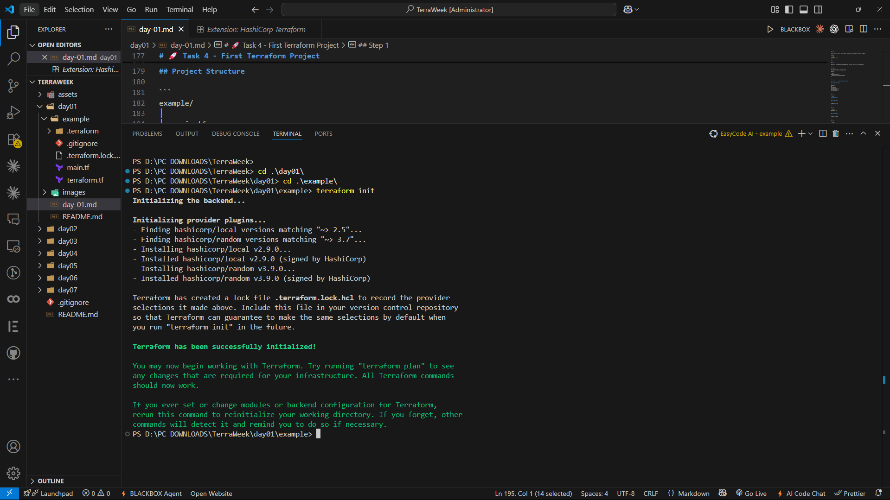

---

## Step 2 — Format Code

```bash
terraform fmt
```

Automatically formats Terraform files according to official standards.

---

## Step 3 — Validate Configuration

```bash
terraform validate
```

Checks configuration for syntax and logical errors.

### Screenshot

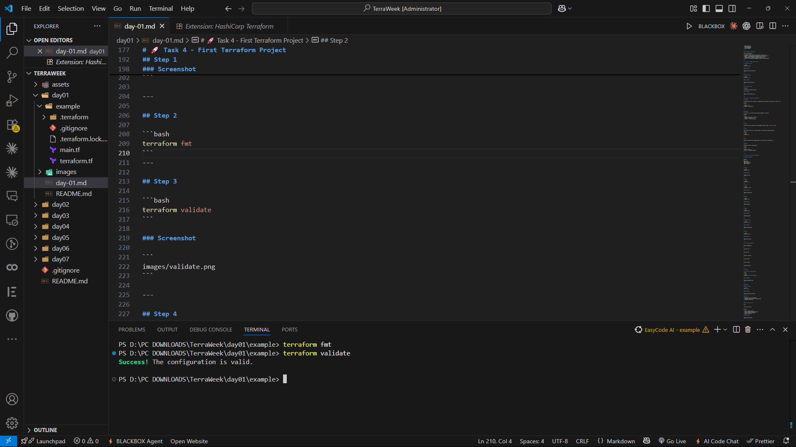

---

## Step 4 — Preview Infrastructure

```bash
terraform plan
```

Displays the resources Terraform intends to create before making any changes.

### Screenshot

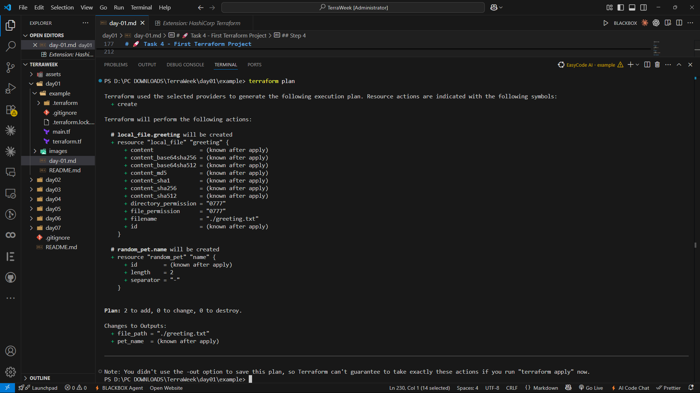

---

## Step 5 — Apply Configuration

```bash
terraform apply
```

Terraform creates the resources after confirmation.

### Screenshot

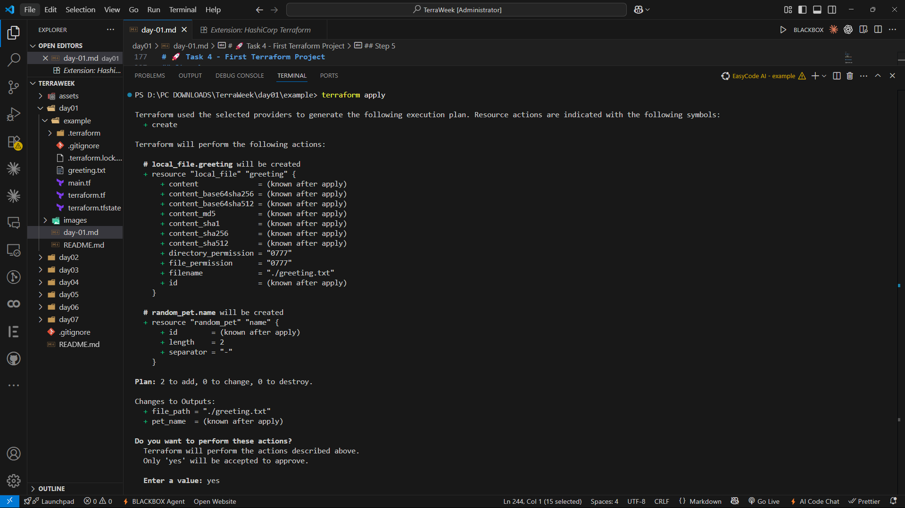

---

## Generated Output

```bash
cat greeting.txt
```

Terraform generated a local text file successfully.

### Screenshot

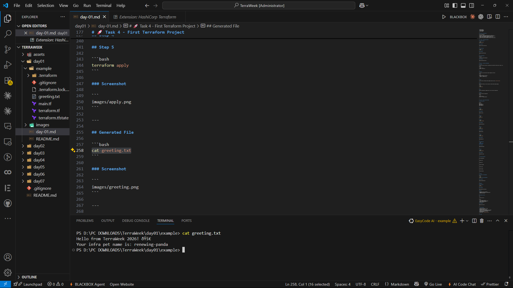

---

## Step 6 — Destroy Infrastructure

```bash
terraform destroy
```

Deletes every resource managed by Terraform.

### Screenshot

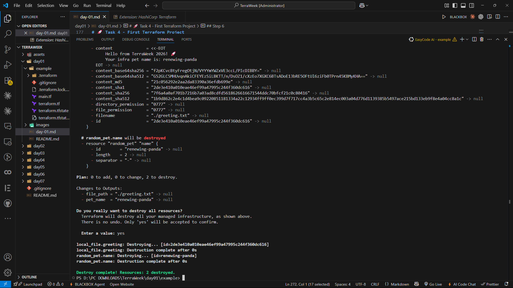

---

# 🍫 Bonus Exploration

## Enable Terraform CLI Autocomplete

Terraform supports command auto-completion, making CLI usage much faster.

Command:

```bash
terraform -install-autocomplete
```

### Screenshot

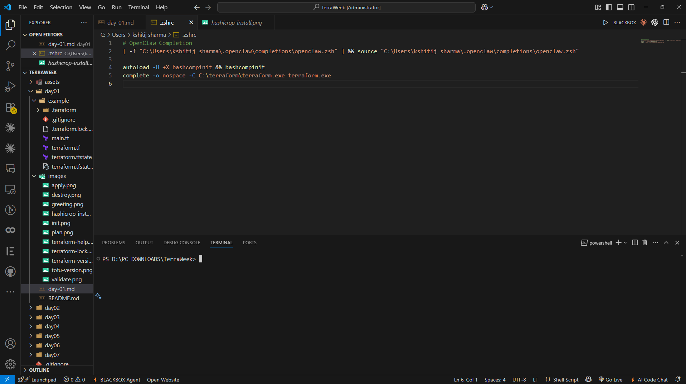

---

# 🌿 Exploring OpenTofu

OpenTofu is an open-source fork of Terraform that was created after HashiCorp changed Terraform's licensing.

It aims to remain fully community-driven while maintaining compatibility with existing Terraform configurations.

Check installation:

```bash
tofu version
```

### Screenshot

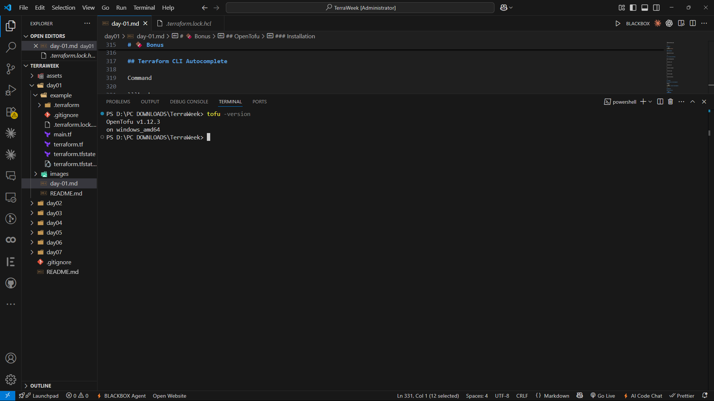

### Key Differences

- Fully open source
- Community governed
- Compatible with most Terraform configurations
- Uses the same HCL language

---

# 🔒 Understanding `.terraform.lock.hcl`

After initializing Terraform, a new file named:

```
.terraform.lock.hcl
```

was automatically generated.

This file stores:

- Exact provider versions
- Provider checksums
- Dependency information

The lock file ensures that every developer working on the project uses the exact same provider versions, making deployments consistent and reproducible.

### Screenshot

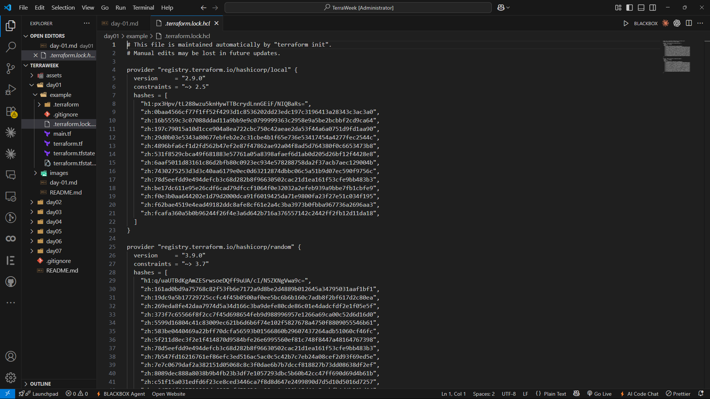

---

# 🎯 What I Learned

After completing Day 1, I learned:

- What Infrastructure as Code is and why it matters.
- Why Terraform has become the industry standard for IaC.
- How Terraform interacts with providers.
- The purpose of Resources, State, Modules, Plans, and HCL.
- The complete Terraform workflow from initialization to destruction.
- How Terraform manages infrastructure locally without requiring cloud credentials.
- The purpose of `.terraform.lock.hcl`.
- The basics of OpenTofu.

---

# 📂 Repository Structure

```
TerraWeek/
│
├── Day-01/
│   ├── README.md
│   ├── example/
│   └── images/
│
├── Day-02/
├── Day-03/
└── ...
```

---

# 🚀 Conclusion

Day 1 laid the foundation for my Terraform journey. Instead of manually creating infrastructure, I learned how to define it as code, making deployments repeatable, version-controlled, and automated. I also explored Terraform's workflow, important concepts, and completed my first successful `terraform apply` and `terraform destroy`.

Looking forward to building real cloud infrastructure in the upcoming days of the TerraWeek Challenge!

---

# 🏷️ Tags

`#Terraform` `#InfrastructureAsCode` `#DevOps` `#HashiCorp` `#OpenTofu` `#GitHub` `#CloudComputing` `#TrainWithShubham` `#TerraWeekChallenge`