# 🌱 TerraWeek Challenge – Day 2
## HCL Deep Dive: Variables, Types & Expressions

📅 **Date:** 13 July 2026

Welcome to **Day 2** of my **TerraWeek Challenge!** 🚀

After completing Day 1, where I learned the fundamentals of **Infrastructure as Code (IaC)** and deployed my very first infrastructure using Terraform, today's challenge focused on understanding the language behind Terraform itself—**HashiCorp Configuration Language (HCL)**.

On Day 1, I learned how Terraform works.

On Day 2, I explored **how Terraform configurations are actually written**.

Instead of using fixed values inside Terraform files, I learned how to create reusable and dynamic configurations using **Variables**, **Expressions**, **Locals**, **Outputs**, and several **built-in Terraform Functions**.

To put these concepts into practice, I deployed an **Nginx Docker container** using the Docker Provider, where almost every configurable value was controlled through variables instead of being hardcoded.

By the end of today's challenge, I gained a much deeper understanding of how professional Terraform configurations are structured and why HCL plays such an important role in Infrastructure as Code.

---

# 📚 Learning Objectives

By the end of Day 2, I was able to:

- Understand HashiCorp Configuration Language (HCL)
- Learn the structure of Terraform configuration files
- Differentiate between Blocks and Arguments
- Work with HCL Expressions
- Create reusable configurations using Variables
- Explore all major Terraform Variable Types
- Apply Variable Validation
- Protect confidential information using Sensitive Variables
- Use Locals for reusable values
- Generate useful Outputs
- Explore commonly used Terraform Functions
- Understand Variable Precedence
- Deploy an Nginx Docker container using Terraform
- Explore advanced HCL concepts such as For Expressions and Conditional Expressions

---

# 📂 Project Structure

Before starting the implementation, I organized my Terraform project into multiple files. Instead of writing everything inside a single file, each file was given a specific responsibility, making the project much cleaner and easier to maintain.

```text
.
├── terraform.tf
├── main.tf
├── variables.tf
├── outputs.tf
├── terraform.tfvars
├── README.md
└── images/
```

Each file serves a different purpose:

| File | Purpose |
|------|---------|
| `terraform.tf` | Configures the Terraform and Docker provider |
| `main.tf` | Defines Docker resources |
| `variables.tf` | Declares input variables |
| `terraform.tfvars` | Stores variable values |
| `outputs.tf` | Displays useful information after deployment |
| `README.md` | Project documentation |

Organizing Terraform projects in this way improves readability and makes the codebase easier to manage as projects grow.

### 📸 Screenshot


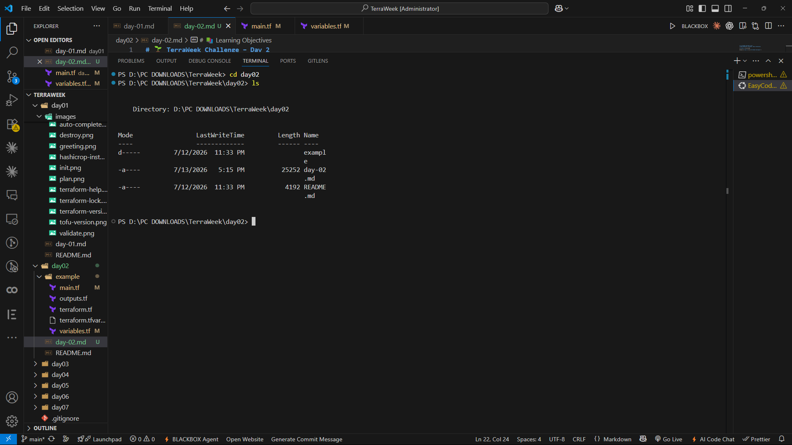


---

# ⚙️ Prerequisites

Before working on today's challenge, I made sure that the following tools were installed and configured correctly.

- Terraform
- Docker Desktop
- Git
- Visual Studio Code
- HashiCorp Terraform Extension

Since today's project uses the **Docker Provider**, Docker Desktop must be running before executing any Terraform commands.

---

# 🛠 Verifying Terraform Installation

The first step was to verify whether Terraform was installed correctly.

Command:

```bash
terraform version
```

This command displays the currently installed version of Terraform along with additional build information.

Verifying the installation beforehand helps avoid unnecessary troubleshooting later in the workflow.

### 📸 Screenshot


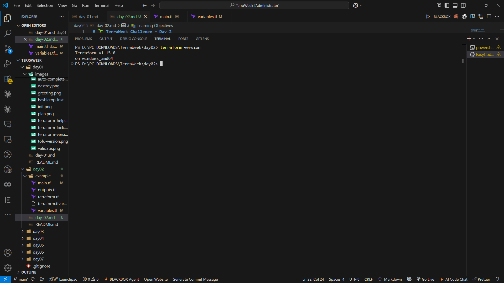


---

# 🐳 Verifying Docker Installation

Since the project deploys an Nginx container locally, Docker must also be installed and running.

I verified Docker by executing the following command:

```bash
docker version
```

Alternatively, the following command can also be used:

```bash
docker ps
```

If Docker is running correctly, it displays the client and server information (or the list of running containers).

Ensuring Docker is running before initializing Terraform prevents provider connection errors during deployment.

### 📸 Screenshot


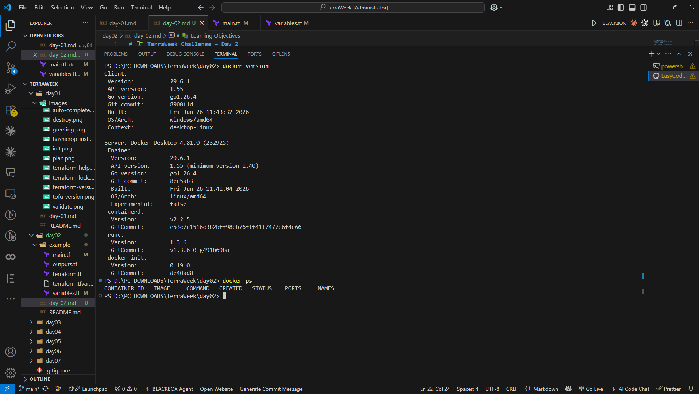


---

# 📖 What is HCL?

HCL stands for **HashiCorp Configuration Language**.

It is a declarative language developed by HashiCorp specifically for writing Infrastructure as Code.

Unlike traditional programming languages where developers describe every individual step, HCL focuses on defining the **desired state** of the infrastructure.

Terraform reads the configuration, compares it with the current state, and automatically determines what changes are required to reach the desired state.

Because of this declarative approach, HCL configurations remain simple, readable, and easy to maintain.

---

# 🌍 Why Do We Need HCL?

Imagine deploying the same infrastructure for multiple environments such as:

- Development
- Testing
- Staging
- Production

If every configuration contained hardcoded values, we would have to edit the Terraform files before every deployment.

This approach quickly becomes difficult to manage.

HCL solves this problem by allowing configurations to become:

- Reusable
- Readable
- Consistent
- Scalable
- Easy to Maintain
- Version Controlled

Instead of changing the infrastructure code repeatedly, we simply provide different variable values and Terraform takes care of the rest.

This is one of the primary reasons why Terraform is widely adopted across the industry.

---

# 🏗 Understanding the Anatomy of an HCL Block

Every Terraform configuration is built using **Blocks**.

A block represents a specific component of the configuration, such as a provider, resource, variable, output, or module.

The basic syntax of an HCL block looks like this:

```hcl
block_type "label_one" "label_two" {

  argument = value

}
```

Each part of the block has its own purpose.

| Component | Description |
|-----------|-------------|
| Block Type | Specifies the kind of block |
| Label One | Resource or Provider Type |
| Label Two | Local Name |
| Arguments | Configuration values |

Example:

```hcl
resource "docker_container" "web" {

  name = var.container_name

}
```

Here:

- `resource` is the block type.
- `docker_container` specifies the type of resource.
- `web` is the local name.
- `name` is an argument that receives its value from a variable.

Understanding this structure is essential because almost every Terraform configuration follows this pattern.

---

# 📦 Understanding Blocks

Terraform provides different block types, each designed for a specific purpose.

Some commonly used blocks include:

- `terraform`
- `provider`
- `resource`
- `variable`
- `locals`
- `output`
- `module`

For example, the Provider block tells Terraform which platform it should communicate with.

```hcl
provider "docker" {

}
```

Similarly, a Resource block describes the infrastructure Terraform should create.

```hcl
resource "docker_image" "nginx" {

  name = "nginx:latest"

}
```

A Variable block defines user input that can be reused throughout the project.

```hcl
variable "container_name" {

  type = string

}
```

Although these blocks perform different tasks, they all follow the same HCL syntax.

---

# 📝 Arguments vs Blocks

One concept that initially confused me was the difference between **Arguments** and **Blocks**.

After experimenting with Terraform configurations, the distinction became much clearer.

## Arguments

Arguments assign values to configuration settings.

Example:

```hcl
name = "nginx"
```

More examples:

```hcl
image    = "nginx:latest"
internal = 80
external = 8080
```

Arguments always follow the format:

```text
key = value
```

---

## Blocks

Blocks, on the other hand, group related configuration together.

Example:

```hcl
ports {

  internal = 80
  external = 8080

}
```

Here, `ports` is a nested block that contains multiple arguments.

This structure keeps Terraform configurations organized and improves readability.

---

## Arguments vs Blocks

| Arguments | Blocks |
|-----------|--------|
| Assign values | Group related configuration |
| Written as `key = value` | Written using `{ }` |
| Cannot contain nested configuration | Can contain arguments and nested blocks |

Understanding this difference makes it much easier to read and write Terraform configurations.

---

# 🔗 Understanding HCL Expressions

Expressions allow Terraform configurations to become dynamic.

Instead of hardcoding values, Terraform can calculate values during execution.

Expressions can reference:

- Variables
- Resources
- Outputs
- Functions
- Operators

Example:

```hcl
var.environment
```

This expression retrieves the value stored inside the `environment` variable.

Expressions can also reference resource attributes.

```hcl
docker_container.web.name
```

Terraform automatically reads the name attribute of the Docker container.

Another useful feature is **String Interpolation**.

Example:

```hcl
"${var.environment}-container"
```

If the value of `environment` is:

```
dev
```

Terraform automatically produces:

```
dev-container
```

Expressions are one of the most powerful features of HCL because they allow infrastructure to adapt based on input values instead of relying on hardcoded configurations.

---

# 🔤 Understanding Terraform Variables

After learning the basics of HCL, the next step was understanding one of the most powerful features of Terraform—**Variables**.

When I first started writing Terraform configurations, I noticed that many values such as the container name, ports, environment, and image name were hardcoded inside the resource block.

Although this approach works for small projects, it quickly becomes difficult to manage when the same infrastructure needs to be deployed multiple times.

For example, suppose I want to deploy the same Docker container for different environments.

Development might use:

```
dev-nginx
```

Staging could use:

```
staging-nginx
```

Production might use:

```
prod-nginx
```

If every value is hardcoded, I would need to edit my Terraform configuration before every deployment.

Terraform Variables solve this problem.

Instead of changing the code, I only change the input values, and Terraform automatically provisions the required infrastructure.

This makes Terraform configurations:

- Reusable
- Flexible
- Easier to Maintain
- Environment Independent

---

# 📦 Creating Variables

Variables are declared using the **variable block**.

A simple variable looks like this:

```hcl
variable "container_name" {

  description = "Name of Docker Container"

  type = string

}
```

Each variable usually contains:

- Name
- Description
- Type
- Default Value (Optional)
- Validation (Optional)

Once declared, variables can be used anywhere inside the project.

Example:

```hcl
resource "docker_container" "web" {

  name = var.container_name

}
```

Here, Terraform replaces the variable with the value provided during execution.

---

# 📘 Understanding Variable Types

Terraform supports multiple variable types depending on the kind of data we want to store.

For this assignment, I explored all the major variable types available in Terraform.

---

# 🔹 String

A **String** stores textual values.

Example:

```hcl
variable "container_name" {

  type = string

}
```

Possible values:

```
nginx

terraweek-web

docker-container
```

String variables are commonly used for:

- Names
- Regions
- Tags
- Environment Names

---

# 🔹 Number

Number variables store numeric values.

Example:

```hcl
variable "external_port" {

  type = number

}
```

Possible values:

```
80

443

8080

3000
```

Terraform automatically understands these values as numbers instead of text.

---

# 🔹 Boolean

Boolean variables contain only two values.

```text
true

false
```

Example:

```hcl
variable "enable_logging" {

  type = bool

}
```

These are commonly used to enable or disable optional features.

---

# 📚 Collection Types

Collection Types store multiple values together.

Terraform provides several collection types.

---

## List

A List stores ordered values.

Example:

```hcl
variable "ports" {

  type = list(number)

}
```

Example value:

```hcl
[
80,
443,
8080
]
```

Lists preserve the order of values.

---

## Map

Maps store values as **Key → Value** pairs.

Example:

```hcl
variable "extra_labels" {

  type = map(string)

}
```

Value:

```hcl
{

project = "terraweek"

owner = "aditya"

environment = "dev"

}
```

Maps are commonly used for metadata and labels.

---

## Set

A Set is similar to a List but removes duplicate values automatically.

Example:

```hcl
variable "allowed_ports" {

  type = set(number)

}
```

Example:

```hcl
[
80,
80,
443,
8080
]
```

Terraform internally converts this into:

```text
80
443
8080
```

This helps avoid duplicate entries.

---

# 🧱 Structural Types

Terraform also supports more advanced data structures.

---

## Object

Objects group multiple related values together.

Example:

```hcl
variable "container_config" {

  type = object({

    name = string

    port = number

  })

}
```

Example Value:

```hcl
{

name = "nginx"

port = 8080

}
```

Objects make configurations cleaner by grouping related properties.

---

## Tuple

A Tuple stores multiple values with predefined data types.

Example:

```hcl
variable "sample_tuple" {

  type = tuple([

    string,

    number,

    bool

  ])

}
```

Example Value:

```text
[
"nginx",
8080,
true
]
```

Unlike Lists, each position inside a Tuple has its own type.

---

# ✅ Variable Validation

Terraform allows us to validate user input before infrastructure is created.

This helps prevent accidental configuration mistakes.

For this assignment, I restricted the environment variable so that only three values are accepted.

```hcl
variable "environment" {

  type = string

  default = "dev"

  validation {

    condition = contains(

      ["dev","staging","prod"],

      var.environment

    )

    error_message = "Environment must be dev, staging or prod."

  }

}
```

Now, if someone provides:

```bash
terraform apply -var="environment=test"
```

Terraform immediately throws an error instead of creating invalid infrastructure.

Validation makes configurations much safer and more reliable.

---

# 🔒 Sensitive Variables

Sometimes Terraform configurations contain confidential information like:

- Passwords
- API Keys
- Tokens
- Secrets

Displaying these values in logs or outputs would be a security risk.

Terraform provides the **Sensitive Variable** feature to protect confidential information.

Example:

```hcl
variable "docker_password" {

  type = string

  sensitive = true

}
```

Whenever Terraform displays outputs, sensitive values are automatically hidden.

This prevents accidental exposure of credentials.

---

# 📍 Understanding Locals

Locals are reusable values calculated inside Terraform.

Instead of writing the same expression multiple times, we define it once inside a `locals` block.

Example:

```hcl
locals {

  name_prefix = "tws-${var.environment}"

}
```

Now the same value can be reused anywhere.

```hcl
local.name_prefix
```

Using Locals improves readability and reduces duplicate code.

---

# 🛠 Terraform Built-in Functions

Terraform provides many built-in functions for working with strings, collections, and numbers.

During this challenge, I explored some of the most commonly used functions.

---

## upper()

Converts text into uppercase.

```hcl
upper("terraweek")
```

Output:

```
TERRAWEEK
```

---

## merge()

Combines multiple maps.

```hcl
merge(
{project="terraweek"},
var.extra_labels
)
```

---

## join()

Joins multiple strings using a separator.

```hcl
join("-",["terra","week","2026"])
```

Output:

```
terra-week-2026
```

---

## format()

Formats text.

```hcl
format(
"http://localhost:%d",
var.external_port
)
```

Output:

```
http://localhost:8080
```

These functions make Terraform configurations much more dynamic and reusable.

---

# 💻 Exploring Terraform Console

Terraform Console is an interactive shell used to evaluate HCL expressions and test Terraform functions without modifying configuration files.

To start the console:

```bash
terraform console
```

I tested several expressions during this challenge.

```bash
> upper("terraweek")
"TERRAWEEK"

> merge({a=1},{b=2})
{
  "a" = 1
  "b" = 2
}

> join("-",["terra","week","2026"])
"terra-week-2026"

> length(["docker","terraform","hcl"])
3
```

Using the console helped me understand how functions and expressions behave before using them in actual Terraform code.

### 📸 Screenshot


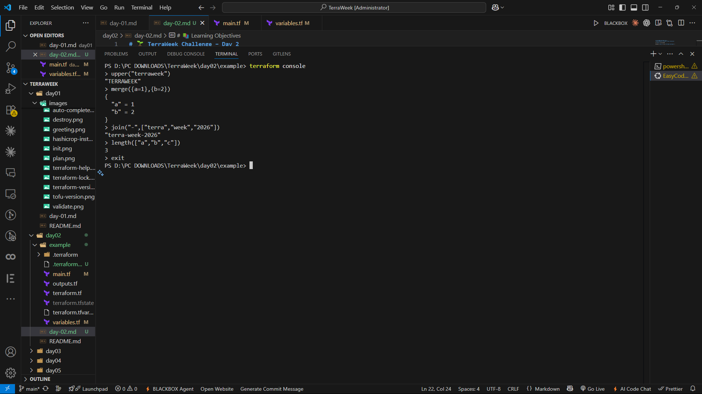


---
# 🚀 Building a Real Terraform Project

After learning HCL, Variables, Locals, Functions, and Expressions, it was finally time to implement everything in a real Terraform project.

Instead of provisioning cloud resources on AWS or Azure, today's assignment uses the **Docker Provider** to deploy an **Nginx container** locally.

The advantage of using Docker is that we can practice all Terraform concepts without creating a cloud account or worrying about cloud costs.

Although the provider changes, the Terraform workflow remains exactly the same.

Whether Terraform creates an EC2 instance on AWS or an Nginx container using Docker, the configuration syntax and workflow remain identical.

Today's implementation helped me understand how Terraform combines HCL with providers to automate infrastructure deployment.

---

# 🔄 Terraform Workflow

Before executing any command, it's important to understand Terraform's workflow.

Terraform follows a simple sequence:

```text
Write Configuration

        ↓

terraform init

        ↓

terraform fmt

        ↓

terraform validate

        ↓

terraform plan

        ↓

terraform apply

        ↓

terraform output

        ↓

terraform destroy
```

Following this workflow ensures that the infrastructure is created safely and consistently.

---

# 🚀 Step 1 — Initialize Terraform

The very first command executed in every Terraform project is:

```bash
terraform init
```

This command initializes the current working directory.

During initialization Terraform:

- Downloads required providers
- Creates the `.terraform` directory
- Creates the provider lock file
- Prepares the project for execution

If initialization is successful, Terraform displays a success message.

Running `terraform init` is mandatory before executing any other Terraform command.

### 📸 Screenshot


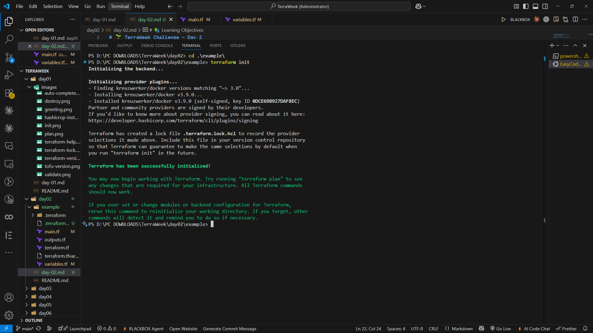


---

# ✅ Step 2 — Validate Configuration

Once Terraform is initialized, the next step is validating the configuration.

Command:

```bash
terraform validate
```

Validation checks the configuration for:

- Syntax errors
- Invalid references
- Missing blocks
- Configuration mistakes

If everything is correct, Terraform displays:

```text
Success! The configuration is valid.
```

Running validation before deployment helps detect mistakes early.

### 📸 Screenshot


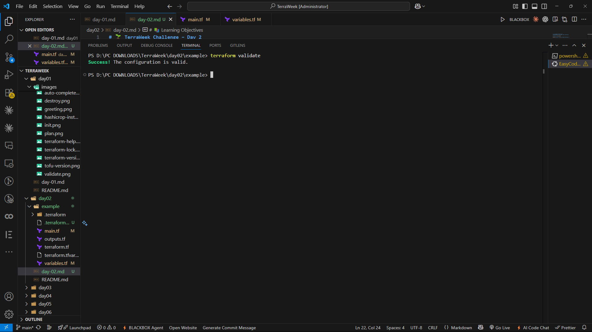


---

# 📋 Step 3 — Preview Infrastructure

Before creating infrastructure, Terraform allows us to preview every planned change.

Command:

```bash
terraform plan
```

The execution plan displayed the following actions:

- Download the Nginx Docker image.
- Create a Docker container.
- Configure the required port mapping.
- Generate output values.

At the end of the execution plan, Terraform summarized the changes.

Example:

```text
Plan: 2 to add, 0 to change, 0 to destroy.
```

Reviewing the execution plan before deployment is considered one of Terraform's best practices because it allows us to verify the changes before they are applied.

### 📸 Screenshot


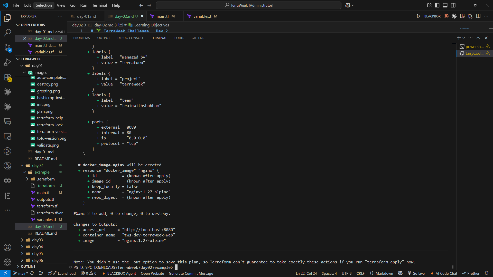


---

# 🚀 Step 4 — Apply Configuration

After verifying the execution plan, the infrastructure was deployed using:

```bash
terraform apply
```

Terraform displayed a confirmation prompt.

```text
Do you want to perform these actions?
```

After typing:

```text
yes
```

Terraform performed the following tasks:

- Pulled the latest Nginx image.
- Created the Docker container.
- Exposed port **8080**.
- Generated output values.

After a few seconds, Terraform displayed:

```text
Apply complete!
```

At this point, the infrastructure had been successfully created.

### 📸 Screenshot


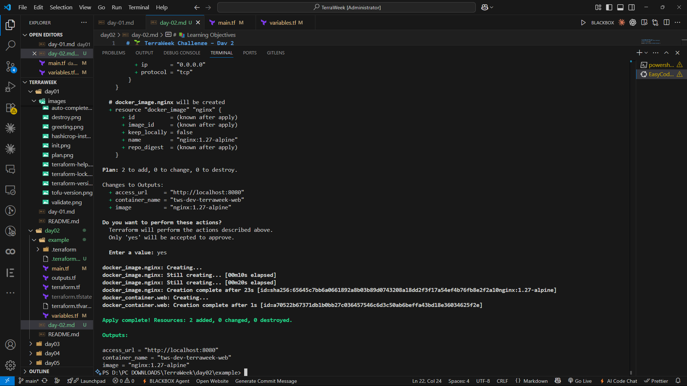


---

# 🐳 Verifying the Running Container

After deployment, I verified that the Docker container was actually running.

Command:

```bash
docker ps
```

This command lists all currently running Docker containers.

The output confirmed that:

- The Nginx image was downloaded.
- The container was running successfully.
- Port **8080** was mapped correctly.

Verifying the container is a good practice before testing the application in a browser.

### 📸 Screenshot


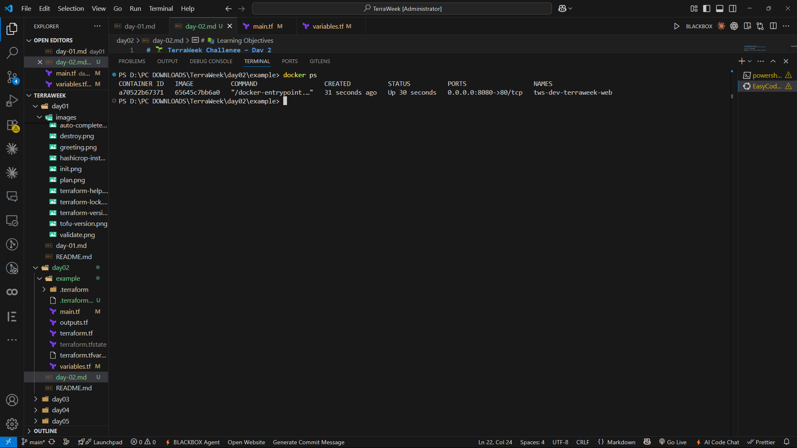


---

# 🌐 Accessing the Nginx Application

Once the container was running, I opened the following URL in my browser:

```text
http://localhost:8080
```

The default **Welcome to nginx!** page appeared successfully.

This confirmed that Terraform had successfully deployed and configured the Docker container.

It was satisfying to see the infrastructure working exactly as expected.

### 📸 Screenshot


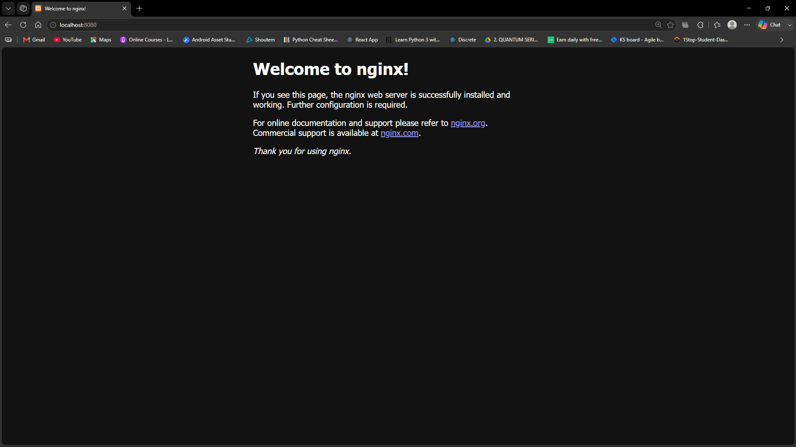


---

# 📤 Viewing Terraform Outputs

Terraform Outputs display useful information after infrastructure has been created.

Instead of manually checking the container configuration, Terraform automatically displayed the required values.

Command:

```bash
terraform output
```

Example Output:

```text
container_name = "tws-web"

access_url = "http://localhost:8080"

image = "nginx:latest"
```

Outputs are extremely useful because they can also be consumed by other Terraform modules or CI/CD pipelines.

### 📸 Screenshot


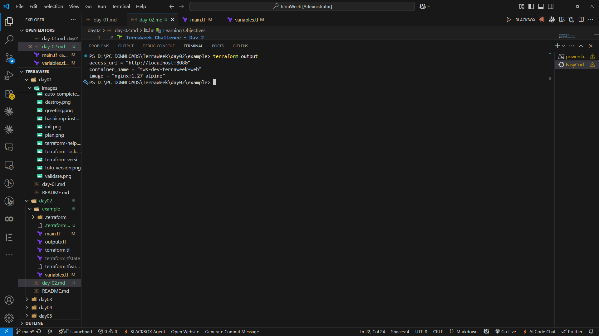


---

# 📊 Understanding Variable Precedence

Terraform variables can receive values from multiple sources.

If the same variable exists in more than one location, Terraform follows a fixed precedence order.

The highest priority source always wins.

```text
-var

      ↓

-var-file

      ↓

*.auto.tfvars

      ↓

terraform.tfvars

      ↓

TF_VAR_ Environment Variables

      ↓

Default Values
```

Understanding variable precedence is important because it allows the same Terraform configuration to be reused across multiple environments without modifying the code.

---

# 🍫 Bonus Exploration

After completing the required tasks, I explored a few advanced HCL features.

These features make Terraform configurations cleaner and more powerful.

---

## Bonus 1 — For Expressions

Terraform provides **For Expressions** to transform collections.

Example:

```hcl
locals {

  upper_labels = [

    for label in ["docker","terraform","nginx"] :

    upper(label)

  ]

}
```

Instead of transforming each value manually, Terraform automatically iterates through every element.

This feature becomes extremely useful while working with Lists and Maps.

### 📸 Screenshot


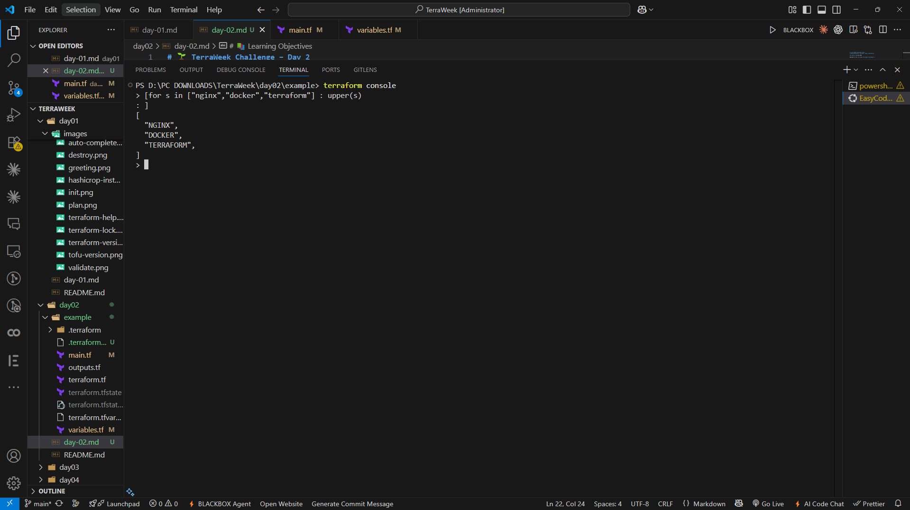


---

## Bonus 2 — Conditional Expressions

Conditional Expressions work similarly to an **if-else** statement.

Example:

```hcl
var.environment == "prod"

?

"large"

:

"small"
```

If the environment is Production, Terraform returns:

```text
large
```

Otherwise:

```text
small
```

Conditional expressions help create reusable configurations for different deployment environments.

### 📸 Screenshot


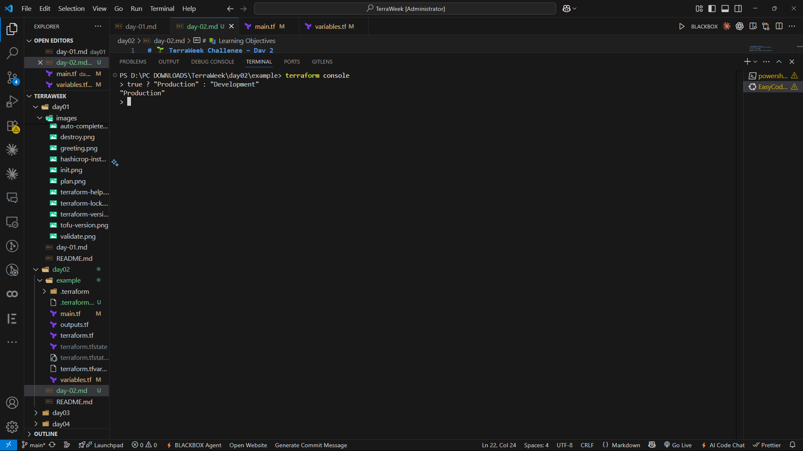


---

## Bonus 3 — Optional Object Attributes

Terraform also supports optional attributes inside Object types.

Example:

```hcl
variable "container_config" {

  type = object({

    name = string

    port = optional(number,8080)

  })

}
```

If the port value is not supplied, Terraform automatically assigns the default value of **8080**.

This feature helps create flexible object definitions without forcing users to specify every attribute.

---

# 🧹 Destroying Infrastructure

Once the testing was completed, I removed all the resources created by Terraform.

Command:

```bash
terraform destroy
```

Terraform again displayed a confirmation prompt.

After typing:

```text
yes
```

Terraform removed:

- Docker Container
- Docker Image (if configured)
- Terraform-managed resources

Finally, Terraform displayed:

```text
Destroy complete!
```

Destroying unused infrastructure is a good practice because it keeps the environment clean and avoids unnecessary resource usage.

### 📸 Screenshot


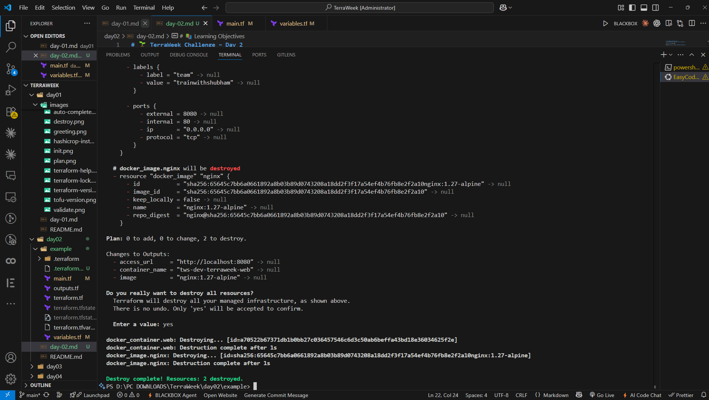


---

# 🎯 What I Learned

Day 2 helped me understand the actual language behind Terraform.

Some of the key takeaways from today's challenge are:

- Learned how Terraform configurations are written using HCL.
- Understood the purpose of Blocks, Arguments, and Expressions.
- Explored all major Terraform Variable Types.
- Applied Validation Rules to improve configuration reliability.
- Protected confidential values using Sensitive Variables.
- Used Locals to avoid duplicate code.
- Worked with Terraform Outputs.
- Explored useful built-in Functions.
- Used Terraform Console to experiment with expressions.
- Understood Variable Precedence.
- Successfully deployed an Nginx Docker container using Terraform.
- Explored advanced HCL concepts like For Expressions, Conditional Expressions, and Optional Object Attributes.

Overall, today's challenge gave me a much stronger understanding of writing reusable and production-ready Terraform configurations.

---

# 🚀 Conclusion

Day 2 marked an important milestone in my Terraform learning journey.

While Day 1 introduced the fundamentals of Infrastructure as Code, today's challenge focused on writing clean, reusable, and maintainable Terraform configurations using HCL.

From understanding variables and expressions to deploying a real Docker container and exploring advanced HCL features, every concept contributed to building a stronger foundation in Terraform.

I'm excited to continue the TerraWeek Challenge and dive deeper into modules, state management, and cloud infrastructure in the upcoming days.

---

# 🏷️ Tags

`#Terraform` `#HashiCorp` `#InfrastructureAsCode` `#Docker` `#DevOps` `#HCL` `#IaC` `#TrainWithShubham` `#TerraWeekChallenge`