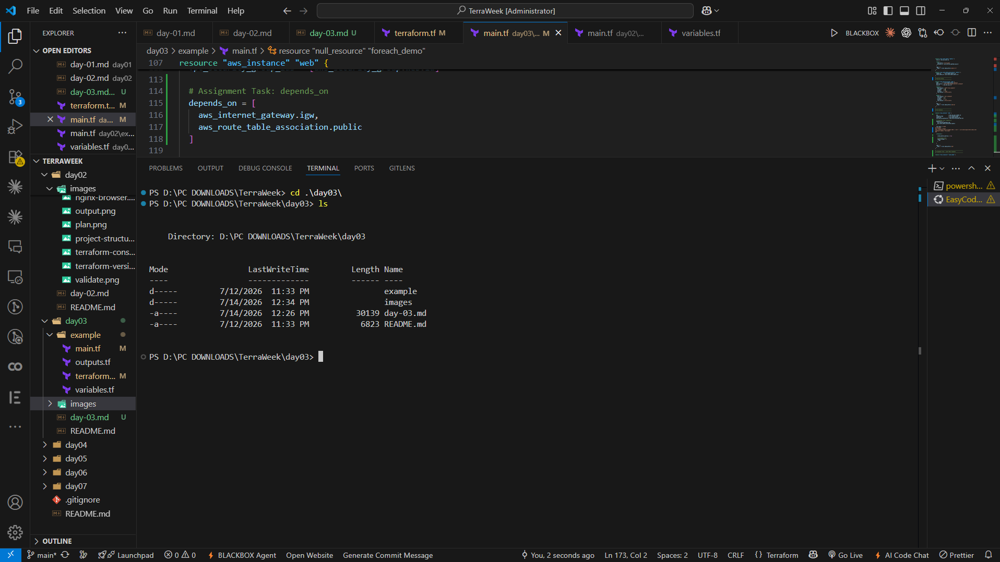
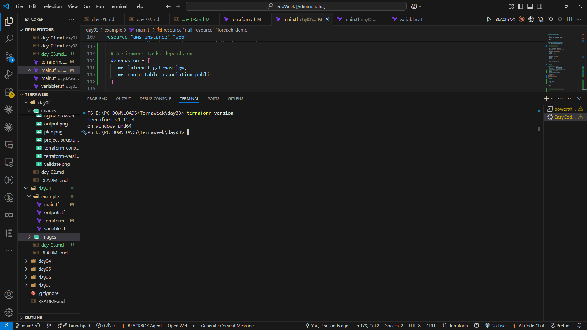
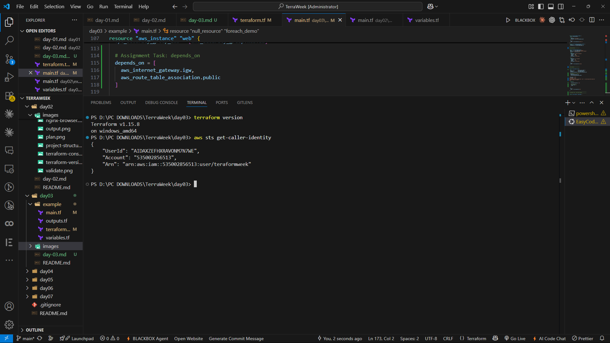
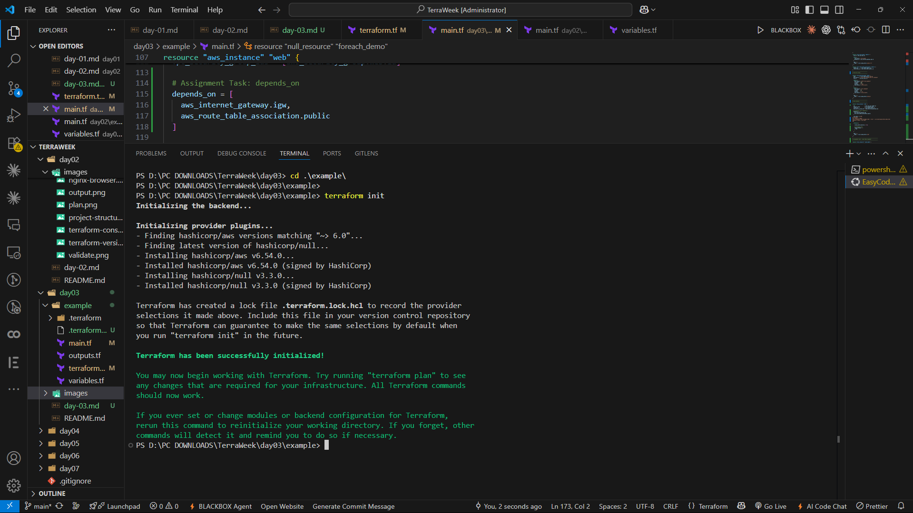
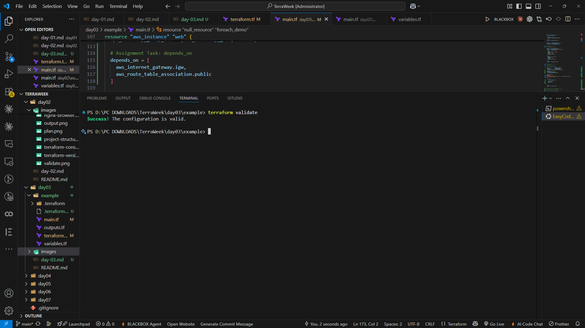
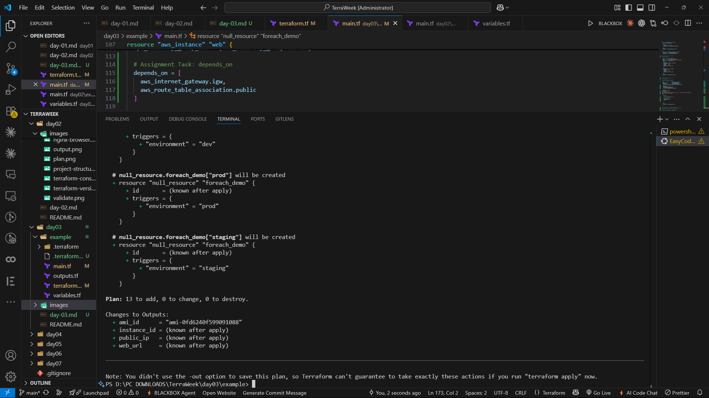
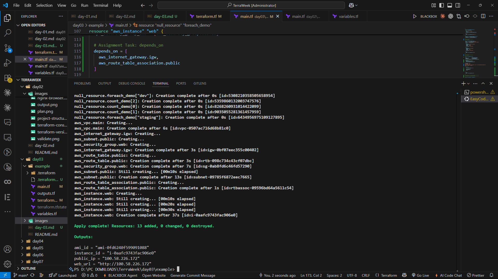
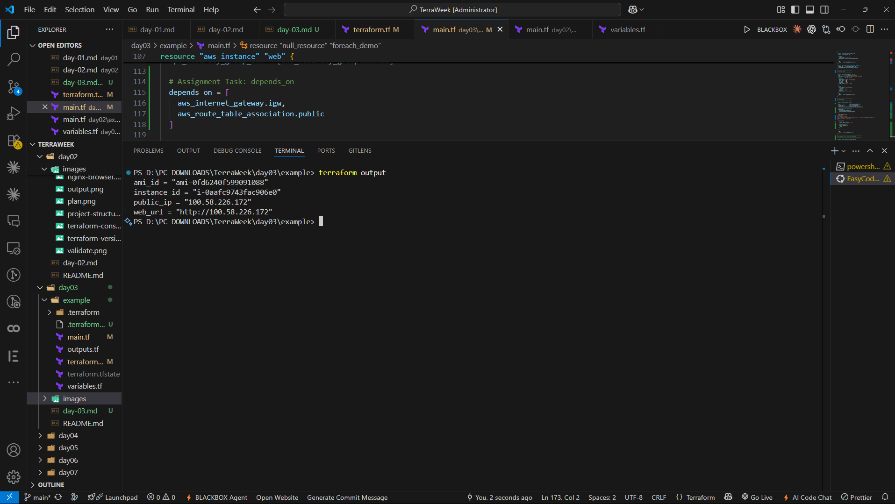
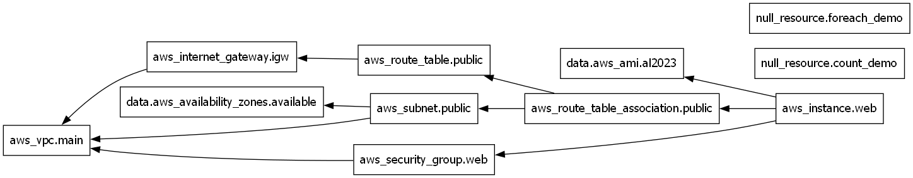
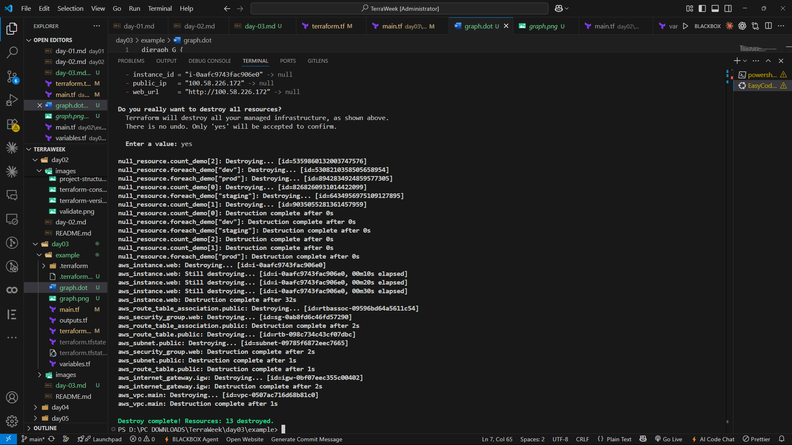

# 🌱 TerraWeek Challenge – Day 3
# Providers, Resources & My First Cloud Infrastructure

📅 **Date:** 14 July 2026

Welcome to **Day 3** of my **TerraWeek Challenge!** 🚀

After spending the first two days understanding the fundamentals of **Infrastructure as Code (IaC)**, Terraform, HCL, Variables, and Expressions, today was my first step into provisioning **real cloud infrastructure**.

Until now, I had been working locally using providers like Docker. While those exercises helped me understand Terraform syntax and workflows, today's challenge introduced me to something much closer to real-world DevOps practices.

For the first time, I learned how Terraform communicates with cloud providers, how infrastructure is created inside AWS, and how different cloud resources work together to build a complete network.

The focus of today's challenge was understanding **Providers**, **Resources**, **Data Sources**, and Terraform's powerful **Meta-Arguments** such as `count`, `for_each`, `depends_on`, and `lifecycle`.

Along the way, I also learned the basics of AWS networking by provisioning a small infrastructure consisting of a **VPC**, **Subnet**, **Internet Gateway**, **Route Table**, **Security Group**, and an **EC2 Instance**.

By the end of today's session, Terraform no longer felt like just another Infrastructure as Code tool—it started feeling like a complete infrastructure automation platform.

---

# 📚 Learning Objectives

By the end of Day 3, I was able to:

- Understand Terraform Providers
- Learn why Provider Version Pinning is important
- Configure the AWS Provider
- Understand Resources and Data Sources
- Learn the difference between creating and reading infrastructure
- Understand the AWS networking fundamentals
- Provision cloud resources using Terraform
- Explore Terraform Meta-Arguments
- Learn how Terraform manages resource dependencies
- Understand Terraform Lifecycle Rules
- Safely provision, update, and destroy infrastructure

---

# 📂 Project Structure

To keep the project organized, I separated the Terraform configuration into multiple files.

```text
.
├── terraform.tf
├── main.tf
├── variables.tf
├── outputs.tf
├── README.md
└── images/
```

Each file has its own responsibility.

| File | Purpose |
|------|---------|
| `terraform.tf` | Terraform settings and AWS Provider configuration |
| `main.tf` | Infrastructure resources |
| `variables.tf` | Input variables |
| `outputs.tf` | Output values |
| `README.md` | Documentation |
| `images/` | Screenshots used in the README |

Keeping the project modular improves readability and makes future maintenance much easier.

### 📸 Screenshot





---

# ⚙️ Prerequisites

Before provisioning any AWS resource, I ensured the following tools were installed and configured correctly.

- Terraform
- AWS CLI
- Git
- Visual Studio Code
- HashiCorp Terraform Extension

Unlike Day 2, today's challenge required communicating with AWS.

Instead of storing credentials inside Terraform files, AWS CLI securely stores them in the local credentials file.

This is considered one of the best security practices while working with Terraform.

---

# 🛠 Verifying Terraform Installation

The first step was verifying that Terraform was installed correctly.

Command:

```bash
terraform version
```

This command displays the currently installed Terraform version.

Verifying the installation helps ensure that the correct version is available before initializing the project.

### 📸 Screenshot





---

# ☁️ Configuring AWS CLI

Since Terraform needs permission to communicate with AWS, the AWS CLI must be configured before creating any infrastructure.

I configured AWS credentials using:

```bash
aws configure
```

The AWS CLI prompted me for:

- AWS Access Key ID
- AWS Secret Access Key
- Default Region
- Output Format

Terraform automatically uses these credentials from the local AWS credentials file.

To verify everything was working correctly, I executed:

```bash
aws sts get-caller-identity
```

This command confirms that Terraform will be able to authenticate with AWS successfully.

### 📸 Screenshot





---

# 🌍 What is a Terraform Provider?

A **Provider** is a plugin that allows Terraform to communicate with a specific platform or service.

Without a provider, Terraform has no way of creating or managing infrastructure.

Different providers support different platforms.

Some of the most commonly used providers are:

- AWS
- Azure
- Google Cloud
- Docker
- Kubernetes
- GitHub
- Cloudflare

Whenever Terraform executes an `apply`, it communicates with the provider, which in turn interacts with the cloud platform using its APIs.

This makes providers the bridge between Terraform and the infrastructure we want to manage.

---

# ⭐ Why Providers Matter

Imagine writing a Terraform configuration that creates an EC2 instance.

Terraform itself does not know how AWS works.

Instead, it delegates the task to the **AWS Provider**, which understands AWS APIs and knows how to create, update, or delete AWS resources.

Similarly:

- Docker Provider manages Docker resources.
- AzureRM Provider manages Azure resources.
- Google Provider manages Google Cloud resources.

Changing the provider often allows the same Terraform workflow to be used across different cloud platforms.

This is one of the biggest reasons why Terraform is called a **multi-cloud Infrastructure as Code tool**.

---

# 📌 Provider Version Pinning

One of the first things I learned today was the importance of **Version Pinning**.

Terraform providers receive updates regularly.

Sometimes those updates introduce:

- New features
- Bug fixes
- Performance improvements
- Breaking changes

If we always download the latest version automatically, an existing project may suddenly stop working after an update.

To avoid this, Terraform allows us to **pin provider versions**.

Example:

```hcl
terraform {

  required_providers {

    aws = {

      source  = "hashicorp/aws"

      version = "~> 6.0"

    }

  }

}
```

The `~>` operator is called the **Pessimistic Constraint Operator**.

It allows Terraform to install compatible updates while preventing unexpected major version upgrades.

Version pinning makes projects stable, reproducible, and easier to maintain across teams.

---

# 🌎 Provider Alias

Terraform also supports configuring multiple instances of the same provider.

This is done using **Aliases**.

Example:

```hcl
provider "aws" {

  region = "ap-south-1"

}

provider "aws" {

  alias  = "mumbai"

  region = "ap-south-1"

}
```

Provider aliases are useful when:

- Deploying resources across multiple AWS Regions
- Managing multiple AWS Accounts
- Creating Disaster Recovery environments
- Working with Multi-Region architectures

Although my project used a single provider configuration, understanding aliases gave me insight into how Terraform scales for enterprise deployments.

---

# 📦 Resources vs Data Sources

One of the most important concepts I learned today was the difference between **Resources** and **Data Sources**.

At first, both looked very similar because both use Terraform blocks.

However, their purpose is completely different.

---

## Resources

Resources create or manage infrastructure.

Whenever Terraform creates something new, it is defined using a Resource block.

Example:

```hcl
resource "aws_instance" "web" {

  instance_type = "t2.micro"

}
```

Resources are responsible for:

- Creating infrastructure
- Updating infrastructure
- Destroying infrastructure

Terraform keeps track of Resources inside the state file.

---

## Data Sources

Data Sources never create infrastructure.

Instead, they read information that already exists.

Example:

```hcl
data "aws_ami" "amazon_linux" {

  most_recent = true

  owners = ["amazon"]

}
```

Instead of creating an AMI, Terraform simply retrieves information about the latest Amazon Linux image.

Data Sources are useful for reading:

- Existing AMIs
- Availability Zones
- Existing VPCs
- Existing Security Groups
- Existing IAM Roles

---

## Resources vs Data Sources

| Resources | Data Sources |
|------------|--------------|
| Create infrastructure | Read existing infrastructure |
| Managed by Terraform | Not managed by Terraform |
| Stored in Terraform State | Only fetch information |
| Can be updated or destroyed | Read-only |

Understanding this distinction is essential because most production Terraform projects use a combination of both.

---

# 🏗 Understanding AWS Networking

Before creating infrastructure, today's assignment introduced a simple overview of AWS networking.

Initially, terms like **VPC**, **Subnet**, and **Internet Gateway** sounded confusing.

However, thinking of them as parts of a neighborhood made them much easier to understand.

- **VPC** → Your own private neighborhood.
- **Subnet** → A street inside that neighborhood.
- **Internet Gateway** → The main gate connecting your neighborhood to the internet.
- **Route Table** → Road signs that tell traffic where to go.
- **Security Group** → A security guard deciding who can enter.
- **EC2 Instance** → The actual house where your application lives.

Together, these resources form the foundation of a basic AWS network.

Understanding how these components connect before writing Terraform code made the implementation much easier.

---
# ⚙️ Configuring the AWS Provider

After understanding what Providers are and why they are important, the next step was configuring the **AWS Provider** inside Terraform.

A provider tells Terraform which platform it should communicate with and how that communication should happen.

Since today's challenge focused on AWS, I configured the **HashiCorp AWS Provider** with version pinning.

Example:

```hcl
terraform {

  required_version = ">= 1.5.0"

  required_providers {

    aws = {

      source  = "hashicorp/aws"

      version = "~> 6.0"

    }

  }

}

provider "aws" {

  region = var.aws_region

}
```

Instead of hardcoding the region directly, I used a variable to make the configuration reusable across multiple environments.

This allows the same Terraform project to work with different AWS Regions by simply changing the input variable.

---

# 🌎 Understanding Resources

Resources are the heart of every Terraform project.

Whenever Terraform creates something in the cloud, it is defined using a **Resource Block**.

Examples of AWS Resources include:

- VPC
- Subnet
- Internet Gateway
- Route Table
- Security Group
- EC2 Instance
- S3 Bucket

Each Resource block describes the desired state of the infrastructure.

Example:

```hcl
resource "aws_vpc" "main" {

  cidr_block = "10.0.0.0/16"

}
```

Here, Terraform creates a new VPC inside AWS.

Once created, Terraform tracks this resource inside the **terraform.tfstate** file.

This state file helps Terraform understand what has already been created and what changes are required during future deployments.

---

# 📖 Understanding Data Sources

Unlike Resources, **Data Sources** do not create anything.

Instead, they fetch information that already exists.

For today's assignment, I used a Data Source to retrieve the latest Amazon Linux 2023 AMI.

Example:

```hcl
data "aws_ami" "amazon_linux" {

  most_recent = true

  owners = ["amazon"]

}
```

This block searches AWS and returns the latest available Amazon Linux image.

Using a Data Source is much better than hardcoding an AMI ID because AMI IDs change over time.

Whenever a newer Amazon Linux image becomes available, Terraform automatically retrieves the latest one.

This makes the infrastructure more reliable and future-proof.

---

# 🎯 Why Use Data Sources?

Suppose I manually write an AMI ID.

```text
ami-0abc123456789
```

After a few months, AWS may release a newer image.

If I continue using the old AMI, my EC2 instance won't use the latest updates.

Instead, using:

```hcl
data "aws_ami"
```

Terraform always selects the latest matching image automatically.

This eliminates manual maintenance.

---

# ⚡ Meta-Arguments in Terraform

Today's challenge also introduced **Meta-Arguments**.

Meta-Arguments are special arguments that modify how Terraform creates resources.

Unlike normal arguments, Meta-Arguments work across many resource types.

The four Meta-Arguments explored today were:

- count
- for_each
- depends_on
- lifecycle

Let's understand each one.

---

# 1️⃣ count

The `count` Meta-Argument creates multiple identical resources.

Example:

```hcl
resource "aws_instance" "web" {

  count = 2

  instance_type = "t2.micro"

}
```

Instead of creating one EC2 instance, Terraform creates **two identical instances**.

This is useful when all resources are exactly the same.

However, if one resource is deleted later, Terraform may need to renumber the remaining resources.

Because of this limitation, `count` is best suited for identical infrastructure.

---

# 2️⃣ for_each

Unlike `count`, `for_each` creates resources using unique keys.

Example:

```hcl
resource "aws_security_group" "sg" {

  for_each = {

    web = 80

    ssh = 22

  }

}
```

Each resource gets its own identity.

Benefits:

- Better readability
- Easier updates
- Stable resource names
- No index shifting

Because of these advantages, `for_each` is generally preferred over `count` whenever resources have unique names.

---

# 3️⃣ depends_on

Terraform automatically detects dependencies.

However, sometimes explicit dependencies are required.

Example:

```hcl
resource "aws_instance" "web" {

  depends_on = [

    aws_internet_gateway.main

  ]

}
```

This tells Terraform that the Internet Gateway must be created before the EC2 instance.

Using `depends_on` avoids race conditions during deployment.

---

# 4️⃣ lifecycle

Lifecycle rules control how Terraform manages resources.

Example:

```hcl
lifecycle {

  create_before_destroy = true

  prevent_destroy = false

}
```

Some commonly used lifecycle rules include:

- create_before_destroy
- prevent_destroy
- ignore_changes

Lifecycle rules provide greater control over infrastructure updates.

For production environments, these settings can help prevent downtime and accidental deletion of critical resources.

---

# 🔄 Terraform Resource Dependencies

One of the most interesting things I learned today is that Terraform automatically builds a dependency graph.

For example:

```
VPC

↓

Subnet

↓

Internet Gateway

↓

Route Table

↓

Security Group

↓

EC2 Instance
```

Terraform understands these relationships automatically by reading references inside the configuration.

As a result, resources are created in the correct order without requiring manual intervention.

Only when Terraform cannot determine the dependency do we use `depends_on`.

---

# 📋 Understanding Terraform State

Every time Terraform creates infrastructure, it records the details inside a **State File**.

```
terraform.tfstate
```

The State File stores information such as:

- Resource IDs
- Current Configuration
- Metadata
- Resource Relationships

Terraform compares this file with the configuration to determine what needs to be created, updated, or destroyed.

Without the State File, Terraform would have no way of tracking existing infrastructure.

---

# 📄 Listing Managed Resources

Terraform also provides a command to display every resource currently managed by the State File.

Command:

```bash
terraform state list
```

This command lists all resources Terraform is managing.

For today's project, the output included resources such as:

- AWS VPC
- Public Subnet
- Internet Gateway
- Route Table
- Security Group
- EC2 Instance

This command is extremely useful for debugging and understanding the current infrastructure.

---

# 💡 Best Practices Learned Today

While working on today's assignment, I also learned a few important best practices.

✔ Always pin provider versions.

✔ Never hardcode AWS credentials inside Terraform files.

✔ Use Data Sources instead of hardcoding AMI IDs.

✔ Prefer `for_each` over `count` whenever resources have unique identities.

✔ Use Lifecycle rules carefully to avoid accidental resource deletion.

✔ Let Terraform manage dependencies automatically whenever possible.

---

# 🚀 Provisioning My First Cloud Infrastructure

After understanding Providers, Resources, Data Sources, and Meta-Arguments, it was finally time to deploy my first real cloud infrastructure using Terraform.

Unlike the previous days where I worked with local resources, today's challenge focused on provisioning infrastructure inside AWS. This helped me understand how Terraform interacts with cloud providers and automates the creation of networking and compute resources.

The infrastructure created during this challenge included:

- Virtual Private Cloud (VPC)
- Public Subnet
- Internet Gateway
- Route Table
- Route Table Association
- Security Group
- EC2 Instance

Each resource had its own responsibility, but Terraform managed all of them together as a single Infrastructure as Code project.

---

# 🔄 Terraform Workflow

Before creating any infrastructure, I followed Terraform's standard workflow.

```
Write Configuration

        ↓

terraform init

        ↓

terraform validate

        ↓

terraform plan

        ↓

terraform apply

        ↓

terraform output

        ↓

terraform state list

        ↓

terraform destroy
```

This workflow helps verify the configuration before deployment and ensures infrastructure changes remain predictable.

---

# 🚀 Step 1 — Initialize Terraform

The first command executed in every Terraform project is:

```bash
terraform init
```

This command initializes the working directory and downloads all required provider plugins.

During initialization Terraform also creates:

- `.terraform/`
- `.terraform.lock.hcl`

Once the initialization completes successfully, Terraform confirms that the project is ready for execution.

### 📸 Screenshot





---

# ✅ Step 2 — Validate the Configuration

Before provisioning infrastructure, I validated the Terraform configuration.

```bash
terraform validate
```

Terraform checked the configuration for:

- Syntax errors
- Missing references
- Invalid arguments
- Unsupported attributes

If everything is correct, Terraform displays:

```text
Success! The configuration is valid.
```

Running validation before deployment is a good habit because it catches mistakes early.

### 📸 Screenshot





---

# 📋 Step 3 — Review the Execution Plan

Next, I generated an execution plan.

```bash
terraform plan
```

Terraform compared the desired configuration with the current infrastructure and displayed every action it planned to perform.

The plan included:

- Creating a VPC
- Creating a Public Subnet
- Attaching an Internet Gateway
- Creating a Route Table
- Creating a Security Group
- Launching an EC2 Instance

At the end of the execution plan Terraform displayed a summary similar to:

```text
Plan: 6 to add, 0 to change, 0 to destroy.
```

The planning phase provides an opportunity to review infrastructure changes before they are applied.

### 📸 Screenshot





---

# 🚀 Step 4 — Apply the Configuration

After reviewing the execution plan, I deployed the infrastructure.

```bash
terraform apply
```

Terraform asked for confirmation before creating the resources.

```
Do you want to perform these actions?
```

After entering:

```
yes
```

Terraform began provisioning the AWS infrastructure.

The deployment included:

- Creating the VPC
- Creating the Public Subnet
- Creating the Internet Gateway
- Configuring the Route Table
- Creating the Security Group
- Launching the EC2 Instance

After a few moments, Terraform displayed:

```
Apply complete!
```

Watching an entire cloud environment being created from a few Terraform files was one of the biggest highlights of today's challenge.

### 📸 Screenshot





---

# ☁️ Verifying Resources in AWS

Once Terraform finished creating the infrastructure, I logged into the AWS Management Console to verify that every resource had been created successfully.

I confirmed the following resources were available:

- VPC
- Public Subnet
- Internet Gateway
- Route Table
- Security Group
- EC2 Instance

Verifying the deployment in AWS helped me connect the Terraform configuration with the actual cloud resources.

---

# 📤 Viewing Terraform Outputs

Terraform Outputs display useful information after the infrastructure has been created.

Instead of manually searching for resource IDs or IP addresses, Terraform automatically displays them.

Command:

```bash
terraform output
```

Example Output:

```text
instance_id = "i-xxxxxxxx"

public_ip = "xx.xx.xx.xx"

vpc_id = "vpc-xxxxxxxx"
```

Outputs make Terraform configurations much easier to consume and can also be used by other modules or CI/CD pipelines.

### 📸 Screenshot





---

# 📦 Understanding Terraform State

One of the most important concepts I learned today was the **Terraform State File**.

Whenever Terraform creates infrastructure, it stores information inside:

```
terraform.tfstate
```

The state file contains:

- Resource IDs
- Current infrastructure
- Metadata
- Dependency information

Terraform uses this file to compare the existing infrastructure with the desired configuration and determine what changes are required.

Without the state file, Terraform would not know which resources it already manages.

---

# 📄 Listing Managed Resources

Terraform also provides a command to display every resource currently tracked inside the state file.

```bash
terraform state list
```

The output included resources such as:

- aws_vpc.main
- aws_subnet.public
- aws_internet_gateway.main
- aws_route_table.public
- aws_security_group.web
- aws_instance.web

This command is extremely useful for debugging and understanding the current infrastructure managed by Terraform.

---

# 🍫 Bonus Exploration

After completing the core tasks, I explored some additional Terraform features that are commonly used in real-world Infrastructure as Code projects.

Although these features are considered bonus tasks for today's challenge, they helped me understand how Terraform can automate deployments even further and simplify infrastructure management.

---

# ⭐ Bonus 1 — Automating Server Setup using User Data

One of the bonus tasks suggested either attaching an Elastic IP or using **User Data** to automatically install Nginx during the EC2 instance launch.

For this project, I chose the **User Data** approach because it demonstrates Infrastructure as Code more effectively.

Instead of manually connecting to the EC2 instance and installing software, Terraform executes a shell script automatically when the instance boots for the first time.

Example:

```hcl
user_data = <<-EOF
#!/bin/bash
yum update -y
yum install -y nginx
systemctl enable nginx
systemctl start nginx
EOF
```

This script performs the following actions automatically:

- Updates the package repository.
- Installs the Nginx web server.
- Enables the Nginx service.
- Starts the web server immediately after launch.

Using **User Data** eliminates manual configuration and ensures every EC2 instance is configured consistently.

This is one of the key advantages of Infrastructure as Code.

---

# ⭐ Bonus 2 — Visualizing Resource Dependencies

Terraform automatically understands the relationships between resources.

To visualize these dependencies, Terraform provides the following command:

```bash
terraform graph > graph.dot
```

This generates a **DOT** file containing the dependency graph.

Using **Graphviz**, the DOT file can be converted into an image.

```bash
dot -Tpng graph.dot -o graph.png
```

The generated graph clearly illustrates how Terraform determines the order in which resources should be created.

For example:

```
VPC
   │
   ▼
Subnet
   │
   ▼
Internet Gateway
   │
   ▼
Route Table
   │
   ▼
Security Group
   │
   ▼
EC2 Instance
```

Understanding this dependency graph helped me appreciate how Terraform automatically manages resource creation without requiring manual sequencing.

### 📸 Screenshot




---

# ⭐ Bonus 3 — Understanding the `moved` Block

Terraform also provides the **moved block**, which allows developers to rename resources without destroying and recreating them.

Example:

```hcl
moved {

  from = aws_instance.web

  to   = aws_instance.server

}
```

Normally, renaming a resource would cause Terraform to destroy the existing resource and create a new one.

The `moved` block updates Terraform's state instead, preserving the existing infrastructure while reflecting the new resource name in the configuration.

Although I didn't need to rename any resources in this project, learning about the `moved` block gave me a better understanding of how Terraform safely handles refactoring.

---

# 🧹 Destroying Infrastructure

Once I verified that everything was working correctly, I removed all the resources created during this challenge.

Command:

```bash
terraform destroy
```

Terraform displayed a confirmation prompt.

```text
Do you really want to destroy all resources?
```

After entering:

```text
yes
```

Terraform destroyed every managed resource in the correct dependency order.

This included:

- VPC
- Public Subnet
- Internet Gateway
- Route Table
- Security Group
- EC2 Instance

Finally, Terraform displayed:

```text
Destroy complete!
```

Destroying unused cloud resources is an important best practice because it helps avoid unnecessary AWS charges and keeps the environment clean.

### 📸 Screenshot





---

# 🎯 What I Learned

Day 3 was my first experience provisioning real cloud infrastructure using Terraform, and it significantly expanded my understanding of Infrastructure as Code.

Some of the key takeaways from today's challenge are:

- Learned how Terraform communicates with AWS using Providers.
- Understood the importance of Provider Version Pinning.
- Explored the difference between Resources and Data Sources.
- Learned the basics of AWS Networking, including VPCs, Subnets, Internet Gateways, Route Tables, Security Groups, and EC2.
- Used Data Sources to retrieve existing AWS information dynamically.
- Explored Terraform Meta-Arguments such as `count`, `for_each`, `depends_on`, and `lifecycle`.
- Learned how Terraform automatically manages resource dependencies.
- Understood the role of the Terraform State File.
- Explored bonus concepts such as User Data, Terraform Graph, and the Moved Block.

The biggest lesson from today was that Infrastructure as Code isn't just about provisioning cloud resources—it's about creating infrastructure that is automated, reusable, version-controlled, and easy to maintain.

---

# 📂 Repository Structure

```text
TerraWeek/
│
├── Day-01/
│   ├── README.md
│   ├── example/
│   └── images/
│
├── Day-02/
│   ├── README.md
│   ├── example/
│   └── images/
│
├── Day-03/
│   ├── terraform.tf
│   ├── main.tf
│   ├── variables.tf
│   ├── outputs.tf
│   ├── README.md
│   └── images/
│
└── ...
```

---

# 🚀 Conclusion

Day 3 was an exciting milestone in my Terraform journey because it introduced me to real cloud infrastructure.

The previous two days helped me understand Terraform syntax and HCL, but today's challenge showed me how those concepts come together to provision an actual AWS environment.

From configuring Providers and using Data Sources to deploying an EC2 instance inside a custom VPC, every step reinforced the power of Infrastructure as Code.

I also explored advanced Terraform capabilities such as Meta-Arguments, User Data, Terraform Graph, and the Moved Block, which are commonly used in production environments.

With three days of the TerraWeek Challenge completed, I now have a much stronger understanding of how Terraform can automate cloud infrastructure in a consistent, repeatable, and scalable way.

I'm excited to continue the journey and explore even more advanced Terraform concepts in the upcoming days.

---

# 🏷️ Tags

`#Terraform` `#AWS` `#InfrastructureAsCode` `#CloudComputing` `#DevOps` `#HashiCorp` `#EC2` `#VPC` `#Automation` `#CloudEngineer` `#LearnInPublic` `#TrainWithShubham` `#TerraWeekChallenge`