# 🌱 TerraWeek Challenge – Day 4
# Terraform State & Remote Backends (Native Locking)

📅 **Date:** 15 July 2026

Welcome to **Day 4** of my **TerraWeek Challenge!** 🚀

After spending the previous three days learning Terraform fundamentals, HCL, Variables, Providers, Resources, and provisioning cloud infrastructure on AWS, today's challenge introduced one of the most important concepts in Terraform—**State Management**.

Creating infrastructure is only one part of Infrastructure as Code.

Managing that infrastructure safely over time is where Terraform State becomes essential.

Today's challenge focused on understanding:

- What Terraform State is
- Why Terraform needs a State File
- Why the State File is considered sensitive
- Local vs Remote State
- Remote Backends using Amazon S3
- Native State Locking using `use_lockfile`
- State Commands
- Importing Existing Infrastructure into Terraform

One interesting thing I learned today is that almost every professional Terraform project stores its state remotely instead of keeping it locally.

Remote State makes collaboration easier, prevents accidental conflicts, and keeps infrastructure management much safer.

By the end of today's challenge, I understood why Terraform State is often called **the brain of Terraform**.

---

# 📚 Learning Objectives

By the end of Day 4, I was able to:

- Understand what Terraform State is.
- Learn why Terraform maintains a State File.
- Understand the importance of State Management.
- Learn why Terraform State should never be committed to Git.
- Understand State Drift.
- Explore Terraform State Commands.
- Learn the difference between Local and Remote State.
- Configure an Amazon S3 Backend.
- Understand Native State Locking using `use_lockfile`.
- Bootstrap backend infrastructure.
- Migrate Local State to Remote State.
- Import existing resources into Terraform State.
- Explore advanced State Management features.

---

# 📂 Project Structure

Today's challenge was slightly different from the previous days.

Instead of working with a single Terraform project, the assignment was divided into two separate directories.

```
Day-04/
│
├── backend_demo/
│   ├── terraform.tf
│   └── resources.tf
│
├── backend_infra/
│   ├── terraform.tf
│   ├── resources.tf
│   ├── variables.tf
│   └── outputs.tf
│
├── README.md
└── images/
```

Each folder serves a completely different purpose.

## 📁 backend_infra

This directory is responsible for creating the infrastructure required to store the Terraform State.

It provisions:

- Amazon S3 Bucket
- Bucket Versioning
- Bucket Encryption
- Other backend-related resources

The important thing to remember is that this folder itself uses **Local State** because the backend must exist before Terraform can store its state remotely.

---

## 📁 backend_demo

Once the backend infrastructure is created, this directory demonstrates how Terraform uses that S3 bucket as its Remote Backend.

Instead of storing the state file locally, Terraform uploads it directly to Amazon S3.

This simulates how Terraform projects are managed in real production environments.

---

### 📸 Screenshot


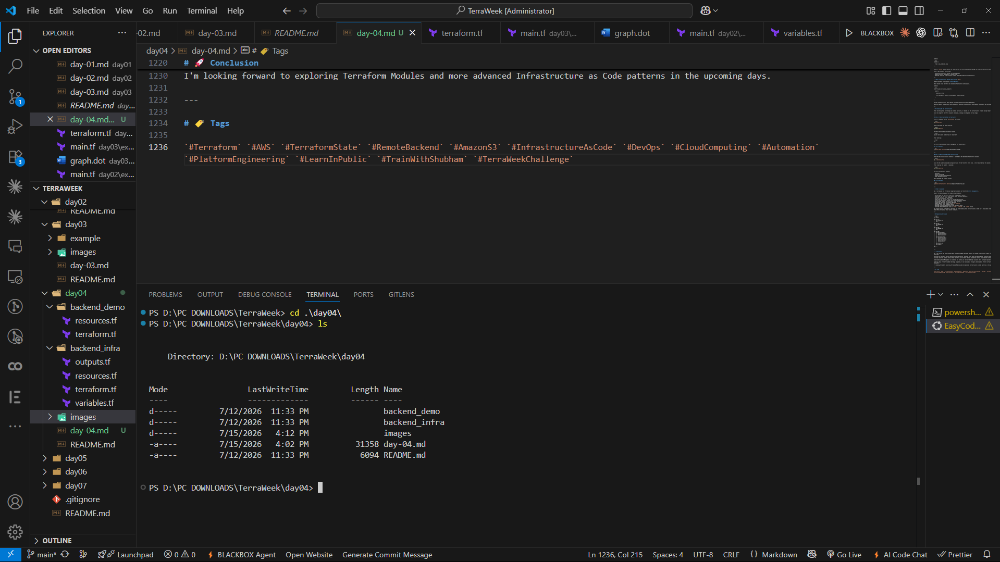


---

# ⚙️ Prerequisites

Before starting today's challenge, I ensured that the following tools were installed and configured.

- Terraform
- AWS CLI
- Git
- Visual Studio Code
- AWS Account
- Amazon S3 Permissions

Since today's project interacts with AWS, the AWS CLI must already be configured with valid credentials.

Unlike previous days, this challenge also requires permissions to create and manage Amazon S3 buckets.

---

# 🛠 Verifying Terraform Installation

Before creating any infrastructure, I verified the installed Terraform version.

Command:

```bash
terraform version
```

Terraform displayed the currently installed version along with provider compatibility information.

Verifying the version beforehand helps ensure compatibility with newer features such as **Native S3 State Locking**, which is available in recent Terraform releases.

### 📸 Screenshot


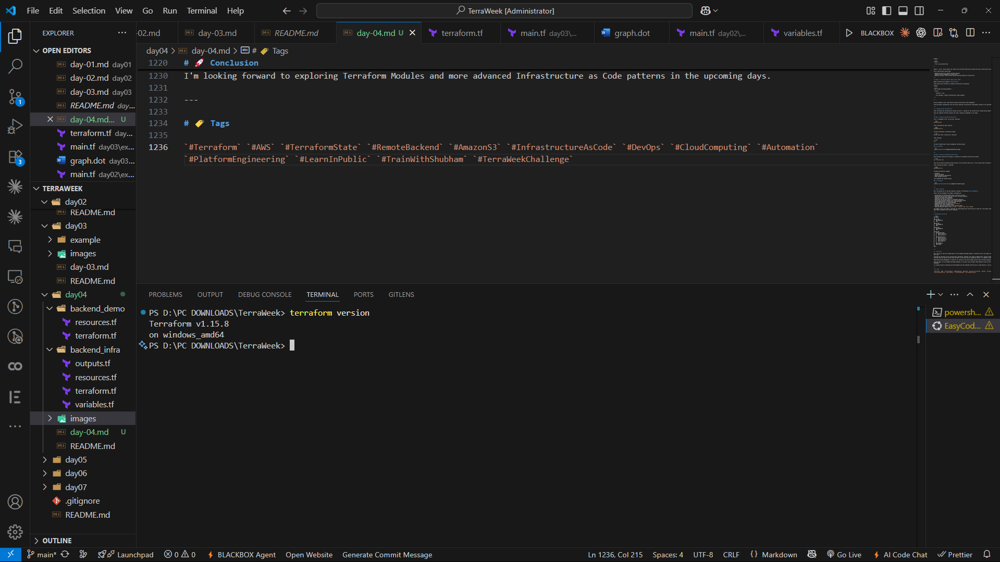


---

# ☁️ Verifying AWS CLI Configuration

Since Terraform communicates with AWS through the AWS Provider, it is important to verify that AWS credentials are configured correctly.

I confirmed my identity using:

```bash
aws sts get-caller-identity
```

This command returns:

- AWS Account ID
- User ARN
- User ID

Receiving a successful response confirms that Terraform will be able to authenticate with AWS.

It is always a good practice to verify authentication before provisioning infrastructure.

### 📸 Screenshot


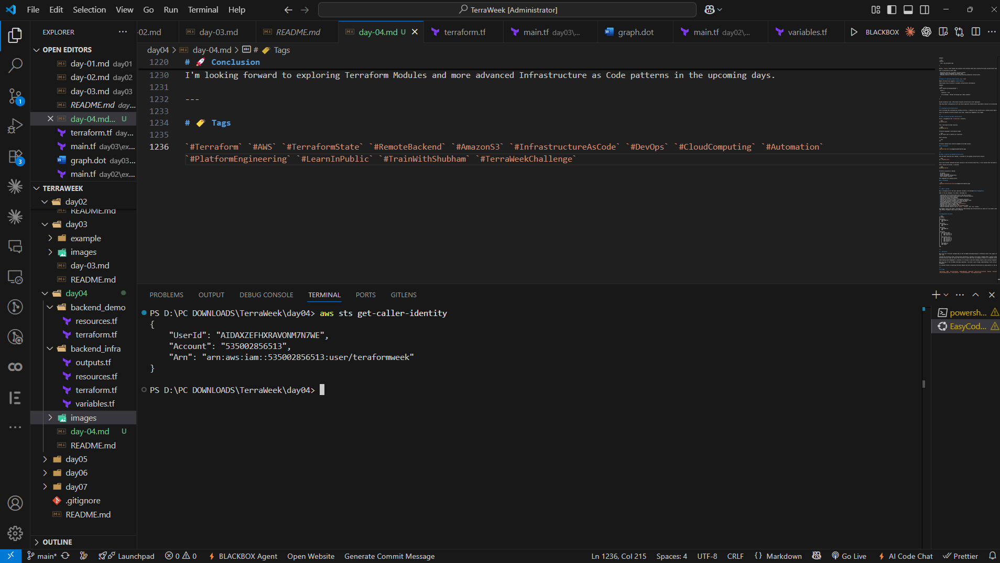


---

# 🗄️ What is Terraform State?

Terraform State is a file that stores information about every resource Terraform manages.

Whenever Terraform creates infrastructure, it records important information inside the **terraform.tfstate** file.

This includes:

- Resource IDs
- Metadata
- Dependencies
- Current Configuration
- Resource Attributes

Terraform uses this file to compare the **current state** of infrastructure with the **desired state** described in the Terraform configuration.

Without the State File, Terraform would have no way of knowing which resources already exist.

This is why the State File is considered the heart of every Terraform project.

---

# 🤔 Why Does Terraform Need State?

Imagine creating an EC2 Instance today.

Tomorrow, you modify the instance type.

How does Terraform know that the instance already exists?

The answer is simple.

Terraform checks the **State File**.

Instead of creating a brand-new EC2 instance every time, Terraform compares the desired configuration with the recorded state and determines exactly what needs to change.

Because of this comparison, Terraform can safely:

- Create resources
- Update resources
- Destroy resources
- Detect infrastructure changes

Without State, Terraform would behave as if every deployment were the first deployment.

---

# 🔐 Why is Terraform State Sensitive?

One of the most surprising things I learned today was that the Terraform State File may contain confidential information.

Depending on the infrastructure, it may store:

- Passwords
- Database Connection Strings
- API Keys
- Access Tokens
- Resource IDs
- Internal Metadata

Although Terraform marks sensitive variables in outputs, the actual values can still exist inside the State File.

Because of this, the State File should never be:

- Edited manually
- Shared publicly
- Committed to Git
- Stored in unsecured locations

Professional teams usually store Terraform State inside secure Remote Backends such as Amazon S3 with encryption enabled.

---

# 🌍 Local State vs Remote State

Terraform supports two approaches for storing the State File.

## Local State

```
terraform.tfstate
```

The State File remains on the developer's local machine.

Advantages:

- Simple
- Easy to use
- Great for learning

Disadvantages:

- Difficult for teams
- Easy to lose
- No locking
- No centralized storage

---

## Remote State

The State File is stored inside a remote storage service.

Examples include:

- Amazon S3
- HCP Terraform (Terraform Cloud)
- Azure Storage
- Google Cloud Storage

Advantages:

- Centralized storage
- Team collaboration
- Better security
- Automatic backups
- State locking

For production environments, Remote State is the recommended approach.

Today's assignment focused on using **Amazon S3** as the Remote Backend with **Native State Locking**.

---
# 🗂️ Understanding the Terraform State File

In the previous section, I learned why Terraform State is one of the most critical components of every Terraform project.

However, simply knowing what the State File is isn't enough.

To work efficiently with Terraform, it's important to understand how Terraform interacts with the State File, how we can inspect it, and how we can safely manage it over time.

Terraform provides several built-in commands that allow us to inspect, move, rename, remove, and visualize resources stored inside the State File.

These commands become extremely useful while maintaining production infrastructure.

---

# 📄 What Does the State File Contain?

Every time Terraform provisions infrastructure, it records important information inside the `terraform.tfstate` file.

The State File stores details such as:

- Resource IDs
- Current Infrastructure
- Dependencies
- Metadata
- Resource Attributes
- Provider Information

Terraform uses this information to compare the desired configuration with the existing infrastructure before making any changes.

This comparison is what makes Terraform idempotent and reliable.

---

# ⚠️ Never Edit the State File Manually

One of the biggest lessons from today's challenge was understanding that the Terraform State File should **never** be edited manually.

Although it is stored as a JSON file, manually changing its contents can corrupt the state and cause Terraform to lose track of managed resources.

Instead of editing the file directly, Terraform provides dedicated commands to safely manipulate the State.

This ensures that the infrastructure remains consistent and predictable.

---

# 🌪️ Understanding State Drift

Infrastructure doesn't always change through Terraform.

Sometimes resources are modified manually through the AWS Console or another tool.

For example:

- Someone changes an EC2 instance type manually.
- A Security Group rule is updated directly in AWS.
- An S3 bucket policy is modified outside Terraform.

These unexpected changes create a mismatch between the **actual infrastructure** and the **Terraform State**.

This situation is called **State Drift**.

Terraform detects these differences during:

```bash
terraform plan
```

or

```bash
terraform refresh
```

Detecting State Drift early helps prevent unexpected infrastructure changes during future deployments.

---

# 🛠️ Exploring Terraform State Commands

Terraform provides several commands for inspecting and managing the State File.

Instead of modifying the State manually, these commands should always be used.

Let's explore the most important ones.

---

# 📋 `terraform state list`

This command lists every resource currently managed by Terraform.

```bash
terraform state list
```

Example Output:

```text
aws_s3_bucket.tf_state

aws_s3_bucket_versioning.versioning

aws_s3_bucket_server_side_encryption_configuration.encryption
```

This command is particularly useful when working with large Terraform projects because it provides a quick overview of all managed resources.

### 📸 Screenshot


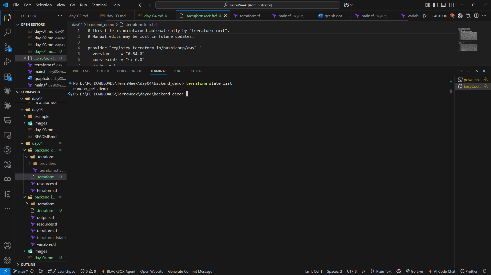


---

# 🔍 `terraform state show`

Sometimes we need detailed information about a specific resource.

Terraform provides the following command:

```bash
terraform state show aws_s3_bucket.tf_state
```

This displays detailed information such as:

- Bucket Name
- ARN
- Region
- Encryption
- Versioning
- Tags

Unlike `terraform show`, this command focuses on a single resource.

### 📸 Screenshot


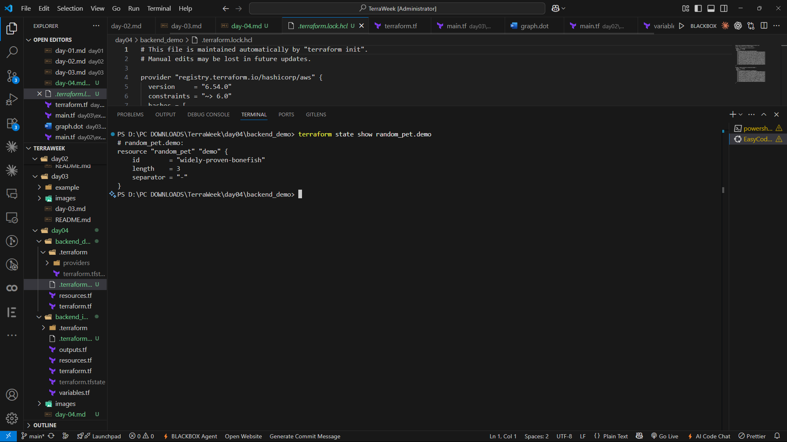


---

# 🔄 `terraform state mv`

As Terraform projects grow, resources are often renamed or reorganized.

Instead of destroying and recreating infrastructure, Terraform allows us to move resource addresses inside the State File.

Example:

```bash
terraform state mv aws_s3_bucket.old aws_s3_bucket.new
```

This command updates the Terraform State without modifying the actual AWS resource.

It is extremely useful while refactoring Terraform configurations.

---

# ❌ `terraform state rm`

Sometimes we want Terraform to stop managing a resource without deleting it.

For that purpose, Terraform provides:

```bash
terraform state rm aws_s3_bucket.tf_state
```

This command removes the resource from the State File only.

The actual AWS resource continues to exist.

This is useful when migrating infrastructure or handing resource management to another Terraform project.

---

# 📖 `terraform show`

Terraform also allows us to display the current infrastructure in a human-readable format.

Command:

```bash
terraform show
```

This command displays:

- Resources
- Attributes
- Dependencies
- Outputs

Unlike opening the JSON State File manually, `terraform show` presents the information in a much cleaner and easier-to-read format.

---

# ☁️ Understanding Remote Backends

Up until now, all Terraform State Files were stored locally.

While this works well for learning and personal projects, it creates several challenges in team environments.

Some common problems include:

- Multiple developers maintaining different State Files.
- Risk of accidentally deleting the State.
- No centralized storage.
- No State Locking.
- Difficult collaboration.

To solve these issues, Terraform supports **Remote Backends**.

A Remote Backend stores the State File in a centralized location that can be accessed safely by multiple team members.

Some commonly used Remote Backends include:

- Amazon S3
- HCP Terraform (Terraform Cloud)
- Azure Storage
- Google Cloud Storage

Today's assignment focused on using **Amazon S3** as the Remote Backend.

---

# 🪣 Why Amazon S3?

Amazon S3 is one of the most widely used Remote Backends for Terraform.

Some of its advantages include:

- Highly Durable
- Secure
- Centralized
- Versioning Support
- Encryption Support
- Easy Team Collaboration

By storing the State File in S3, every team member works with the same infrastructure state.

This significantly reduces deployment conflicts.

---

# 🔒 Native State Locking

One of the biggest updates introduced in recent Terraform versions is **Native S3 State Locking**.

Older Terraform versions required **DynamoDB** to prevent multiple users from modifying the same State File simultaneously.

Modern Terraform versions simplify this process using:

```hcl
use_lockfile = true
```

This enables native locking directly within Amazon S3, eliminating the need for DynamoDB.

Whenever Terraform performs an operation such as `apply`, it temporarily creates a `.tflock` file inside the S3 bucket.

Once the operation finishes successfully, the lock file is automatically removed.

This prevents concurrent modifications to the same State File and makes team collaboration much safer.

---

# 🏗️ Bootstrapping the Backend Infrastructure

Before Terraform can store its State remotely, the Remote Backend itself must already exist.

This creates an interesting challenge:

How can Terraform store its State inside an S3 bucket that hasn't been created yet?

The solution is called **Bootstrapping**.

The `backend_infra` project is responsible for creating:

- S3 Bucket
- Versioning
- Encryption

Since the bucket doesn't exist initially, this project temporarily uses **Local State**.

Once the S3 bucket is available, other Terraform projects can safely migrate their State into it.

---

# ⚙️ Configuring the S3 Backend

After creating the backend infrastructure, the next step is configuring the backend.

Example:

```hcl
terraform {

  backend "s3" {

    bucket = "your-terraform-state-bucket"

    key = "day04/terraform.tfstate"

    region = "us-east-1"

    encrypt = true

    use_lockfile = true

  }

}
```

This configuration instructs Terraform to:

- Store the State File in Amazon S3.
- Encrypt the State File.
- Enable Native State Locking.
- Maintain a centralized State for the project.

Once configured, Terraform automatically offers to migrate the existing Local State to the Remote Backend during initialization.

---
# 🚀 Bootstrapping the Remote Backend

After understanding Terraform State and Remote Backends, it was finally time to implement everything practically.

Unlike the previous days, today's practical was divided into **two separate Terraform projects**.

The first project creates the backend infrastructure, while the second project uses that infrastructure as its Remote Backend.

The workflow looks like this:

```text
backend_infra
      │
      ▼
Create S3 Bucket
      │
      ▼
Configure Remote Backend
      │
      ▼
Migrate Local State → Amazon S3
      │
      ▼
Verify Remote State
      │
      ▼
Explore State Commands
      │
      ▼
Import Existing Resources
```

This two-step approach is called **Bootstrapping**, and it's the standard way of creating Terraform backends in production.

---

# 🏗️ Step 1 — Create the Backend Infrastructure

The very first step was creating the infrastructure that would later store the Terraform State.

I navigated to the **backend_infra** directory.

```bash
cd backend_infra
```

This project is responsible for creating:

- Amazon S3 Bucket
- Bucket Versioning
- Server-Side Encryption

At this stage, Terraform still uses **Local State**, because the backend doesn't exist yet.

---

# 🚀 Step 2 — Initialize Backend Infrastructure

Once inside the `backend_infra` directory, I initialized Terraform.

```bash
terraform init
```

Terraform downloaded the required AWS Provider and initialized the working directory.

During initialization, Terraform created:

- `.terraform/`
- `.terraform.lock.hcl`

Once the initialization completed successfully, Terraform displayed:

```text
Terraform has been successfully initialized!
```

### 📸 Screenshot


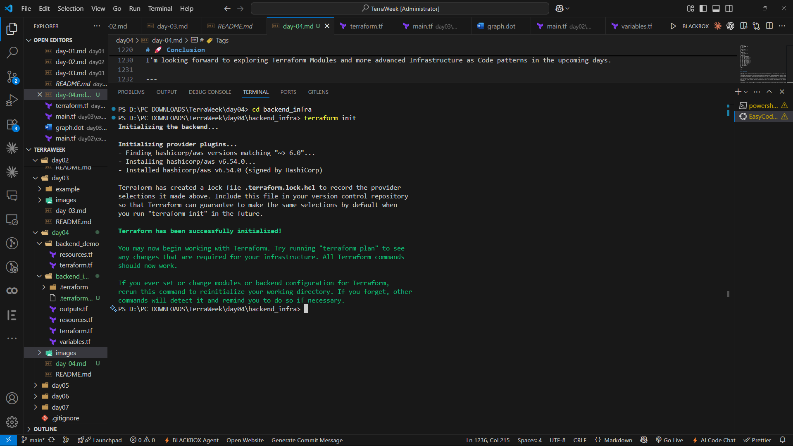


---

# 📋 Step 3 — Create the S3 Backend

After initialization, I provisioned the backend infrastructure.

```bash
terraform apply
```

Terraform displayed the execution plan, listing all the S3-related resources it was about to create.

These resources included:

- S3 Bucket
- Bucket Versioning
- Bucket Encryption

After reviewing the execution plan, I confirmed the deployment.

```text
yes
```

Terraform created the backend infrastructure successfully.

Once completed, the S3 bucket was ready to store Terraform State.

### 📸 Screenshot


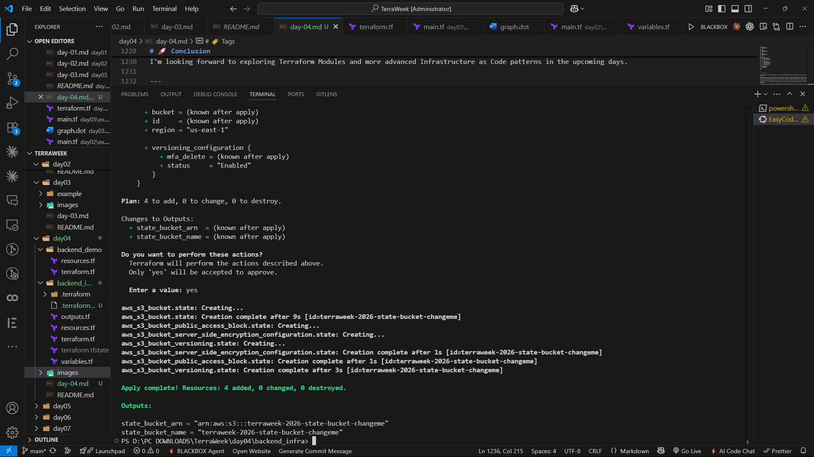


---

# 🪣 Verifying the S3 Bucket

After the deployment completed successfully, I opened the AWS Management Console to verify that the backend infrastructure had been created.

Inside the Amazon S3 Console, I confirmed:

- The S3 Bucket was created.
- Versioning was enabled.
- Server-Side Encryption was enabled.

This bucket will now act as the centralized location for storing Terraform State.

### 📸 Screenshot


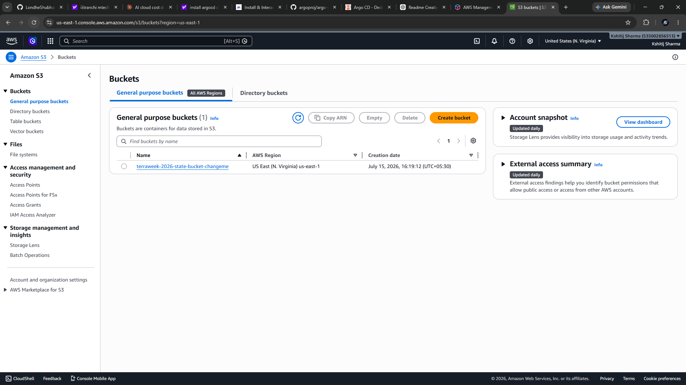


---

# 🔄 Step 4 — Configure the Remote Backend

Once the backend infrastructure was available, I moved to the second project.

```bash
cd ../backend_demo
```

Unlike `backend_infra`, this project contains the Remote Backend configuration.

The `terraform.tf` file points Terraform to the S3 bucket created earlier.

Example:

```hcl
terraform {

  backend "s3" {

    bucket = "my-terraform-state-bucket"

    key = "day04/terraform.tfstate"

    region = "us-east-1"

    encrypt = true

    use_lockfile = true

  }

}
```

The most important addition here is:

```hcl
use_lockfile = true
```

This enables **Native S3 State Locking**, eliminating the need for DynamoDB.

---

# 🚀 Step 5 — Initialize the Remote Backend

After configuring the backend, I initialized Terraform again.

```bash
terraform init
```

This time Terraform detected an existing Local State and asked whether it should migrate the State to Amazon S3.

Terraform displayed a message similar to:

```text
Do you want to copy existing state to the new backend?
```

I selected:

```text
yes
```

Terraform then uploaded the existing Local State to the S3 bucket.

This completed the migration from Local State to Remote State.

### 📸 Screenshot


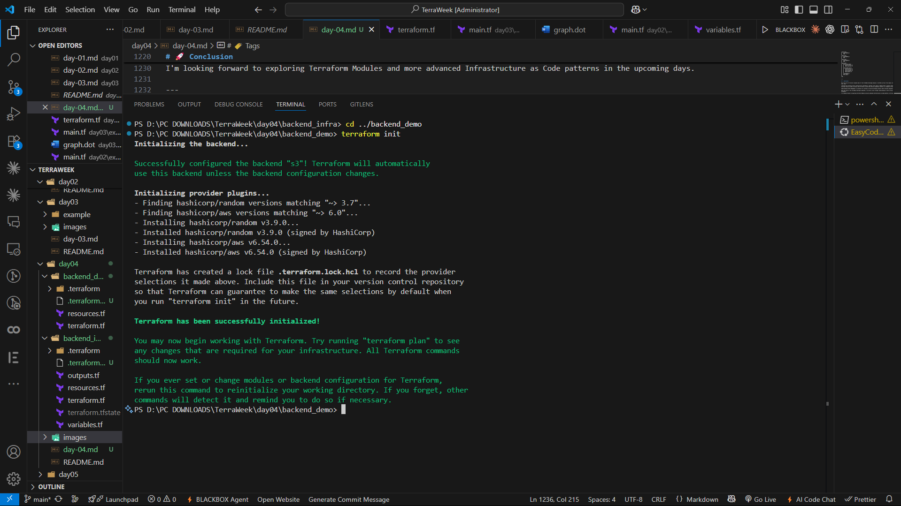


---

# ☁️ Verifying Remote State

After the migration completed, I opened the Amazon S3 Console again.

Inside the bucket, I verified that Terraform had uploaded:

```
terraform.tfstate
```

This confirmed that Terraform was now using **Remote State** instead of Local State.

From this point onward, every Terraform operation updates the State File directly inside Amazon S3.

### 📸 Screenshot


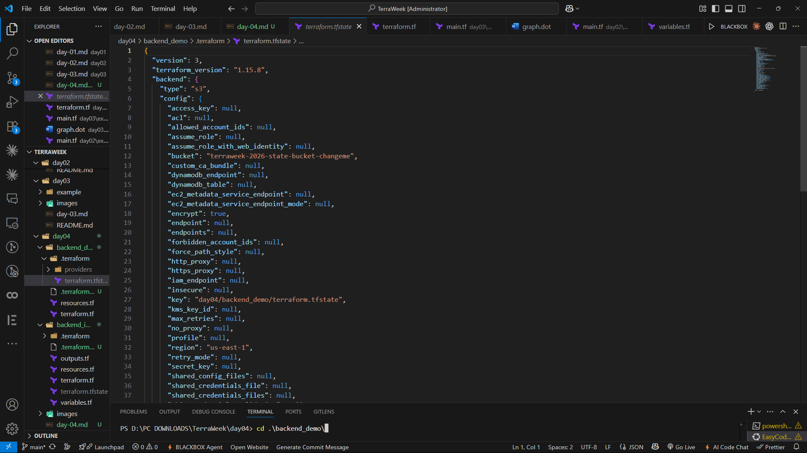


---

# 🔒 Verifying Native State Locking

One of the biggest improvements in modern Terraform is Native State Locking.

Whenever Terraform executes commands such as:

```bash
terraform apply
```

Terraform temporarily creates a lock file inside the S3 bucket.

```
terraform.tfstate.tflock
```

The lock file prevents multiple users from modifying the State File simultaneously.

After Terraform completes the operation successfully, the lock file is removed automatically.

Watching the `.tflock` file appear and disappear during deployment demonstrated how Terraform safely prevents concurrent updates.

### 📸 Screenshot


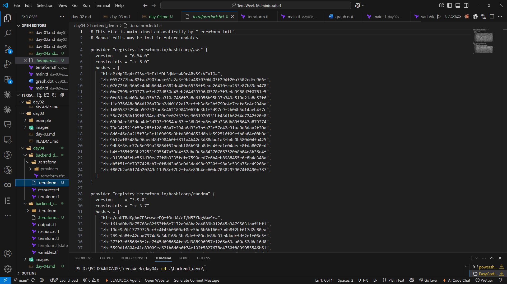


---

# 📤 Viewing Terraform Outputs

Once the backend was fully configured, I viewed the output values generated by Terraform.

Command:

```bash
terraform output
```

Depending on the configuration, Terraform displayed useful information such as:

- Bucket Name
- Bucket ARN
- Region

Outputs provide a convenient way to access infrastructure details without manually searching through the AWS Console.

---

# 📥 Importing Existing Resources

Another important feature introduced in today's challenge was the **Import Block**.

Sometimes cloud resources already exist because they were created manually.

Instead of recreating them, Terraform allows us to import those resources into the State File.

Example:

```hcl
import {

  to = aws_s3_bucket.imported

  id = "my-existing-bucket"

}
```

Terraform then generates the configuration automatically using:

```bash
terraform plan -generate-config-out=generated.tf
```

The generated configuration can be reviewed and integrated into the existing project.

Import Blocks make it much easier to bring manually created infrastructure under Terraform management.

### 📸 Screenshot


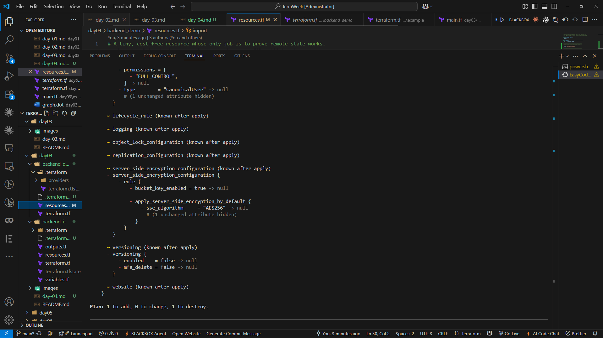


---

# 🍫 Bonus Exploration

After completing the core tasks, I explored a few additional Terraform features that are commonly used in production environments.

Although these tasks were optional, they provided a much deeper understanding of how Terraform manages infrastructure safely and efficiently across teams.

These bonus exercises focused on improving state management, collaboration, and infrastructure refactoring.

---

# ⭐ Bonus 1 — Comparing Remote Backends

Terraform supports multiple Remote Backends for storing the State File.

Although I implemented **Amazon S3** in this challenge, I also explored some other popular backend options.

| Backend | Best Use Case | Locking Support | Notes |
|----------|---------------|-----------------|------|
| Amazon S3 | AWS Workloads | ✅ Native (`use_lockfile`) | Most widely used in AWS environments |
| HCP Terraform (Terraform Cloud) | Teams & Enterprises | ✅ Built-in | Remote runs, policies, collaboration |
| Azure Storage | Azure Workloads | ✅ Supported | Best for Microsoft Azure users |
| Google Cloud Storage (GCS) | Google Cloud | ✅ Supported | Ideal for GCP-based projects |

For AWS-based infrastructure, Amazon S3 remains one of the most popular choices because it is highly durable, secure, and integrates seamlessly with Terraform.

---

# ⭐ Bonus 2 — S3 Bucket Versioning

One of the biggest advantages of storing Terraform State in Amazon S3 is **Bucket Versioning**.

Instead of replacing the existing State File every time Terraform performs an operation, Amazon S3 preserves older versions automatically.

This provides several benefits:

- Recovery from accidental deletion
- Rollback to previous State versions
- Better auditing
- Improved disaster recovery

If the latest State File becomes corrupted or is deleted accidentally, an earlier version can be restored directly from the S3 Console.

This significantly improves the reliability of Infrastructure as Code projects.

---

# ⭐ Bonus 3 — Understanding the `moved` Block

As Terraform projects evolve, resources are often renamed or reorganized.

Normally, renaming a resource causes Terraform to destroy the old resource and create a new one.

To avoid this unnecessary recreation, Terraform provides the **`moved` block**.

Example:

```hcl
moved {

  from = aws_s3_bucket.old_bucket

  to   = aws_s3_bucket.state_bucket

}
```

Instead of recreating the infrastructure, Terraform updates the resource address inside the State File.

This makes refactoring Terraform configurations much safer.

---

# ⭐ Bonus 4 — Understanding the `removed` Block

Sometimes we want Terraform to stop managing a resource without actually deleting it.

Terraform provides the **`removed` block** for this purpose.

Example:

```hcl
removed {

  from = aws_s3_bucket.logs

}
```

Using a `removed` block removes the resource from Terraform State while leaving the actual infrastructure untouched.

This is particularly useful when:

- Migrating resources to another Terraform project
- Handing resource management to another team
- Removing resources from Terraform without deleting production infrastructure

---

# ⭐ Bonus 5 — Continuous Health Checks using `check`

Modern Terraform also supports **Check Blocks**.

These blocks allow Terraform to validate infrastructure continuously.

Example:

```hcl
check "bucket_versioning_enabled" {

  assert {

    condition = true

    error_message = "Bucket versioning must remain enabled."

  }

}
```

Unlike validation rules, Check Blocks evaluate infrastructure after deployment.

They help detect configuration drift and ensure important infrastructure requirements continue to be satisfied.

---

# 🧹 Cleaning Up the Infrastructure

After verifying that everything was working correctly, I removed all the infrastructure created during today's challenge.

Since two separate Terraform projects were used, cleanup also happened in two stages.

---

## Step 1 — Destroy the Demo Infrastructure

First, I navigated to the `backend_demo` directory.

```bash
cd backend_demo
```

Then I destroyed the demo resources.

```bash
terraform destroy
```

Terraform displayed a confirmation prompt.

```text
Do you really want to destroy all resources?
```

After entering:

```text
yes
```

Terraform removed every resource managed by the demo project.

### 📸 Screenshot


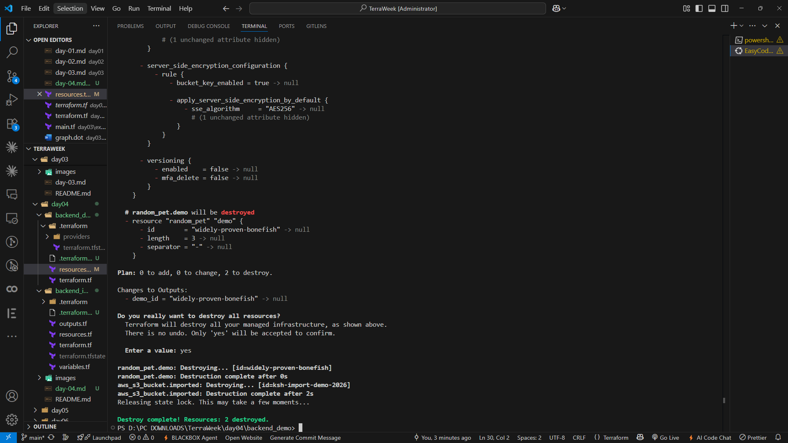


---

## Step 2 — Destroy the Backend Infrastructure

Once the demo resources were removed, I switched to the backend infrastructure project.

```bash
cd ../backend_infra
```

Since the S3 bucket contained multiple versions of the Terraform State File, I first ensured that the bucket was empty.

After clearing the bucket, I executed:

```bash
terraform destroy
```

Terraform successfully removed:

- S3 Bucket
- Bucket Versioning
- Bucket Encryption Configuration
- Other backend resources

This completed the cleanup process.

### 📸 Screenshot


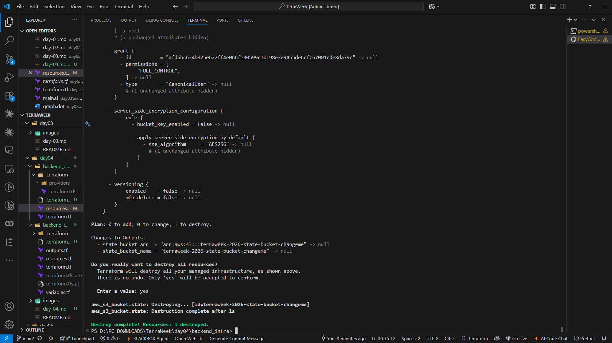


---

# 🎯 What I Learned

Day 4 introduced one of the most important concepts in Terraform—**State Management**.

Some of the key takeaways from today's challenge are:

- Learned what the Terraform State File is and why it exists.
- Understood why Terraform State should never be edited manually.
- Explored Terraform State Commands.
- Learned the concept of State Drift.
- Understood why Terraform State is considered sensitive.
- Learned the difference between Local State and Remote State.
- Bootstrapped backend infrastructure using Terraform.
- Configured Amazon S3 as a Remote Backend.
- Enabled Native State Locking using `use_lockfile`.
- Migrated Local State to Remote State.
- Imported existing infrastructure into Terraform State.
- Explored advanced features such as `moved`, `removed`, and `check` blocks.

The biggest lesson from today's challenge was understanding that Infrastructure as Code isn't only about creating resources—it is equally about managing them safely throughout their entire lifecycle.

---

# 📂 Repository Structure

```text
TerraWeek/
│
├── Day-01/
│   ├── README.md
│   └── ...
│
├── Day-02/
│   ├── README.md
│   └── ...
│
├── Day-03/
│   ├── README.md
│   └── ...
│
├── Day-04/
│   ├── backend_demo/
│   │   ├── terraform.tf
│   │   └── resources.tf
│   │
│   ├── backend_infra/
│   │   ├── terraform.tf
│   │   ├── resources.tf
│   │   ├── variables.tf
│   │   └── outputs.tf
│   │
│   ├── README.md
│   └── images/
│
└── ...
```

---

# 🚀 Conclusion

Day 4 was one of the most valuable days of the TerraWeek Challenge because it shifted my focus from simply creating infrastructure to managing it safely over time.

Learning how Terraform stores infrastructure information, migrates Local State to Remote State, protects State using Native S3 Locking, and imports existing resources made me realize that Terraform is much more than an automation tool—it is a complete infrastructure management platform.

Understanding State Management is essential for working on real-world DevOps projects where multiple engineers collaborate on the same infrastructure.

With four days of the TerraWeek Challenge completed, I now have a much stronger understanding of both infrastructure provisioning and infrastructure management.

I'm looking forward to exploring Terraform Modules and more advanced Infrastructure as Code patterns in the upcoming days.

---

# 🏷️ Tags

`#Terraform` `#AWS` `#TerraformState` `#RemoteBackend` `#AmazonS3` `#InfrastructureAsCode` `#DevOps` `#CloudComputing` `#Automation` `#PlatformEngineering` `#LearnInPublic` `#TrainWithShubham` `#TerraWeekChallenge`