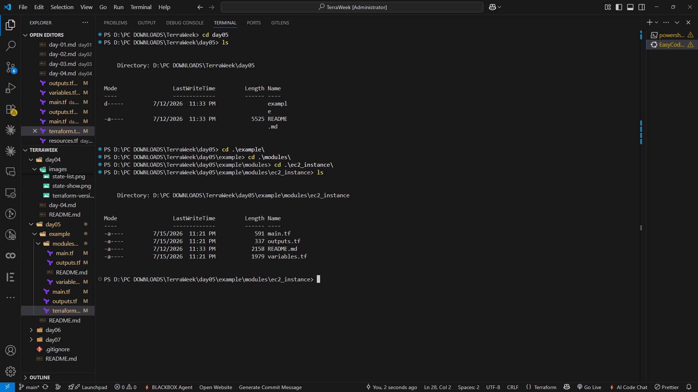
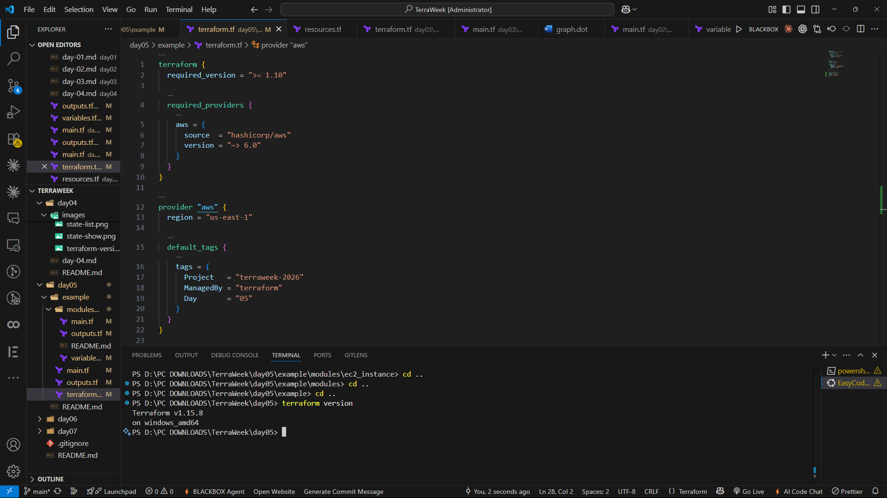
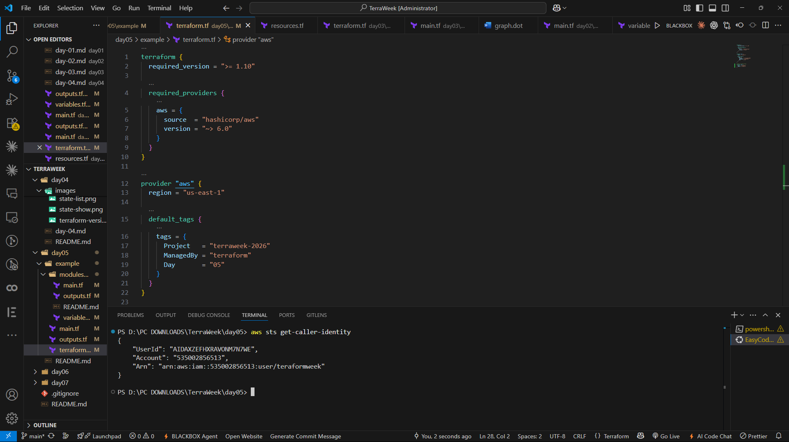
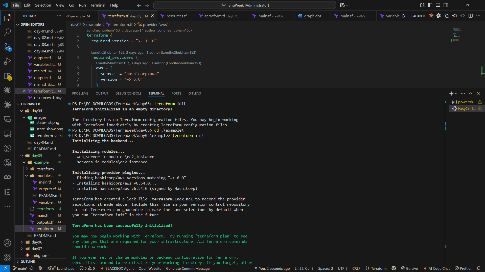
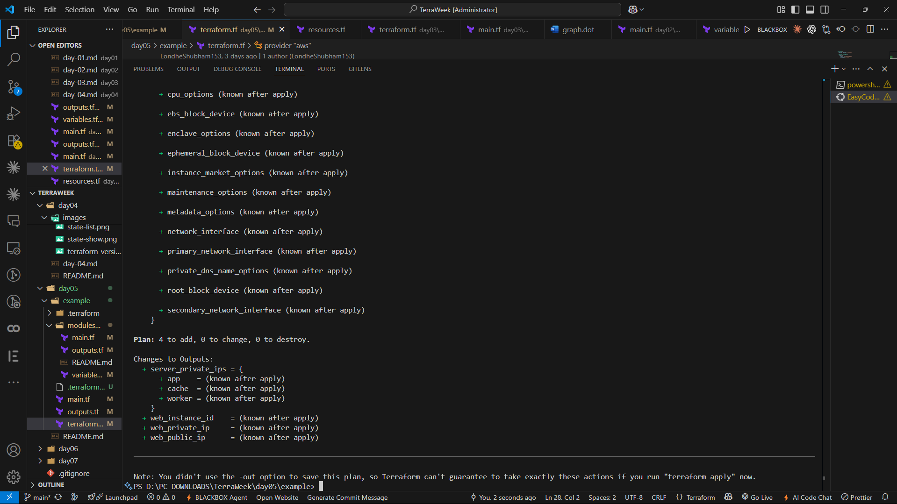
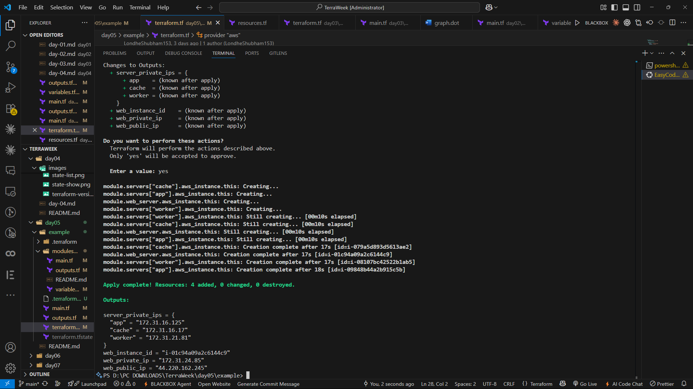
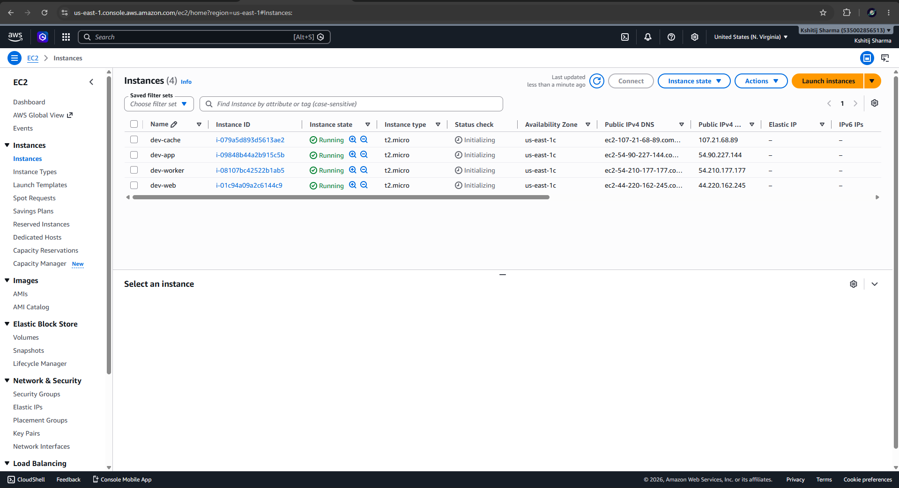
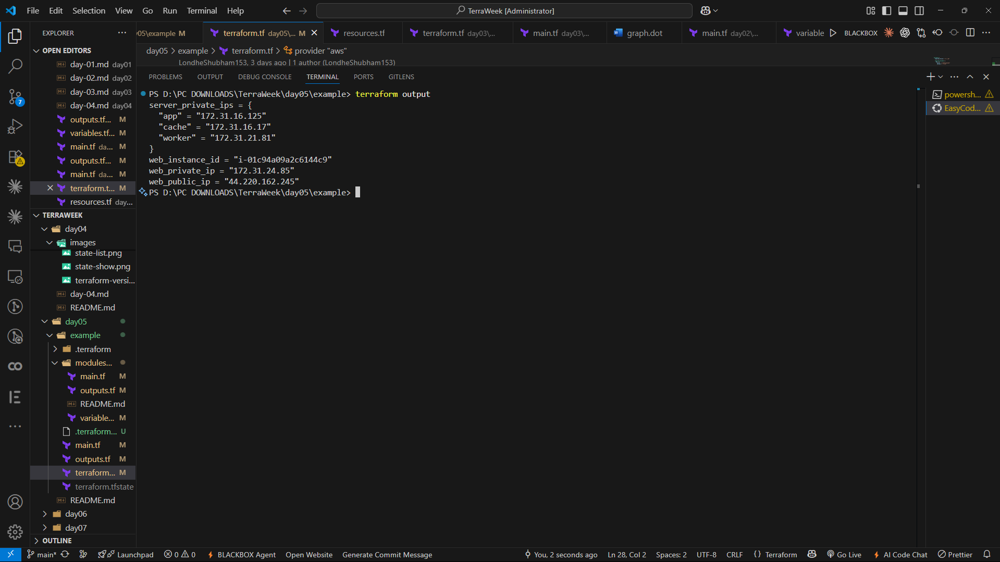
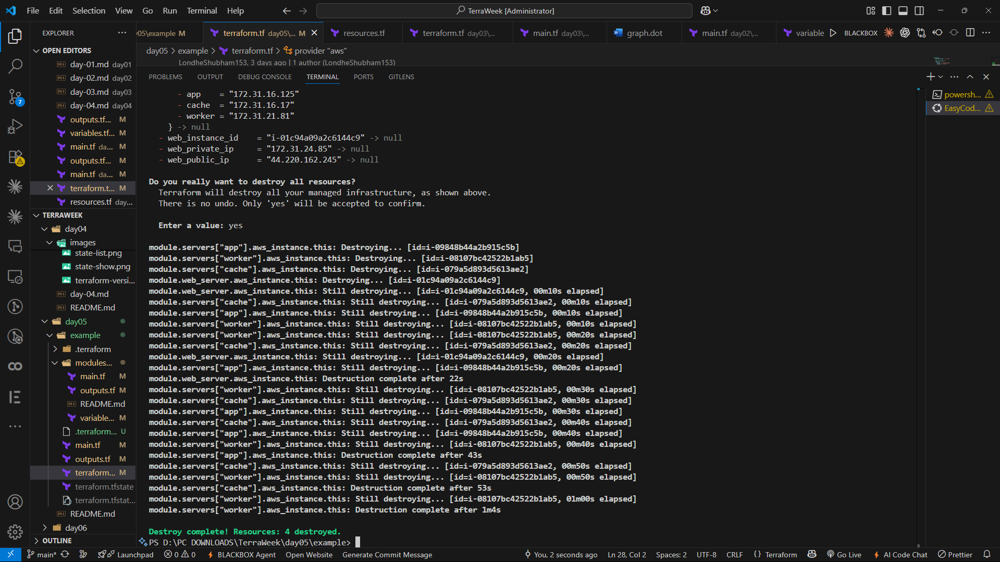

# 🌱 TerraWeek Challenge – Day 5
# Terraform Modules: Writing Reusable Infrastructure

📅 **Date:** 16 July 2026

Welcome to **Day 5** of my **TerraWeek Challenge!** 🚀

During the previous four days, I learned how to write Terraform configurations, provision AWS infrastructure, manage Terraform State, and configure Remote Backends.

Today's challenge focused on one of Terraform's most powerful features—**Modules**.

Until now, every infrastructure component was written directly inside the root configuration. While that approach works for small projects, it quickly becomes difficult to maintain as infrastructure grows.

Imagine creating the same EC2 configuration multiple times for different environments.

Instead of copying and pasting hundreds of lines of Terraform code, Modules allow us to package infrastructure into reusable building blocks.

This makes Infrastructure as Code:

- Cleaner
- Easier to maintain
- Reusable
- Consistent
- Easier to test
- Easier to version

Today's challenge introduced me to the concepts of:

- Root Modules
- Child Modules
- Local Modules
- Registry Modules
- Git Modules
- Module Version Pinning
- Module Composition
- Reusing Modules with `for_each`

By the end of today's challenge, I understood why almost every production Terraform project is built around reusable modules rather than large monolithic Terraform files.

---

# 📚 Learning Objectives

By the end of Day 5, I was able to:

- Understand what Terraform Modules are.
- Learn why Modules improve Infrastructure as Code.
- Understand the difference between Root Modules and Child Modules.
- Create my own reusable Local Module.
- Pass values into Modules using Variables.
- Read values from Modules using Outputs.
- Understand why Modules should receive IDs as inputs.
- Consume Modules from the Terraform Registry.
- Understand Git-based Modules.
- Learn different ways to pin Module versions.
- Instantiate multiple Modules using `for_each`.
- Explore Module Composition.

---

# 🤔 What is a Terraform Module?

A **Terraform Module** is simply a collection of Terraform configuration files grouped together to perform a specific task.

Instead of writing the same infrastructure repeatedly, we can package it into a reusable module and call it whenever needed.

For example:

Instead of writing an EC2 Instance configuration three different times:

- Development
- Staging
- Production

we can create one reusable EC2 Module and use it across all environments.

Think of a Module as a reusable function in programming.

You write it once...

...and use it as many times as you want.

---

# 🏗️ Why Do We Need Modules?

As Terraform projects grow, the amount of Infrastructure as Code also grows.

Without Modules:

- Code duplication increases.
- Maintenance becomes difficult.
- Bugs need to be fixed in multiple places.
- Infrastructure becomes inconsistent.

Modules solve these problems by keeping infrastructure reusable and standardized.

Instead of updating ten different EC2 configurations, we update one Module.

Every environment automatically benefits from the change.

This significantly reduces maintenance effort.

---

# 🌍 Root Module vs Child Module

One of the most important concepts I learned today was the difference between the **Root Module** and a **Child Module**.

## Root Module

The Root Module is the Terraform project that we execute directly.

This is where we run commands like:

```bash
terraform init

terraform plan

terraform apply
```

The Root Module usually contains:

- Provider Configuration
- Data Sources
- Variables
- Module Calls
- Outputs

It acts as the entry point for the entire Terraform project.

---

## Child Module

A Child Module is a reusable Terraform package that is called by another module.

Instead of creating infrastructure directly, it receives inputs from the Root Module and returns useful outputs.

In today's project, the reusable EC2 module is the Child Module.

This design keeps the infrastructure modular and much easier to maintain.

---

# ✨ Benefits of Using Modules

Modules provide several important advantages.

Some of the biggest benefits include:

- Reusability
- Consistency
- Encapsulation
- Versioning
- Easier Testing
- Better Team Collaboration
- Cleaner Project Structure

Instead of maintaining hundreds of duplicated Terraform resources, Modules allow us to centralize infrastructure logic in a single place.

This is one of the main reasons why Modules are considered the backbone of scalable Terraform projects.

---

# 📂 Project Structure

Today's project consists of two parts.

The Root Module lives at the project root, while the reusable EC2 Module is stored inside the `modules` directory.

```text
Day-05/
│
├── main.tf
├── outputs.tf
├── terraform.tf
│
├── modules/
│
│   └── ec2_instance/
│       ├── main.tf
│       ├── variables.tf
│       ├── outputs.tf
│       └── README.md
│
├── README.md
└── images/
```

The Root Module calls the Child Module whenever an EC2 instance needs to be created.

This separation keeps infrastructure reusable and organized.

### 📸 Screenshot





---

# 📁 Understanding the Module Structure

A well-designed Terraform Module typically contains four files.

### `main.tf`

Contains the infrastructure resources.

Example:

- EC2 Instance
- Security Groups
- IAM Roles

---

### `variables.tf`

Defines every input the Module expects.

Instead of hardcoding values, the Module receives them from the Root Module.

---

### `outputs.tf`

Exports useful information back to the Root Module.

Examples:

- Instance ID
- Public IP
- Private IP

---

### `README.md`

Explains:

- Module purpose
- Required Inputs
- Outputs
- Usage Examples

Documenting Modules is considered a best practice because other developers can quickly understand how to use them.

---

# ⚙️ Prerequisites

Before working with Terraform Modules, I ensured that the following tools were installed and configured correctly.

- Terraform
- AWS CLI
- Git
- Visual Studio Code
- AWS Account

Since the module provisions AWS resources, valid AWS credentials are required before running Terraform.

---

# 🛠️ Verifying Terraform Installation

The first step was verifying the installed Terraform version.

```bash
terraform version
```

Terraform displayed the currently installed version.

This confirms that the required Terraform version is available before initializing the project.

### 📸 Screenshot





---

# ☁️ Verifying AWS CLI

Before provisioning infrastructure, I verified my AWS credentials.

```bash
aws sts get-caller-identity
```

Terraform uses these credentials to authenticate with AWS.

A successful response confirmed that my AWS CLI was configured correctly.

### 📸 Screenshot





---

# 🧩 Understanding the Root Module

In every Terraform project, there is always one **Root Module**.

The Root Module is the starting point of the entire Terraform configuration. It is responsible for initializing providers, fetching required data, calling reusable modules, and exposing useful outputs.

In today's project, the Root Module contains:

- `terraform.tf`
- `main.tf`
- `outputs.tf`

Unlike previous days where the infrastructure was written directly inside `main.tf`, today's Root Module delegates the actual EC2 creation to a reusable Child Module.

Its responsibilities include:

- Configuring the AWS Provider
- Looking up the latest Amazon Linux AMI
- Resolving required IDs (Subnet, Security Group)
- Passing those values to the reusable module
- Reading outputs from the module

This separation keeps the Root Module lightweight while the infrastructure logic remains encapsulated inside the Child Module.

---

# 📦 Understanding the Child Module

The reusable EC2 Module is located inside:

```text
modules/
└── ec2_instance/
```

This module is responsible for creating a single EC2 Instance.

Instead of hardcoding infrastructure values, the module accepts everything as **inputs**, making it reusable across different environments, VPCs, AWS accounts, and regions.

The module itself contains:

```
main.tf
variables.tf
outputs.tf
README.md
```

Each file has a dedicated responsibility.

| File | Purpose |
|------|---------|
| `main.tf` | Creates the EC2 instance |
| `variables.tf` | Accepts input variables |
| `outputs.tf` | Exports useful values |
| `README.md` | Documents how to use the module |

This is considered the standard structure for production-quality Terraform modules.

---

# 📥 Module Inputs

One of the key ideas behind Terraform Modules is **Inputs**.

Inputs make a module configurable.

Instead of embedding values inside the module, the Root Module supplies them when calling the module.

Typical inputs include:

- Instance Name
- AMI ID
- Instance Type
- Subnet ID
- Security Group IDs
- Environment
- Tags

Example:

```hcl
module "web_server" {

  source = "./modules/ec2_instance"

  name = "web"

  instance_type = "t2.micro"

  environment = "dev"

  ami = data.aws_ami.al2023.id

  subnet_id = local.subnet_id

  vpc_security_group_ids = local.security_group_ids

}
```

This approach keeps the module flexible and reusable.

---

# 📤 Module Outputs

Modules can also return useful information back to the Root Module.

Instead of searching AWS manually, Terraform exposes outputs from the Child Module.

Typical outputs include:

- Instance ID
- Public IP
- Private IP

Example:

```hcl
output "web_public_ip" {

  value = module.web_server.public_ip

}
```

Outputs make it easier for other modules, automation pipelines, or users to consume infrastructure information.

---

# 💡 Why Pass IDs Instead of Performing Lookups?

One of the most interesting design decisions in today's challenge was that the Child Module does **not** perform its own data lookups.

Instead, the Root Module resolves everything once and passes the values into the module.

For example:

```hcl
ami = data.aws_ami.al2023.id
```

instead of placing the `data "aws_ami"` block inside every module.

This has several advantages:

- Better performance
- Avoids repeated API calls
- Keeps the module reusable
- Makes testing easier
- Keeps the module cloud-agnostic

This is considered a Terraform best practice and is also the approach demonstrated in the assignment. :contentReference[oaicite:0]{index=0}

---

# 📍 Calling a Local Module

Terraform allows us to reference a module stored inside the current project.

Example:

```hcl
module "web_server" {

  source = "./modules/ec2_instance"

}
```

The `source` attribute tells Terraform where the module is located.

Since today's module is stored locally, Terraform loads it directly from the filesystem.

During initialization, Terraform automatically discovers and prepares the module for use.

---

# 🌎 Using Modules from the Terraform Registry

Terraform also provides an official **Terraform Registry**, which hosts thousands of reusable modules maintained by HashiCorp and the community.

Instead of writing everything from scratch, we can use existing production-ready modules.

Example:

```hcl
module "vpc" {

  source = "terraform-aws-modules/vpc/aws"

  version = "~> 5.0"

}
```

Using Registry Modules significantly reduces development time while promoting standardized infrastructure.

The assignment specifically encouraged exploring Registry Modules and pinning their versions. :contentReference[oaicite:1]{index=1}

---

# 🔗 Using Modules from Git

Modules can also be stored inside Git repositories.

Example:

```hcl
module "network" {

  source = "git::https://github.com/example/terraform-modules.git//network?ref=v1.0.0"

}
```

Terraform downloads the module directly from the repository.

Git Modules are commonly used when organizations maintain their own internal module library.

---

# 🔒 Module Version Pinning

One of today's biggest lessons was understanding **Module Version Pinning**.

Without version pinning, Terraform always downloads the latest available version.

This can unexpectedly introduce breaking changes.

To avoid this, versions should always be pinned.

Some common strategies include:

### Exact Version

```hcl
version = "= 5.1.2"
```

---

### Compatible Minor Versions

```hcl
version = "~> 5.0"
```

Allows:

```
5.0.x
5.1.x
5.2.x
```

But blocks:

```
6.0
```

---

### Version Range

```hcl
version = ">= 5.0, < 6.0"
```

Useful when supporting multiple compatible releases.

---

### Git Tag

```hcl
source = "git::https://github.com/org/repo.git//module?ref=v1.2.0"
```

---

### Git Commit SHA

```hcl
source = "git::https://github.com/org/repo.git//module?ref=8d0f5d8b2..."
```

Using a full commit SHA provides maximum reproducibility because the module code can never change.

---

# 🎯 Why Version Pinning Matters

Version pinning offers several important benefits:

- Reproducible deployments
- Stable infrastructure
- Protection from breaking changes
- Consistent CI/CD pipelines
- Easier debugging
- Predictable upgrades

Professional Terraform projects almost always pin provider versions and module versions to ensure infrastructure behaves consistently across environments.

---

# 🔄 Modular Composition using `for_each`

Another powerful concept introduced today was **Module Composition**.

Instead of calling the same module repeatedly, Terraform allows us to instantiate multiple copies using `for_each`.

Example:

```hcl
module "servers" {

  source = "./modules/ec2_instance"

  for_each = toset([
    "app",
    "worker",
    "cache"
  ])

  name = each.key

  instance_type = "t2.micro"

  environment = "dev"

  ami = data.aws_ami.al2023.id

  subnet_id = local.subnet_id

  vpc_security_group_ids = local.security_group_ids

}
```

With a single module definition, Terraform can provision multiple EC2 instances while keeping the configuration concise and maintainable. This pattern is one of the main practical tasks in the Day 5 assignment. :contentReference[oaicite:2]{index=2}

---

# 🚀 Deploying Infrastructure using Terraform Modules

With the Root Module and Child Module ready, it was finally time to deploy infrastructure using my own reusable Terraform Module.

Unlike the previous days where all infrastructure was written directly inside the root configuration, today's deployment was much cleaner.

The Root Module simply passed the required inputs to the Child Module, while the Child Module handled the actual EC2 creation.

This separation of responsibilities is one of the biggest reasons why Terraform Modules are considered a best practice for Infrastructure as Code.

The deployment workflow looked like this:

```text
Write Root Module

        │

        ▼

Call Child Module

        │

        ▼

terraform init

        │

        ▼

Download Module

        │

        ▼

terraform plan

        │

        ▼

terraform apply

        │

        ▼

Verify EC2 Instance

        │

        ▼

terraform output

        │

        ▼

Reuse Module using for_each
```

---

# 🚀 Step 1 — Initialize Terraform

The first step was initializing the Terraform project.

```bash
terraform init
```

Unlike the previous days, Terraform now performed two tasks during initialization.

- Downloaded the AWS Provider.
- Initialized the Local Module.

Terraform automatically discovered the Child Module inside:

```
modules/ec2_instance
```

and prepared it for execution.

Once everything completed successfully, Terraform displayed:

```text
Terraform has been successfully initialized!
```

This confirmed that both the provider and the reusable module were ready.

### 📸 Screenshot





---

# 📋 Step 2 — Review the Execution Plan

Before creating any infrastructure, I reviewed the execution plan.

```bash
terraform plan
```

Terraform evaluated:

- Root Module
- Child Module
- Variables
- Outputs
- Resource Dependencies

Then it displayed every resource that would be created.

Since the infrastructure itself lives inside the Child Module, the execution plan clearly showed Terraform expanding the module before provisioning resources.

Example:

```text
module.web_server.aws_instance.this
```

This demonstrated how Terraform internally resolves module resources.

Reviewing the execution plan before deployment helps prevent accidental infrastructure changes.

### 📸 Screenshot





---

# 🚀 Step 3 — Provision Infrastructure

Once I verified the execution plan, I deployed the infrastructure.

```bash
terraform apply
```

Terraform displayed:

```
Do you want to perform these actions?
```

After confirming with:

```
yes
```

Terraform provisioned the infrastructure by calling the Child Module.

Instead of creating resources directly from the Root Module, Terraform executed the reusable EC2 Module.

After a few moments Terraform displayed:

```
Apply complete!
```

This confirmed that the EC2 instance had been successfully provisioned using my own reusable Terraform Module.

### 📸 Screenshot





---

# ☁️ Verifying the EC2 Instance

After Terraform completed successfully, I opened the AWS Management Console.

Inside the EC2 Dashboard, I verified that the instance had been created successfully.

I confirmed:

- Instance Name
- Instance Type
- Running State
- Public IP Address
- Availability Zone

Seeing the EC2 instance created entirely through a reusable Terraform Module reinforced the practical value of modular Infrastructure as Code.

### 📸 Screenshot





---

# 📤 Viewing Module Outputs

One of the biggest advantages of Terraform Modules is the ability to expose useful information through Outputs.

Instead of manually locating resource details inside AWS, Terraform displays them automatically.

Command:

```bash
terraform output
```

Example:

```text
instance_id = "i-xxxxxxxxxxxxxxxx"

public_ip = "xx.xx.xx.xx"

private_ip = "172.xx.xx.xx"
```

These values are actually produced inside the Child Module and then returned to the Root Module.

This makes modules easy to integrate with other modules and automation pipelines.

### 📸 Screenshot





---

# 🔄 Creating Multiple EC2 Instances using `for_each`

One of today's most interesting tasks was learning that the same module can be instantiated multiple times.

Instead of writing three different EC2 resources, Terraform allows us to reuse a single module.

Example:

```hcl
module "servers" {

  source = "./modules/ec2_instance"

  for_each = toset([
    "app",
    "worker",
    "cache"
  ])

  name = each.key

  instance_type = "t2.micro"

  environment = "dev"

  ami = data.aws_ami.al2023.id

  subnet_id = local.subnet_id

  vpc_security_group_ids = local.security_group_ids

}
```

When Terraform evaluates this configuration, it automatically creates:

- App Server
- Worker Server
- Cache Server

without duplicating the module code.

This demonstrates the real power of Modules combined with Meta-Arguments.

---

# 📋 Reviewing the Plan with Multiple Module Instances

After adding `for_each`, I generated another execution plan.

```bash
terraform plan
```

Terraform now displayed multiple module instances similar to:

```text
module.servers["app"]

module.servers["worker"]

module.servers["cache"]
```

This clearly showed that Terraform treats each module instance independently while still using the same reusable module definition.

---

# 🔍 Inspecting the Infrastructure

After deployment, I also explored Terraform's outputs and state to better understand how module resources are represented.

Useful commands included:

```bash
terraform output
```

```bash
terraform state list
```

Example output:

```text
module.web_server.aws_instance.this
```

This naming convention makes it easy to identify which resources belong to which module.

---

# 🍫 Bonus Exploration

After completing the core module implementation, I explored a few advanced Terraform Module concepts that are commonly used in real-world DevOps projects.

These bonus tasks helped me understand how teams build reusable infrastructure libraries, maintain module quality, and safely evolve infrastructure over time.

Instead of focusing only on creating resources, these concepts emphasize writing modules that are reusable, maintainable, and production-ready.

---

# ⭐ Bonus 1 — Documenting the Module

One of the best practices recommended in today's challenge was documenting every reusable module.

A well-documented module allows other developers to understand:

- What the module does
- Required Inputs
- Optional Inputs
- Outputs
- Usage Examples
- Default Values

Instead of reading the module source code, developers can simply open the module's `README.md`.

My reusable EC2 module includes documentation describing its purpose, required inputs, optional parameters, outputs, and a usage example, making it much easier to consume in other projects. :contentReference[oaicite:0]{index=0}

---

# ⭐ Bonus 2 — Input Validation

Reusable modules should validate user inputs whenever possible.

Terraform allows us to define validation rules inside `variables.tf`.

Example:

```hcl
variable "environment" {

  type = string

  validation {

    condition = contains(
      ["dev","staging","prod"],
      var.environment
    )

    error_message = "Environment must be dev, staging or prod."

  }

}
```

Input Validation prevents invalid values from entering the module and reduces configuration mistakes.

This makes reusable modules much safer for teams.

---

# ⭐ Bonus 3 — Publishing Modules using Git

Terraform Modules don't have to remain inside the same repository.

They can also be stored in a separate Git repository and reused across multiple projects.

Example:

```hcl
module "web_server" {

  source = "git::https://github.com/yourusername/terraform-aws-modules.git//ec2_instance?ref=v1.0.0"

}
```

Using:

```text
?ref=v1.0.0
```

pins the module to a specific Git tag.

Instead of downloading the latest code every time, Terraform always downloads the exact version.

This improves stability and reproducibility.

---

# ⭐ Bonus 4 — Module Composition

Another advanced concept introduced today was **Module Composition**.

Instead of building one large module containing everything, Terraform encourages connecting multiple small modules together.

For example:

```
Networking Module

        │

        ▼

EC2 Module

        │

        ▼

Load Balancer Module
```

The output of one module becomes the input of another.

Example:

```hcl
module "network" {

  source = "./modules/network"

}

module "web" {

  source = "./modules/ec2_instance"

  subnet_id = module.network.public_subnet_id

}
```

This creates highly modular and reusable Infrastructure as Code.

Instead of duplicating networking logic inside every EC2 module, the networking module provides the required outputs.

---

# ⭐ Bonus 5 — Why Modular Infrastructure Matters

Today's challenge completely changed the way I think about Terraform projects.

Without modules:

- Infrastructure becomes repetitive.
- Code duplication increases.
- Maintenance becomes difficult.
- Bugs are fixed in multiple places.

With Modules:

- Infrastructure becomes reusable.
- Updates happen in one place.
- Projects remain organized.
- Teams can share common infrastructure.
- Testing becomes much easier.

This is why almost every production Terraform repository relies heavily on reusable modules.

---

# 🧹 Cleaning Up the Infrastructure

After verifying that everything was working correctly, I removed all the infrastructure created during today's challenge.

Terraform makes cleanup just as simple as deployment.

Command:

```bash
terraform destroy
```

Terraform displayed a confirmation prompt.

```text
Do you really want to destroy all resources?
```

After entering:

```text
yes
```

Terraform removed every resource that had been created by the Root Module.

Since the infrastructure itself was provisioned through the Child Module, Terraform automatically traversed the module hierarchy and destroyed all managed resources safely.

Finally, Terraform displayed:

```text
Destroy complete!
```

Destroying unused cloud resources is an important habit because it helps avoid unnecessary AWS costs.

### 📸 Screenshot





---

# 🎯 What I Learned

Day 5 introduced one of the most important Terraform concepts—**Modules**.

Some of the key takeaways from today's challenge are:

- Learned what Terraform Modules are.
- Understood the difference between Root Modules and Child Modules.
- Built my own reusable Local Module.
- Passed values into Modules using Variables.
- Returned useful information using Outputs.
- Learned why modules should receive IDs instead of performing their own lookups.
- Explored Local Modules, Registry Modules, and Git Modules.
- Understood different Module Version Pinning strategies.
- Used `for_each` to instantiate multiple module instances.
- Explored Module Composition.
- Learned how documentation and validation improve module quality.

The biggest lesson from today was understanding that Modules are the foundation of scalable Infrastructure as Code.

Instead of writing the same infrastructure repeatedly, we can package it once and reuse it across projects, environments, and teams.

---

# 📂 Repository Structure

```text
TerraWeek/
│
├── Day-01/
│   ├── README.md
│   └── ...
│
├── Day-02/
│   ├── README.md
│   └── ...
│
├── Day-03/
│   ├── README.md
│   └── ...
│
├── Day-04/
│   ├── README.md
│   └── ...
│
├── Day-05/
│   ├── main.tf
│   ├── outputs.tf
│   ├── terraform.tf
│   │
│   ├── modules/
│   │   └── ec2_instance/
│   │       ├── main.tf
│   │       ├── variables.tf
│   │       ├── outputs.tf
│   │       └── README.md
│   │
│   ├── README.md
│   └── images/
│
└── ...
```

---

# 🚀 Conclusion

Day 5 marked an important shift in my Terraform journey.

Until now, I had been focused on learning how to provision infrastructure.

Today, I learned how to **design reusable infrastructure**.

By separating the Root Module from reusable Child Modules, passing inputs through variables, exposing outputs, and organizing infrastructure into well-defined components, I gained a much better understanding of how production Terraform projects are structured.

Exploring Registry Modules, Git Modules, Module Version Pinning, and Module Composition also gave me insight into how large teams build consistent, maintainable Infrastructure as Code.

With five days of the TerraWeek Challenge completed, I now have a much stronger foundation in writing Terraform that is not only functional but also reusable and scalable.

I'm excited to continue the challenge and explore even more advanced Terraform concepts in the upcoming days.

---

# 🏷️ Tags

`#Terraform` `#TerraformModules` `#InfrastructureAsCode` `#AWS` `#DevOps` `#CloudComputing` `#Automation` `#PlatformEngineering` `#CloudEngineering` `#LearnInPublic` `#TrainWithShubham` `#TerraWeekChallenge`