# 🌱 TerraWeek Challenge – Day 6
# Building Production-Ready Terraform Workflows

📅 **Date:** 17 July 2026

Welcome to **Day 6** of my **TerraWeek Challenge!** 🚀

For the past five days, I have been learning Terraform one concept at a time.

I started by installing Terraform and understanding how Infrastructure as Code works. Then I explored HCL, variables, expressions, Docker provider, Terraform State, Remote Backends, and finally reusable Terraform Modules.

Each day introduced a new building block.

But after completing those exercises, one important question came to my mind.

> **What happens after we finish writing Terraform code?**

Is writing a successful `terraform apply` enough to call an Infrastructure project production-ready?

The answer is **No.**

Creating infrastructure is only the first milestone.

The real challenge begins when multiple engineers start working on the same codebase.

Imagine a team where five DevOps Engineers are contributing to a single Terraform repository.

One engineer modifies networking.

Another updates IAM permissions.

Someone else changes the EC2 configuration.

At the same time, another developer opens a Pull Request that accidentally introduces a formatting issue or an invalid Terraform configuration.

Without proper quality checks, that small mistake can easily reach production.

The consequences can be serious.

- Production deployments may fail.
- Infrastructure can drift from the intended configuration.
- Security vulnerabilities may go unnoticed.
- Cloud costs may increase unexpectedly.
- Other engineers may spend hours debugging avoidable issues.

This is exactly why professional Infrastructure as Code projects don't stop at writing Terraform resources.

They focus on **building reliable workflows** around Terraform.

Today's challenge was completely different from the previous days.

Instead of creating new AWS resources, the objective was to learn how modern DevOps teams maintain **quality, consistency, and confidence** while working with Infrastructure as Code.

Day 6 introduced the practices that transform Terraform from a simple provisioning tool into a production-ready engineering workflow.

Rather than asking:

> **"Can Terraform create this resource?"**

Today's challenge asks:

> **"How can we be confident that our infrastructure is correct before it ever reaches production?"**

That shift in mindset completely changes the way Infrastructure as Code is developed.

---

# 🌍 Why This Project Matters

When people first learn Terraform, they usually focus on creating infrastructure.

They write a resource, execute:

```bash
terraform apply
```

and celebrate when the resource appears inside AWS.

While that's an important milestone, it represents only a small portion of what professional Terraform projects actually involve.

Real-world Infrastructure as Code is about much more than provisioning resources.

It is about building systems that are:

- Reliable
- Repeatable
- Testable
- Secure
- Easy to collaborate on
- Safe to deploy

Imagine deploying infrastructure directly into production without any validation.

A missing variable...

A typo inside a resource...

A formatting mistake...

An incorrect output...

Any of these seemingly minor issues can interrupt an entire deployment pipeline.

To prevent these problems, organizations introduce several automated quality gates before infrastructure is deployed.

Those quality gates verify that the Terraform project satisfies a number of important conditions.

For example:

- Is the code formatted correctly?
- Is the configuration valid?
- Do automated tests pass?
- Does the infrastructure satisfy expected behavior?
- Are there any security issues?
- Can this project be safely deployed through CI/CD?

Answering these questions manually every time would be slow and error-prone.

Instead, Terraform provides tools that automate these checks.

That is the core objective of today's project.

---

# 🚀 From Infrastructure Creation to Infrastructure Engineering

One of the biggest lessons I learned during this challenge is that there is a major difference between **creating infrastructure** and **engineering infrastructure**.

Creating infrastructure means writing Terraform code that provisions resources.

Engineering infrastructure means building an entire workflow around that code.

A professional Terraform project doesn't stop after `terraform apply`.

It continues with:

- Formatting
- Validation
- Testing
- Security Scanning
- Continuous Integration
- Documentation

Only after all of these checks pass should infrastructure be considered ready for deployment.

This project demonstrates that complete workflow.

---

# 🎯 Learning Objectives

By the end of Day 6, I wanted to understand not only **how Terraform works**, but also **how teams work with Terraform**.

The primary learning objectives for today's challenge were:

- Understand why Terraform Workspaces are useful.
- Learn how to isolate environments without duplicating code.
- Validate Terraform configurations before deployment.
- Write automated infrastructure tests using Terraform Native Testing.
- Build confidence through repeatable testing.
- Automate Terraform quality checks using GitHub Actions.
- Scan Infrastructure as Code for security issues using Trivy.
- Follow Infrastructure as Code best practices.
- Prepare Terraform projects for real-world collaboration.

Rather than introducing more AWS services, today's challenge focused on improving the **development lifecycle** surrounding Infrastructure as Code.

---

# ✨ Project Highlights

This project demonstrates several modern Terraform capabilities that are commonly used in production environments.

## 🌿 Terraform Workspaces

Terraform Workspaces allow multiple isolated environments to share the same Terraform configuration.

Instead of maintaining three separate repositories for:

- Development
- Staging
- Production

we can manage all environments from a single codebase.

This reduces duplication while keeping deployments isolated.

---

## 🧪 Native Terraform Testing

One of the most exciting additions to Terraform is its built-in testing framework.

Instead of manually verifying infrastructure behavior, Terraform allows us to write automated tests.

These tests verify that:

- Variables behave correctly.
- Outputs contain expected values.
- Invalid configurations fail.
- Infrastructure behaves as expected.

Infrastructure can now be tested just like application code.

---

## ⚙️ GitHub Actions

Infrastructure quality should never depend on manual execution.

Every Push and Pull Request should automatically verify the Terraform project.

GitHub Actions makes that possible.

Today's workflow automatically executes:

- Terraform Format
- Terraform Validate
- Terraform Test
- Terraform Plan
- Trivy Security Scan

This significantly improves deployment confidence.

---

## 🔒 Security First

Security should be integrated into the development process instead of being added later.

This project uses **Trivy** to scan Terraform configurations for security issues before deployment.

Detecting problems early reduces risk and encourages secure Infrastructure as Code practices.

---

## 📈 Production Best Practices

Throughout this project I also focused on following recommended Terraform practices.

These include:

- Version Pinning
- Automated Validation
- Native Testing
- CI/CD Automation
- Clean Repository Structure
- Documentation
- Git Ignore Rules

Small improvements like these make a significant difference when projects grow over time.

---

# 📂 Project Structure

The project is intentionally organized into dedicated folders so that every component has a single responsibility.

```text
Day-06/
│
├── main.tf
├── terraform.tf
│
├── tests/
│   └── basic.tftest.hcl
│
├── .github/
│   └── workflows/
│       └── terraform.yml
│
├── ARCHITECTURE.md
├── README.md
└── images/
```

Each file contributes to a different part of the Terraform workflow.

| File | Purpose |
|------|---------|
| `main.tf` | Defines the Terraform resources used in this project |
| `terraform.tf` | Terraform settings and required providers |
| `tests/basic.tftest.hcl` | Native Terraform test cases |
| `.github/workflows/terraform.yml` | CI/CD pipeline for Terraform |
| `ARCHITECTURE.md` | High-level architecture documentation |
| `README.md` | Complete project documentation |

### 📸 Screenshot

```md
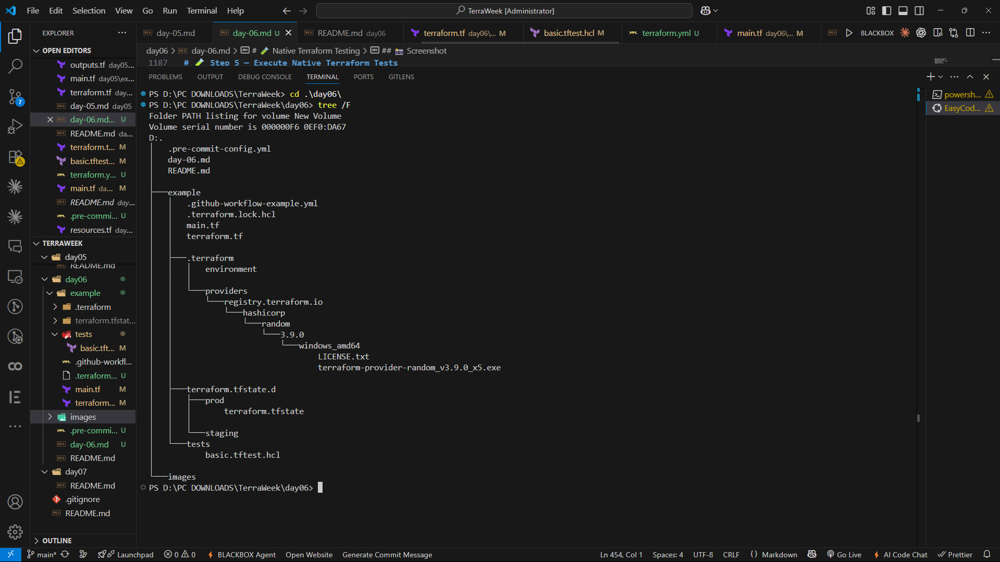
```

---

# 🏗️ Understanding the Core Technologies

Before jumping into the implementation, I wanted to understand *why* each technology introduced in today's challenge exists.

One thing I noticed while learning Terraform over the last few days is that every concept solves a very specific problem.

For example:

- Variables make Terraform reusable.
- Modules remove code duplication.
- Remote Backends enable collaboration.

Similarly, every concept introduced in Day 6 also solves a real-world engineering problem.

Instead of creating new infrastructure resources, today's technologies focus on making Infrastructure as Code **reliable, maintainable, and production-ready.**

Let's understand each one individually.

---

# 🌿 Terraform Workspaces

Imagine deploying the same application into three different environments.

```
Development

↓

Staging

↓

Production
```

Without Terraform Workspaces, you would probably end up maintaining three separate folders.

```
dev/

staging/

prod/
```

Every folder would contain almost identical Terraform code.

This quickly becomes difficult to maintain.

A simple change would have to be copied into every environment manually.

Terraform Workspaces solve this problem elegantly.

Instead of duplicating the project, Terraform creates isolated **state files** for different environments while allowing the same Terraform configuration to be reused.

The workflow looks like this.

```text
Terraform Configuration

          │

          ▼

 ┌────────────────────┐

 │    Workspace       │

 ├────────────────────┤

 │ Development        │

 │ Staging            │

 │ Production         │

 └────────────────────┘

          │

          ▼

 Separate Terraform State
```

Each workspace manages its own infrastructure independently.

This makes Workspaces extremely useful for:

- Development
- Testing
- QA
- Staging
- Production

without maintaining multiple repositories.

One of the biggest lessons I learned today is that **Infrastructure should be reusable, not duplicated.**

---

## 📸 Screenshot


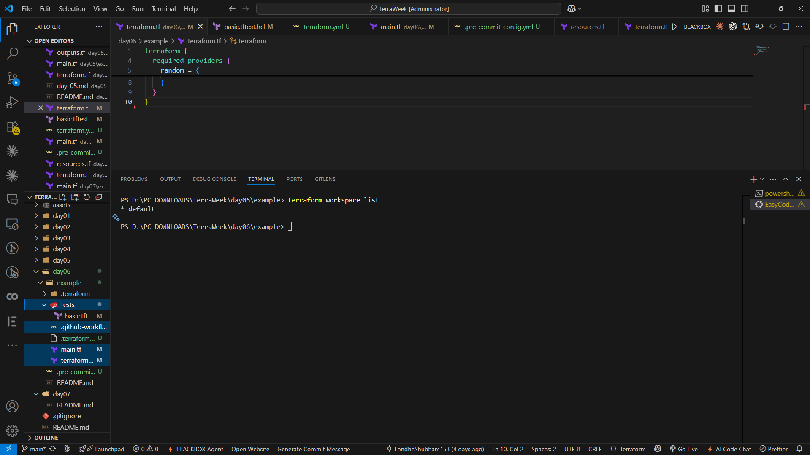


---

## 📸 Screenshot


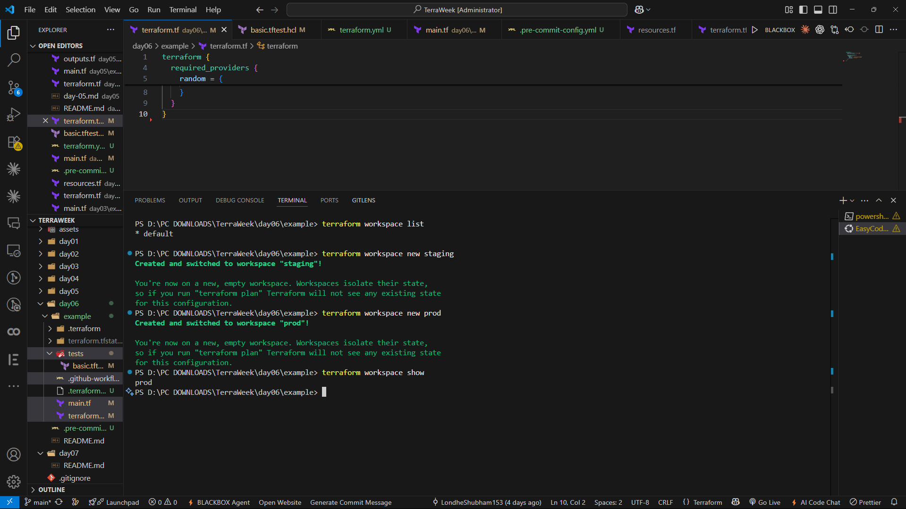


---

# 🧪 Native Terraform Testing

When developers write application code, they usually write unit tests.

So I asked myself:

> **Can Infrastructure also be tested?**

The answer is **Yes.**

Terraform now provides its own **Native Testing Framework**.

Instead of manually verifying outputs after every deployment, we can write automated tests inside:

```
tests/basic.tftest.hcl
```

These tests execute Terraform operations and verify expected behavior automatically.

For example, a test can check:

- Whether a variable accepts valid input.
- Whether invalid configurations fail.
- Whether outputs contain expected values.
- Whether generated resources match the desired configuration.

This transforms Infrastructure as Code into **testable code.**

Rather than hoping the infrastructure works correctly, we can prove it using automated tests.

That is a major step toward production-quality Infrastructure as Code.

---

## 📸 Screenshot


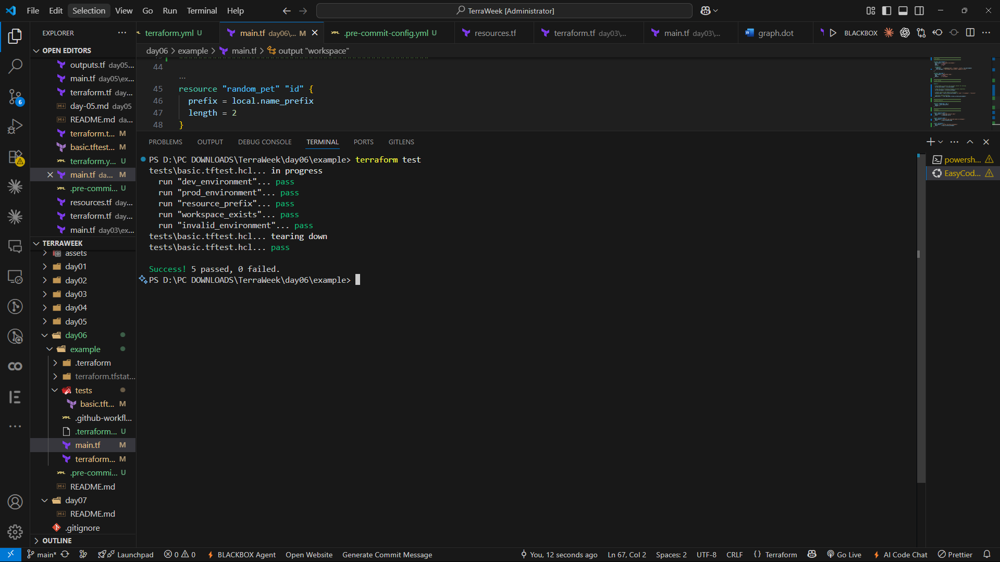


---

# ⚙️ Continuous Integration with GitHub Actions

One of the biggest differences between personal Terraform projects and production repositories is **automation.**

Imagine every developer manually running:

```bash
terraform fmt

terraform validate

terraform test

terraform plan
```

before every commit.

Sometimes people forget.

Sometimes they skip validation.

Sometimes they push broken code.

Continuous Integration solves this problem.

Every Push and Pull Request automatically executes the Terraform workflow.

Instead of trusting every contributor to remember each command, GitHub Actions performs those checks automatically.

Today's workflow includes:

```text
Git Push

      │

      ▼

GitHub Actions

      │

      ├── terraform fmt

      ├── terraform validate

      ├── terraform test

      ├── terraform plan

      └── Trivy Scan
```

This ensures that infrastructure changes are validated before they are merged into the main branch.

Automation removes human error and increases deployment confidence.

---

## 📸 Screenshot


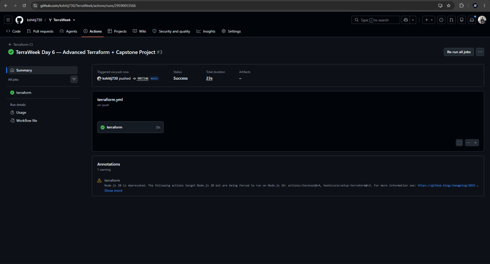


---

# 🔒 Security Scanning using Trivy

Security should never be treated as the final step in a deployment pipeline.

Instead, security should be integrated into the development workflow from the beginning.

That's exactly where **Trivy** fits into today's project.

Trivy scans Terraform configurations and looks for potential security issues before infrastructure is deployed.

Examples include:

- Misconfigurations
- Insecure defaults
- Weak security settings
- Compliance violations

Running automated security scans helps identify problems early, making infrastructure safer before it ever reaches production.

Rather than fixing security after deployment, we shift security **left** into the development process.

---

## 📸 Screenshot


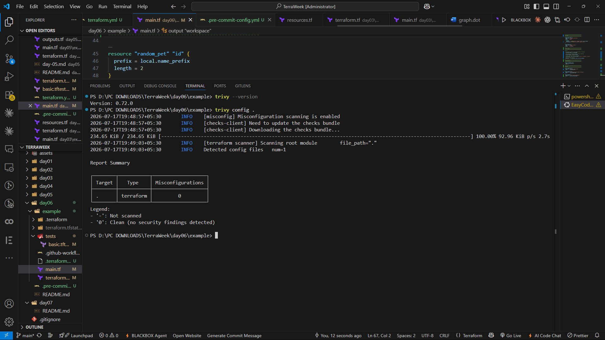


---

# ✅ Infrastructure Quality Gates

One of the most valuable concepts I learned today is the idea of **Quality Gates**.

Instead of allowing any Terraform configuration to be deployed, professional teams introduce a sequence of automated checks.

Only after every quality gate passes is the infrastructure considered ready.

Today's project follows a workflow similar to this.

```text
Write Terraform Code

        │

        ▼

terraform fmt

        │

        ▼

terraform validate

        │

        ▼

terraform test

        │

        ▼

terraform plan

        │

        ▼

Trivy Security Scan

        │

        ▼

GitHub Actions

        │

        ▼

Deployment Ready
```

Each stage verifies a different aspect of the project.

Together, they significantly reduce deployment risks.

---

# ⚙️ Prerequisites

Before running the project, make sure the following tools are installed.

- Terraform v1.10 or later
- Git
- GitHub Account
- Visual Studio Code
- Trivy *(optional for local scans)*

Verify the installed Terraform version.

```bash
terraform version
```

---

## 📸 Screenshot


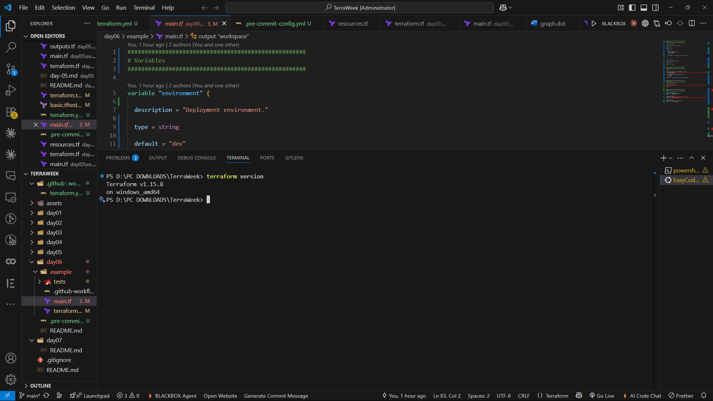


---

# 🎯 Project Philosophy

When I started learning Terraform, my goal was simply to provision cloud infrastructure.

After completing Day 6, that goal has evolved.

Now, I want to build infrastructure that is:

- Easy to test
- Easy to review
- Easy to automate
- Easy to maintain
- Safe to deploy

Today's challenge wasn't about creating more resources.

It was about creating **better engineering practices** around Infrastructure as Code.

That mindset is what separates experimentation from production-ready Terraform.

---

# 🌿 Working with Terraform Workspaces

Now that the project structure is ready and we understand why production workflows matter, it's time to start working with one of the most useful Terraform features introduced in this challenge—**Terraform Workspaces**.

One of the biggest challenges in Infrastructure as Code is managing multiple environments.

Almost every real-world project has environments like:

```
Development

↓

Testing

↓

Staging

↓

Production
```

Each environment should remain isolated while using the same Infrastructure as Code.

Without Workspaces, developers usually duplicate the Terraform project.

```
terraform-dev/

terraform-staging/

terraform-prod/
```

Although this works initially, maintaining multiple copies quickly becomes painful.

Every update has to be repeated across multiple folders.

Terraform Workspaces solve this problem by allowing multiple isolated state files while sharing the same Terraform configuration.

Instead of maintaining multiple projects, Terraform lets us switch environments using a single command.

```bash
terraform workspace new dev

terraform workspace new staging

terraform workspace new prod
```

Each workspace maintains its own state independently.

This keeps environments isolated without introducing unnecessary code duplication.

---

## 📸 Screenshot


---

Once the required workspaces are created, switching between them becomes very straightforward.

For example:

```bash
terraform workspace select prod
```

To verify the currently active workspace:

```bash
terraform workspace show
```

Example output:

```
prod
```

This confirms that Terraform will now use the **Production** state instead of Development or Staging.

The current workspace can even influence resource configuration.

For example, a production workspace may provision a larger EC2 instance while the development workspace uses a smaller and less expensive instance.

This allows infrastructure behavior to change dynamically without maintaining separate Terraform codebases.

---

## 📸 Screenshot


---

# 📝 Formatting Terraform Code

One of the first quality gates executed in professional Terraform projects is formatting.

Terraform provides a built-in formatter that automatically organizes the code according to HashiCorp's recommended style.

Running:

```bash
terraform fmt -recursive
```

ensures that:

- Indentation is consistent.
- Blocks are properly aligned.
- The project follows a standard layout.
- Code reviews become easier.

Rather than manually formatting every file, Terraform performs the formatting automatically.

Clean formatting may seem like a small improvement, but it significantly improves readability when multiple engineers collaborate on the same project.

---

# ✅ Validating Infrastructure

Formatting only checks how the code looks.

Validation checks whether the Terraform configuration is **correct**.

Before deploying infrastructure, Terraform can verify the project using:

```bash
terraform validate
```

Terraform analyzes:

- Variables
- Resources
- Outputs
- Expressions
- References

If everything is configured correctly, Terraform displays:

```text
Success!

The configuration is valid.
```

Validation catches configuration mistakes before infrastructure is deployed.

This saves time and prevents avoidable deployment failures.

One important lesson I learned today is that validation should always be performed before generating an execution plan.

---

## 📸 Screenshot


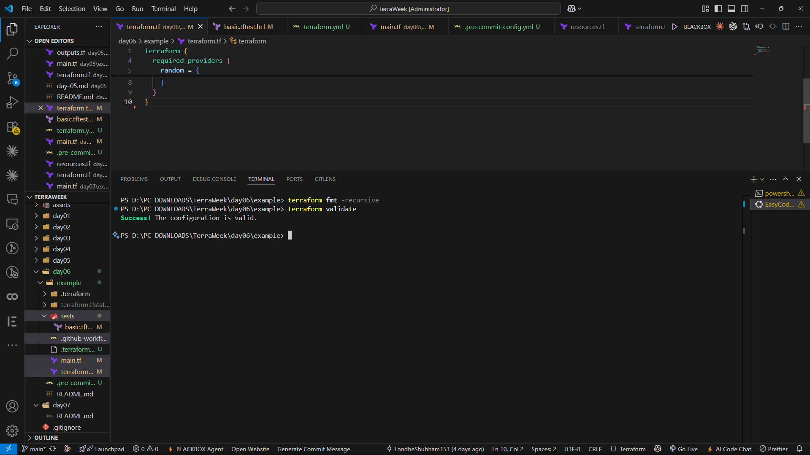


---

# 🧪 Infrastructure Testing with Terraform Native Testing

One of the most exciting features introduced in today's challenge was **Terraform Native Testing**.

Until recently, Infrastructure as Code testing usually required external tools.

Terraform now includes its own testing framework using:

```
tests/basic.tftest.hcl
```

This allows Terraform projects to define automated tests directly alongside the infrastructure code.

Instead of manually checking every deployment, we can verify expected behavior automatically.

Examples include:

- Validating outputs.
- Confirming variables behave correctly.
- Ensuring invalid configurations fail.
- Testing generated resource names.
- Verifying workspace-specific behavior.

The tests become part of the project itself, making infrastructure significantly more reliable.

Executing the tests is simple.

```bash
terraform test
```

Terraform automatically discovers every test file inside the `tests/` directory and executes each test sequentially.

If every assertion succeeds, the project passes.

If even one assertion fails, Terraform immediately reports the failure.

This provides immediate feedback before deployment.

---

## 📸 Screenshot


---

# 🔍 Understanding Assertions

A test is only meaningful if it verifies expected behavior.

Terraform achieves this using **Assertions**.

Each assertion checks whether an expected condition is true.

For example:

- Is the selected instance type correct?
- Is the generated resource name using the expected prefix?
- Does the workspace output exist?
- Does invalid input trigger validation errors?

Instead of relying on manual verification, assertions automatically validate these conditions every time the tests are executed.

This makes Infrastructure as Code much more dependable and easier to maintain.

---

# ⚙️ Automating Quality Checks with GitHub Actions

Running Terraform commands manually works well while learning.

However, production teams rarely depend on developers remembering every command before pushing changes.

Instead, these checks are automated using **Continuous Integration**.

This project includes a GitHub Actions workflow that automatically executes whenever code is pushed to the repository or a Pull Request is opened.

The workflow performs several important checks.

```text
Git Push

     │

     ▼

GitHub Actions

     │

     ├── terraform fmt

     ├── terraform validate

     ├── terraform test

     ├── terraform plan

     └── Trivy Scan
```

By automating these steps, every contribution is verified before it reaches the main branch.

Automation not only improves reliability but also builds confidence that infrastructure changes are safe.

---

## 📸 Screenshot


---

# 🔒 Security Scanning using Trivy

Infrastructure quality is incomplete without security.

Even correctly functioning infrastructure may contain insecure configurations.

This project integrates **Trivy** to scan Terraform configurations for potential security issues.

Running:

```bash
trivy config .
```

allows Trivy to analyze the Terraform project and identify common Infrastructure as Code misconfigurations.

Examples include:

- Weak security defaults.
- Misconfigured resources.
- Compliance violations.
- Potential security risks.

Integrating security directly into the development workflow encourages developers to identify issues early rather than after deployment.

This approach is often referred to as **Shift Left Security**.

---

## 📸 Screenshot


---

# 🚀 Running the Project

After understanding the concepts behind Terraform Workspaces, Native Testing, GitHub Actions, and Infrastructure Quality Gates, it was finally time to execute the project.

Unlike the previous days of the TerraWeek Challenge, today's deployment was not just about creating infrastructure.

Before Terraform even attempted to provision anything, the project had already gone through multiple quality checks.

The overall execution flow looked like this.

```text
Write Terraform Code

        │

        ▼

terraform init

        │

        ▼

terraform workspace

        │

        ▼

terraform fmt

        │

        ▼

terraform validate

        │

        ▼

terraform test

        │

        ▼

terraform plan

        │

        ▼

terraform apply

        │

        ▼

terraform output

        │

        ▼

terraform destroy
```

Instead of blindly deploying infrastructure, every stage verifies something important about the project before moving to the next step.

---

# 🚀 Step 1 — Initialize the Project

The very first step was initializing the Terraform project.

```bash
terraform init
```

Terraform performed several important tasks during initialization.

- Downloaded the required provider plugins.
- Created the `.terraform` directory.
- Initialized the backend.
- Prepared the project for execution.

Once everything completed successfully, Terraform displayed:

```text
Terraform has been successfully initialized!
```

This confirmed that the project was ready for the next phase.

### 📸 Screenshot


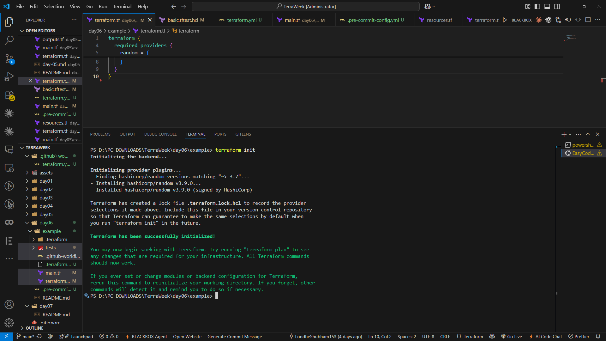


---

# 🌿 Step 2 — Select the Desired Workspace

Before planning or applying infrastructure, I selected the environment in which Terraform should operate.

For example:

```bash
terraform workspace select dev
```

or

```bash
terraform workspace select prod
```

Using different workspaces allows the same Terraform configuration to provision isolated environments without maintaining duplicate code.

To verify the active workspace:

```bash
terraform workspace show
```

Terraform returned:

```text
dev
```

or

```text
prod
```

depending on the selected environment.

This confirms that Terraform will use the corresponding state file for all upcoming operations.

---

# 📝 Step 3 — Format the Project

Before validating the configuration, I formatted the Terraform code.

```bash
terraform fmt -recursive
```

Formatting ensures that:

- Every Terraform file follows HashiCorp's recommended style.
- Indentation is consistent.
- Blocks are aligned properly.
- Code reviews become much easier.

Although formatting does not affect infrastructure itself, maintaining a consistent codebase is considered an essential DevOps practice.

---

# ✅ Step 4 — Validate the Configuration

After formatting the project, I validated the Terraform configuration.

```bash
terraform validate
```

Terraform verified:

- Variables
- Resources
- Outputs
- Expressions
- References

When no issues were found, Terraform displayed:

```text
Success!

The configuration is valid.
```

Validation helps detect configuration mistakes long before infrastructure reaches production.

---

# 🧪 Step 5 — Execute Native Terraform Tests

One of the biggest highlights of today's challenge was Terraform Native Testing.

Instead of manually verifying infrastructure behavior after deployment, I executed automated tests.

```bash
terraform test
```

Terraform automatically discovered every test inside:

```
tests/basic.tftest.hcl
```

Each test verified a specific aspect of the project.

Examples included:

- Environment validation
- Workspace behavior
- Generated resource names
- Output values
- Expected failures

If every assertion passed successfully, Terraform displayed a successful test summary.

Automated testing significantly improves confidence in Infrastructure as Code.

### 📸 Screenshot


---

# 📋 Step 6 — Review the Execution Plan

Before creating any infrastructure, I generated an execution plan.

```bash
terraform plan
```

The execution plan shows exactly what Terraform intends to do.

Typical information includes:

- Resources to be created
- Resources to be updated
- Resources to be destroyed
- Output changes

Reviewing the plan before deployment is considered one of the most important Terraform best practices.

It provides an opportunity to catch unexpected changes before they affect infrastructure.

### 📸 Screenshot


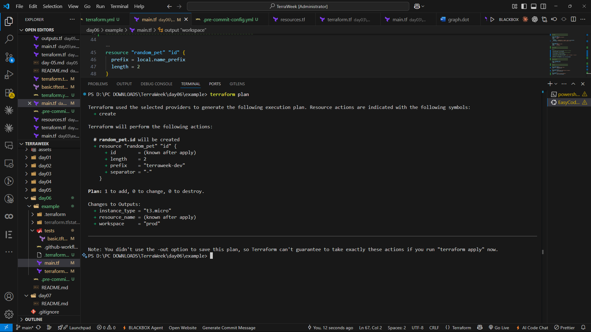


---

# 🚀 Step 7 — Apply the Infrastructure

Once the execution plan looked correct, I proceeded with deployment.

```bash
terraform apply
```

Terraform displayed the familiar confirmation prompt.

```text
Do you want to perform these actions?
```

After confirming with:

```text
yes
```

Terraform provisioned the infrastructure.

Unlike previous days where the emphasis was on resource creation, today's deployment represented the final stage of a much larger quality pipeline.

Every previous validation step contributed to making this deployment safer and more reliable.

After completion, Terraform displayed:

```text
Apply complete!
```

### 📸 Screenshot


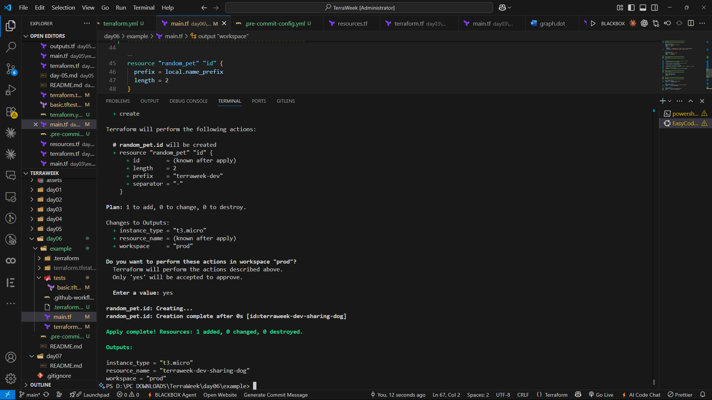


---

# 📤 Step 8 — Inspecting Terraform Outputs

After deployment completed successfully, I viewed the outputs generated by Terraform.

```bash
terraform output
```

Example:

```text
resource_name = "terraweek-dev..."

instance_type = "t3.micro"

workspace = "dev"
```

Outputs provide a simple way to expose useful infrastructure information without manually inspecting resources.

They are commonly consumed by:

- Other Terraform modules.
- Automation pipelines.
- Deployment scripts.
- Infrastructure documentation.

### 📸 Screenshot


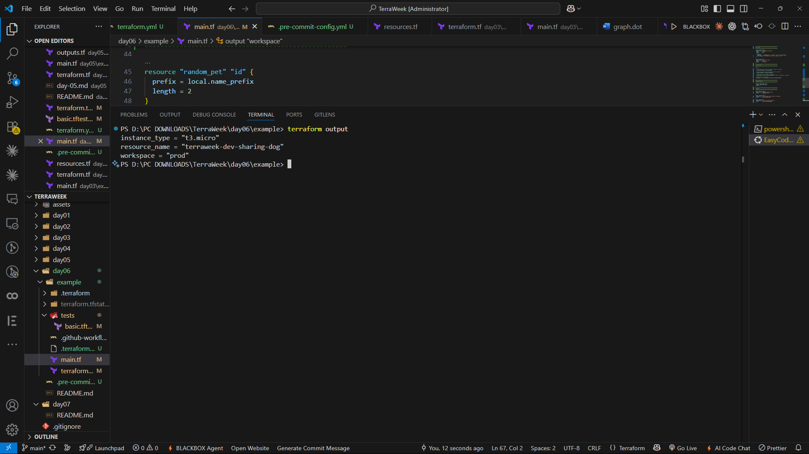


---

# 🔎 Understanding the Deployment Workflow

One important observation from today's challenge is that deployment is **only one step** in the complete Infrastructure as Code lifecycle.

A production-ready workflow looks like this.

```text
Terraform Code

      │

      ▼

Formatting

      │

      ▼

Validation

      │

      ▼

Testing

      │

      ▼

Security Scan

      │

      ▼

Execution Plan

      │

      ▼

Deployment
```

This layered approach greatly reduces the chances of deployment failures.

Instead of reacting to infrastructure problems after deployment, potential issues are identified much earlier.

---

# 🧹 Cleaning Up the Infrastructure

Every cloud resource created during development comes with a cost.

One habit that every DevOps Engineer should develop is cleaning up temporary infrastructure after testing is complete.

Terraform makes this incredibly simple.

Instead of manually deleting resources one by one from the cloud console, Terraform removes everything it created while respecting resource dependencies.

To remove the infrastructure, I executed:

```bash
terraform destroy
```

Terraform displayed a confirmation prompt.

```text
Do you really want to destroy all resources?
```

After typing:

```text
yes
```

Terraform began deleting every managed resource.

Once the cleanup completed successfully, Terraform displayed:

```text
Destroy complete!
```

Cleaning up unused infrastructure not only saves cloud costs but also keeps cloud environments clean and easy to manage.

### 📸 Screenshot


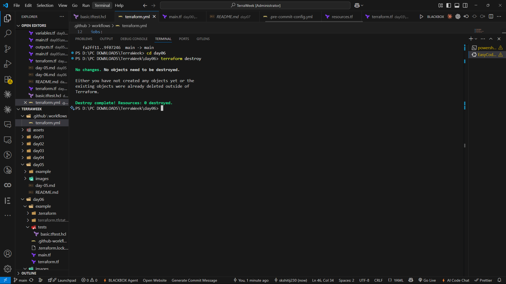


---

# 🍫 Bonus Exploration

Although the core challenge focused on Workspaces, Testing, and CI/CD, I also explored a few advanced concepts that are becoming increasingly common in production Terraform projects.

These topics gave me a broader understanding of how Infrastructure as Code is evolving beyond traditional local Terraform workflows.

---

# ⭐ Bonus 1 — HCP Terraform

One of the most interesting concepts I explored was **HCP Terraform** (formerly Terraform Cloud).

Instead of running Terraform entirely from a local machine, HCP Terraform provides a managed platform where Terraform operations can be executed remotely.

Some of its major advantages include:

- Remote Runs
- Secure State Management
- Team Collaboration
- Role-Based Access Control
- Policy Enforcement
- Cost Estimation
- Drift Detection

In large organizations, Terraform is rarely executed from a developer's laptop.

Instead, deployments are triggered through HCP Terraform or CI/CD pipelines.

This ensures consistency and improves security across teams.

---

# ⭐ Bonus 2 — Pre-Commit Hooks

Another useful concept introduced today was **Pre-Commit Hooks**.

Rather than waiting until GitHub Actions detects formatting or validation issues, Pre-Commit Hooks execute quality checks **before the code is committed**.

Typical Terraform pre-commit hooks include:

- `terraform fmt`
- `terraform validate`
- `terraform tflint`
- Trivy Configuration Scan

Using Pre-Commit Hooks improves developer productivity by catching problems early in the development process.

This reduces unnecessary CI failures and keeps repositories clean.

---

# ⭐ Bonus 3 — Ephemeral Resources

Modern development workflows often require temporary infrastructure.

Examples include:

- Feature branch testing
- Pull Request environments
- Integration testing
- Short-lived demo environments

Instead of keeping infrastructure running permanently, Terraform can provision temporary environments that are automatically destroyed after testing.

These are commonly referred to as **Ephemeral Resources**.

Benefits include:

- Lower cloud costs
- Faster testing
- Cleaner cloud accounts
- Improved automation

This concept is becoming increasingly popular in modern DevOps practices.

---

# ⭐ Bonus 4 — OpenTofu

During today's exploration, I also learned about **OpenTofu**.

OpenTofu is an open-source Infrastructure as Code tool created as a community-driven alternative to Terraform.

From a user's perspective, the syntax is intentionally very similar.

Example:

```bash
tofu init

tofu plan

tofu apply
```

Most Terraform configurations can be executed using OpenTofu with little or no modification.

Although Terraform remains the industry standard, learning about OpenTofu provides valuable insight into the broader Infrastructure as Code ecosystem.

---

# 🏗️ Architecture Notes

To better understand today's workflow, I also documented the overall project architecture in a separate file.

The architecture explains:

- Terraform Execution Flow
- Workspace Strategy
- Native Testing Lifecycle
- GitHub Actions Pipeline
- Security Scanning Workflow
- Deployment Pipeline

Keeping architecture documentation separate from the README makes the project easier to understand for new contributors.

📄 Refer to:

```text
ARCHITECTURE.md
```

---

# 📚 Best Practices Followed

Throughout this project, I tried to follow several Terraform and DevOps best practices.

These include:

- Version Pinning
- Terraform Workspaces
- Native Terraform Testing
- Automated Validation
- GitHub Actions
- Trivy Security Scanning
- Infrastructure Documentation
- Architecture Documentation
- Git Ignore Rules
- Clean Project Structure

Applying these practices helps create Infrastructure as Code that is easier to maintain, review, and scale.

---

# 🎯 What I Learned

Day 6 was very different from every previous day of the TerraWeek Challenge.

Earlier challenges focused on **building infrastructure**.

Today's challenge focused on **building confidence in infrastructure**.

Some of my biggest takeaways include:

- Learned how Terraform Workspaces isolate environments without duplicating code.
- Understood the importance of formatting and validation before deployment.
- Explored Terraform Native Testing for automated infrastructure verification.
- Learned how GitHub Actions automates Infrastructure as Code workflows.
- Integrated security scanning into the deployment lifecycle using Trivy.
- Explored modern Terraform ecosystem tools such as HCP Terraform and OpenTofu.
- Understood why Infrastructure as Code should be treated exactly like application code.

The biggest lesson from today is that **Infrastructure should never be deployed without quality checks.**

Testing, validation, automation, and security are no longer optional—they are essential parts of modern Infrastructure as Code.

---

# 🚀 Looking Back at the TerraWeek Journey

Over the last six days, every challenge introduced a new concept that built upon the previous one.

### 🌱 Day 1

- Terraform Installation
- AWS CLI
- Providers
- Git Ignore

### 📦 Day 2

- HCL
- Variables
- Expressions
- Locals
- Outputs

### ☁️ Day 3

- AWS Provider
- EC2 Resources
- Data Sources
- Dependencies

### 🗂️ Day 4

- Terraform State
- Remote Backend
- State Locking

### 🧩 Day 5

- Terraform Modules
- Root Modules
- Child Modules
- Registry Modules
- Module Composition

### 🚀 Day 6

- Workspaces
- Native Testing
- CI/CD
- GitHub Actions
- Trivy
- Production Best Practices

Looking back, it's amazing to see how every day's learning connected to the next, gradually building a much stronger understanding of Infrastructure as Code.

---

# 🎉 Conclusion

Day 6 wasn't about provisioning another cloud resource.

Instead, it was about learning how professional teams ensure that Infrastructure as Code is **safe, reliable, secure, and maintainable**.

Workspaces introduced better environment management.

Native Testing brought confidence into Infrastructure as Code.

GitHub Actions automated repetitive quality checks.

Trivy demonstrated the importance of integrating security directly into the development lifecycle.

Together, these concepts transformed Terraform from a provisioning tool into a complete Infrastructure Engineering workflow.

Although this marks the end of the Day 6 challenge, it also sets the stage for something much bigger.

The next step is bringing together everything learned throughout TerraWeek into a complete **Capstone Project**—a production-style Terraform project that combines modules, remote state, testing, CI/CD, security, and best practices into a single real-world solution.

The journey doesn't end here.

In many ways, it is only just beginning.

---

# 🏷️ Tags

`#Terraform` `#InfrastructureAsCode` `#TerraformTesting` `#TerraformWorkspaces` `#GitHubActions` `#Trivy` `#DevOps` `#AWS` `#CloudEngineering` `#PlatformEngineering` `#Automation` `#LearnInPublic` `#TrainWithShubham` `#TerraWeekChallenge`