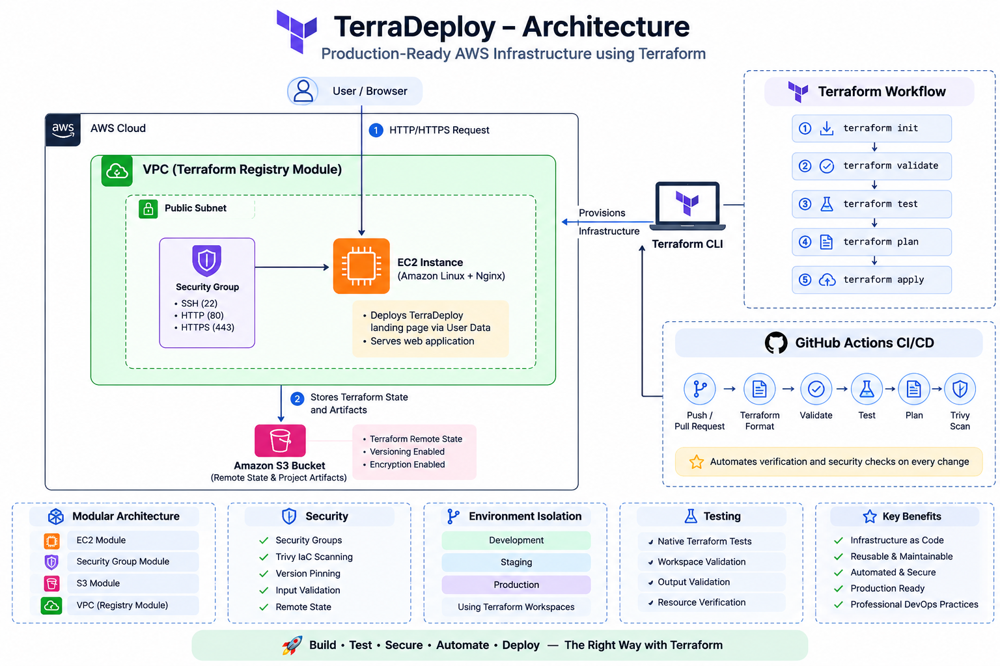

# 🏗️ ARCHITECTURE.md

# TerraDeploy – Production Ready AWS Infrastructure using Terraform

> **Infrastructure Architecture Document for the TerraWeek Capstone Project**

---

# 📖 Table of Contents

- Introduction
- Architecture Goals
- High-Level Architecture
- Infrastructure Components
- Terraform Architecture
- Module Architecture
- Request Flow
- Deployment Workflow
- CI/CD Workflow
- Security Architecture
- Testing Strategy
- Remote Backend
- Workspaces
- Design Decisions
- Future Improvements
- Conclusion

---

# 🌍 Introduction

TerraDeploy is a production-inspired Infrastructure as Code project developed using **Terraform** and **Amazon Web Services (AWS)**.

The project demonstrates how a real-world Terraform repository should be organized using reusable modules, remote state management, Infrastructure testing, Continuous Integration, and security scanning.

Instead of provisioning resources individually, the project emphasizes **modularity, automation, consistency, and maintainability**.

The architecture intentionally separates networking, compute, security, and state management into reusable building blocks.

---

# 🎯 Architecture Goals

The architecture was designed around the following principles.

- Infrastructure as Code
- Modular Design
- Reusability
- Security
- Automation
- Scalability
- Maintainability
- Repeatability

The primary objective is not simply deploying AWS resources, but creating infrastructure that is easy to manage and extend.

---

# 🏗 High-Level Architecture



This architecture separates infrastructure into logical layers while ensuring that deployments remain automated and repeatable.

---

# ☁ Infrastructure Components

## Amazon VPC

The networking layer is created using the official Terraform Registry module.

Responsibilities include:

- VPC Creation
- Public Subnets
- Internet Gateway
- Route Table
- DNS Support

Using the official module avoids reinventing common networking patterns and follows community best practices.

---

## Security Group

A reusable Security Group module controls inbound and outbound network traffic.

Allowed ports:

- SSH (22)
- HTTP (80)
- HTTPS (443)

All rules are managed through Terraform.

---

## Amazon EC2

The EC2 module provisions an Amazon Linux instance.

During provisioning, **User Data** automatically:

- Updates the operating system
- Installs Nginx
- Starts the service
- Deploys the TerraDeploy landing page

This demonstrates automated server provisioning using Terraform.

---

## Amazon S3

Amazon S3 is used for:

- Remote Terraform State
- Project Artifacts
- Future Infrastructure Assets

Using S3 enables collaboration between multiple engineers while ensuring Terraform state remains centralized.

---

# 📦 Terraform Architecture

The Terraform configuration follows a layered structure.

```text
Terraform Root Module

        │

        ├───────────────┐

        ▼               ▼

 Registry Module   Custom Modules

        │               │

        ▼               ▼

      AWS VPC      EC2

                    │

                    ▼

             Security Group

                    │

                    ▼

                 Amazon S3
```

This separation improves readability and allows modules to be reused across multiple projects.

---

# 📂 Module Architecture

## Root Module

Responsible for:

- Provider Configuration
- Backend Configuration
- Calling Child Modules
- Variables
- Outputs
- Local Values

---

## Child Modules

### EC2 Module

Responsibilities:

- Launch EC2
- Configure User Data
- Apply Tags

---

### Security Group Module

Responsibilities:

- SSH Rules
- HTTP Rules
- HTTPS Rules

---

### S3 Module

Responsibilities:

- Bucket Creation
- Versioning
- Encryption
- Artifact Storage

---

### Registry Module

The VPC is created using:

```text
terraform-aws-modules/vpc/aws
```

Using Registry Modules reduces maintenance effort while following HashiCorp recommended practices.

---

# 🔄 Request Flow

The following diagram illustrates how requests reach the application.

```text
User Browser

      │

      ▼

Internet

      │

      ▼

EC2 Public IP

      │

      ▼

Security Group

      │

      ▼

Nginx

      │

      ▼

TerraDeploy Landing Page
```

---

# 🚀 Deployment Workflow

Terraform follows a predictable deployment lifecycle.

```text
Terraform Code

        │

        ▼

terraform init

        │

        ▼

terraform fmt

        │

        ▼

terraform validate

        │

        ▼

terraform test

        │

        ▼

terraform plan

        │

        ▼

terraform apply

        │

        ▼

AWS Infrastructure
```

Every stage verifies a different aspect of the project before deployment.

---

# ⚙️ Continuous Integration Workflow

GitHub Actions automatically verifies every infrastructure change.

```text
Git Push

      │

      ▼

GitHub Actions

      │

      ├── Terraform Format

      ├── Terraform Validate

      ├── Terraform Test

      ├── Terraform Plan

      └── Trivy Scan
```

Automating these steps ensures that infrastructure quality does not depend on manual verification.

---

# 🔒 Security Architecture

Security was considered throughout the project.

Implemented practices include:

- Security Groups
- Terraform Validation
- Trivy Configuration Scanning
- Version Pinning
- Remote State
- Input Validation

Rather than detecting issues after deployment, security checks are integrated into the Infrastructure as Code workflow.

---

# 🧪 Testing Strategy

Infrastructure is validated using Terraform Native Testing.

Test coverage includes:

- Workspace Validation
- Output Validation
- Variable Validation
- Resource Creation
- Invalid Configuration Detection

Testing infrastructure before deployment reduces operational risks.

---

# 🌱 Terraform Workspaces

Terraform Workspaces isolate environments while sharing the same Terraform configuration.

Supported environments:

```text
Development

↓

Staging

↓

Production
```

Benefits include:

- Separate State Files
- Cleaner Deployments
- Reduced Code Duplication
- Easier Environment Management

---

# ☁ Remote Backend

Terraform state is stored remotely using Amazon S3.

Advantages:

- Team Collaboration
- Shared State
- Improved Reliability
- Centralized Infrastructure Management

Remote state also prepares the project for future CI/CD integration.

---

# 🎯 Engineering Decisions

Several design decisions were made intentionally during development.

## Why Terraform Registry Module?

Rather than creating a VPC manually, the official Registry module was used because it is:

- Well Tested
- Community Maintained
- Production Ready

---

## Why Custom Modules?

Custom modules make infrastructure:

- Reusable
- Easier to Maintain
- Easier to Scale

They also reduce duplication across projects.

---

## Why GitHub Actions?

Automating Infrastructure as Code improves consistency while reducing human error.

Every infrastructure change is verified before deployment.

---

## Why Terraform Native Testing?

Infrastructure should be tested just like application code.

Automated testing increases deployment confidence.

---

## Why Trivy?

Infrastructure misconfigurations are easier to fix before deployment than after production release.

Security scanning is integrated into the development lifecycle.

---

# 🚀 Future Improvements

Potential enhancements include:

- Application Load Balancer
- Auto Scaling Group
- Route 53
- ACM SSL Certificates
- CloudWatch Monitoring
- ECS Deployment
- AWS WAF
- HCP Terraform Remote Runs
- Cost Estimation
- Policy as Code

These improvements would move the project even closer to enterprise-scale deployments.

---

# 📚 Key Takeaways

This project demonstrates much more than AWS resource provisioning.

It showcases:

- Infrastructure as Code
- Modular Design
- Remote State
- Environment Isolation
- Automated Testing
- CI/CD
- Security
- Documentation
- Production Best Practices

Together, these practices form the foundation of modern DevOps and Cloud Engineering workflows.

---

# 🎉 Conclusion

TerraDeploy represents the culmination of everything learned throughout the TerraWeek Challenge.

By combining reusable Terraform modules, Infrastructure as Code principles, remote state management, automated testing, CI/CD pipelines, and security best practices, the project demonstrates how cloud infrastructure can be managed professionally and reproducibly.

While the current implementation focuses on a production-inspired AWS environment, the overall architecture is intentionally modular, making it easy to extend with additional AWS services as future requirements evolve.

This architecture serves not only as the technical foundation of the project but also as a reference for building scalable, maintainable, and collaborative Infrastructure as Code solutions.