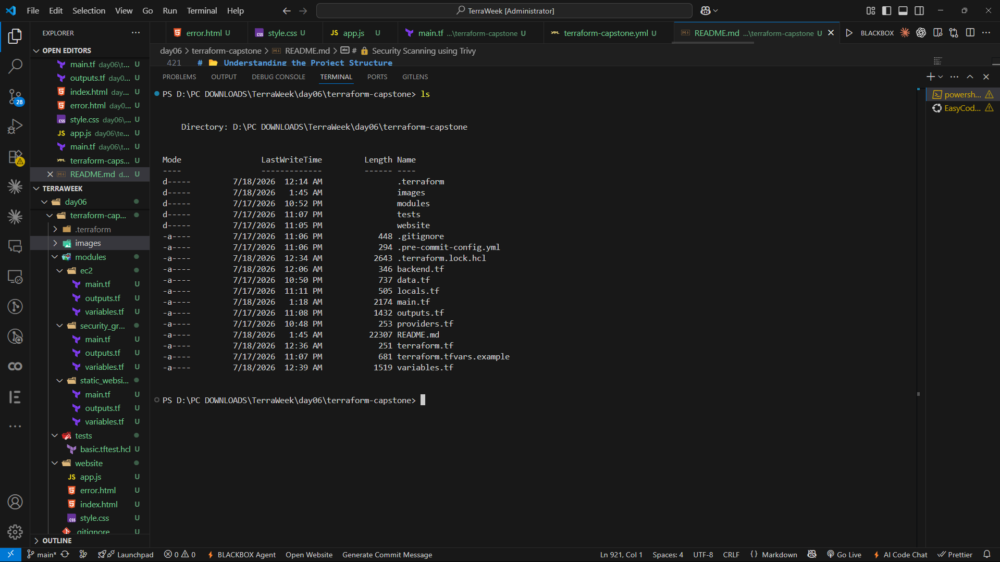
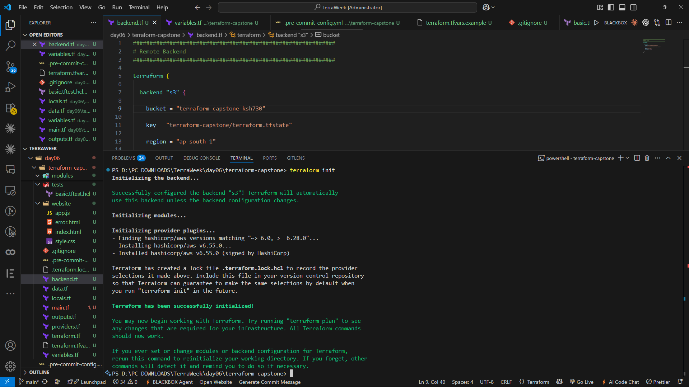
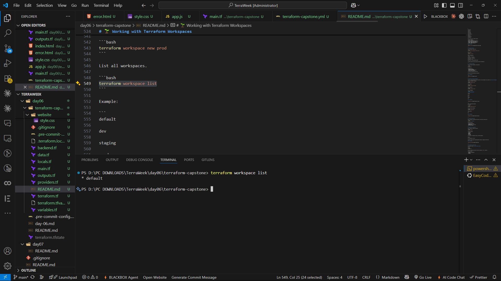
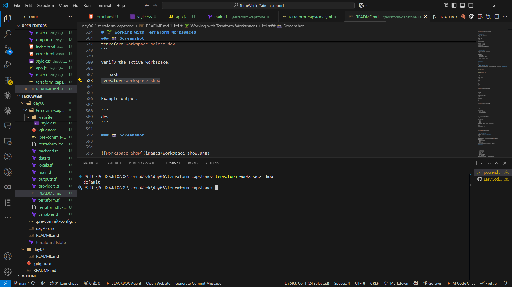
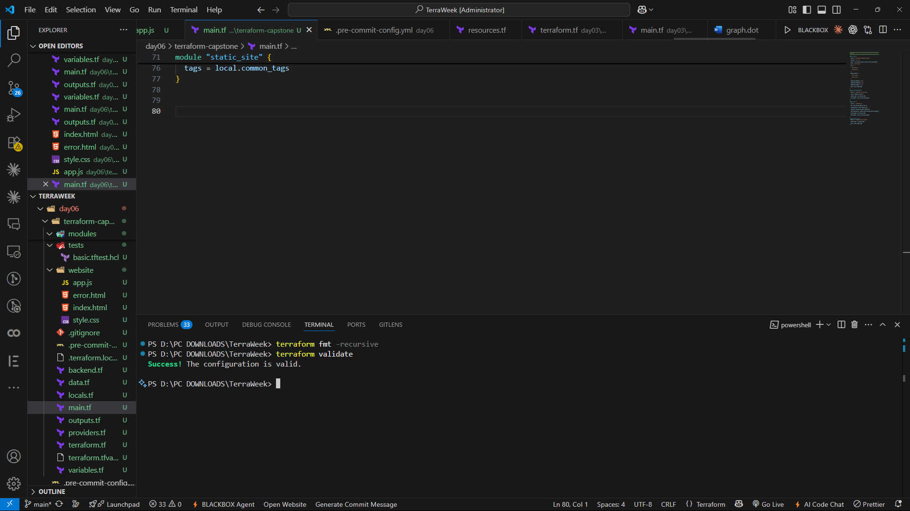
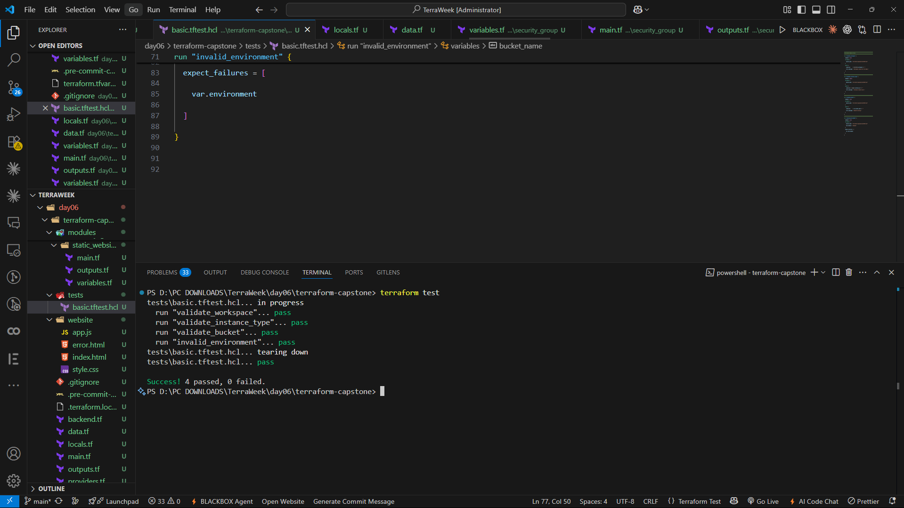
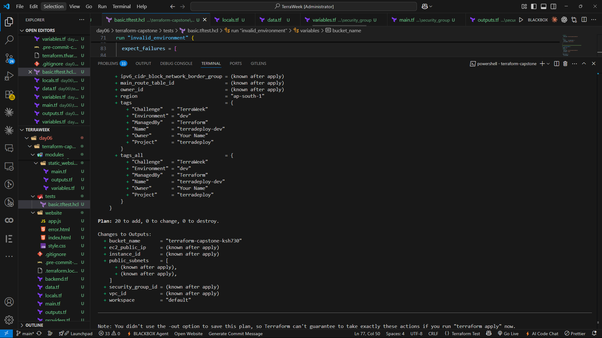
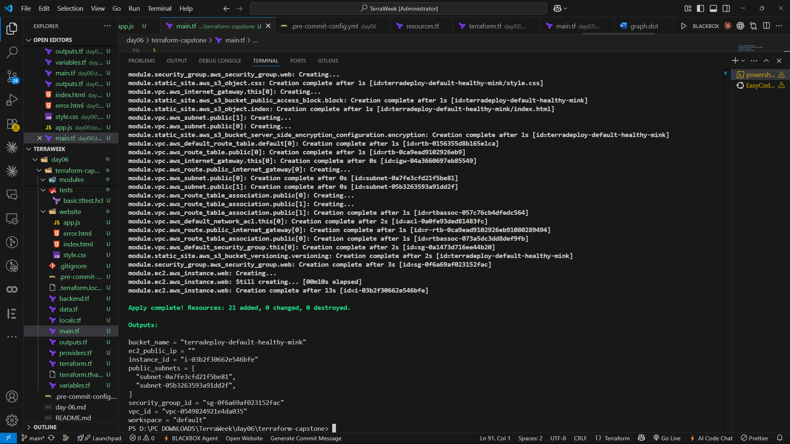
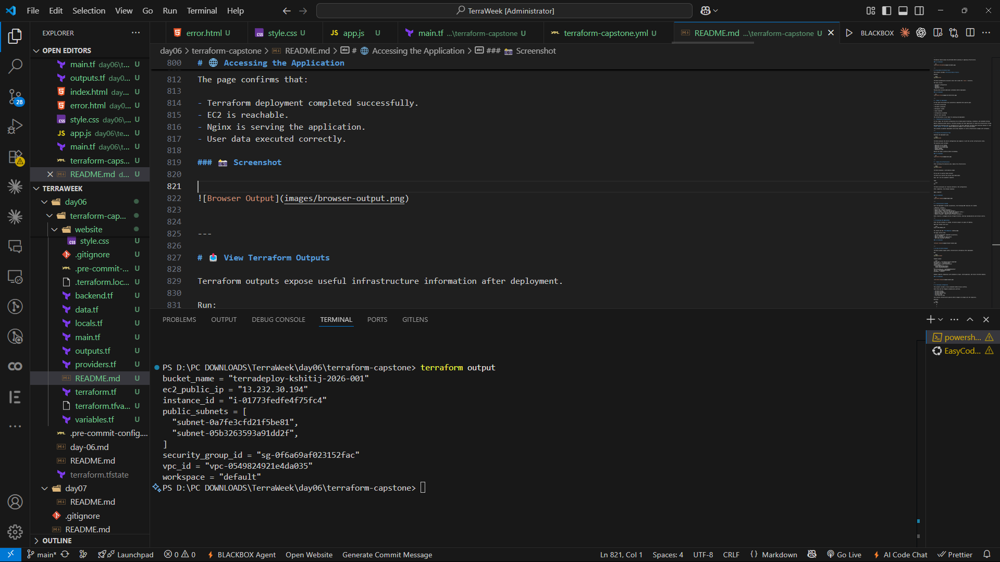

# 🚀 TerraDeploy – Production-Ready AWS Infrastructure using Terraform


> **A production-inspired Infrastructure as Code project demonstrating modular AWS infrastructure, reusable Terraform modules, remote state management, automated testing, CI/CD pipelines, and security best practices.**

---

# 📑 Table of Contents

- Introduction
- Why This Project?
- Project Overview
- Features
- Architecture
- AWS Services Used
- Project Structure
- Prerequisites
- What's Next?

---

# 🌍 Introduction

Welcome to my **TerraWeek Capstone Project**.

Over the past six days of the **TrainWithShubham TerraWeek Challenge**, I explored Terraform from the ground up. Every challenge introduced a new concept—from understanding HCL and variables to managing Terraform state, creating reusable modules, and building automated Infrastructure as Code workflows.

This capstone project combines everything I learned into a **single production-inspired Terraform project**.

Rather than deploying a single EC2 instance or creating a simple S3 bucket, the goal was to build infrastructure the way professional DevOps teams do:

- Modular
- Reusable
- Version Controlled
- Automated
- Secure
- Easy to Maintain

This project demonstrates how Terraform can provision AWS infrastructure while following modern DevOps and Infrastructure as Code best practices.

---

# 🤔 Why I Built This Project

When learning Terraform, it's common to create small standalone examples.

For example:

- Create an EC2 instance
- Create an S3 bucket
- Create a Security Group

While these examples are useful for understanding Terraform syntax, they don't represent how Infrastructure as Code is managed in production.

Real-world Terraform projects involve much more than provisioning cloud resources.

Professional infrastructure should:

- Support multiple environments.
- Use reusable modules.
- Store state remotely.
- Follow consistent coding standards.
- Be automatically tested.
- Integrate with CI/CD.
- Include security scanning.
- Be properly documented.

This capstone project was built to demonstrate those practices.

Instead of focusing on a single AWS service, it focuses on building a **complete Infrastructure as Code workflow**.

---

# 🚀 Project Overview

**TerraDeploy** is a production-inspired Infrastructure as Code project built using **Terraform** and **AWS**.

The project provisions a secure cloud environment using reusable Terraform modules while following modern DevOps principles.

The infrastructure includes:

- A custom Virtual Private Cloud (VPC) using the official Terraform Registry module.
- A reusable EC2 module for deploying compute resources.
- A reusable Security Group module.
- An Amazon S3 bucket for artifacts and remote state management.
- Environment isolation using Terraform Workspaces.
- Automated validation and testing using Terraform Native Testing.
- Continuous Integration using GitHub Actions.
- Security scanning using Trivy.

Every component has been organized into reusable modules to encourage maintainability and scalability.

---

# 🎯 Project Features

This project demonstrates several production-ready Terraform concepts.

## ☁ Infrastructure as Code

Infrastructure is fully defined using Terraform configuration files.

Everything can be recreated from code.

---

## 📦 Modular Design

The project uses reusable Terraform modules for:

- EC2
- Security Groups
- S3
- VPC (Terraform Registry Module)

This reduces code duplication and improves maintainability.

---

## 🌱 Environment Isolation

Terraform Workspaces allow the same infrastructure to be deployed into multiple environments.

Examples:

- Development
- Staging
- Production

without maintaining separate Terraform projects.

---

## 🔐 Remote State Management

Terraform state is stored remotely using an Amazon S3 backend.

Benefits include:

- Collaboration
- Centralized State
- Consistency
- State Locking

---

## 🧪 Native Terraform Testing

Infrastructure can be validated automatically before deployment.

Tests verify:

- Variables
- Outputs
- Workspace Configuration
- Resource Creation

---

## ⚙️ Continuous Integration

Every push to GitHub automatically runs:

- Terraform Format
- Terraform Validate
- Terraform Test
- Terraform Plan
- Trivy Security Scan

This ensures every infrastructure change is verified before deployment.

---

## 🔒 Security

Infrastructure is scanned using **Trivy** to detect Infrastructure as Code security issues before deployment.

Security is integrated directly into the development workflow instead of being performed afterward.

---

# 🏗️ Project Architecture

The following diagram shows the overall infrastructure deployed by TerraDeploy.

```text
                    Internet
                        │
                        ▼
                EC2 Web Server
                        │
                        ▼
                Security Group
                        │
                        ▼
     VPC (Terraform Registry Module)
                        │
                        ▼
      Amazon S3 (Remote State & Artifacts)

──────────────────────────────────────────────

Terraform CLI

        │

        ▼

GitHub Actions

├── terraform fmt

├── terraform validate

├── terraform test

├── terraform plan

└── Trivy Security Scan
```

The infrastructure is modular, reusable, and designed around production-oriented Terraform workflows rather than isolated AWS resources.

---

# ☁️ AWS Services Used

| Service | Purpose |
|----------|---------|
| Amazon EC2 | Compute Instance |
| Amazon VPC | Networking |
| Security Groups | Network Security |
| Amazon S3 | Remote Backend & Artifacts |
| IAM | Authentication & Authorization |

---

# 📂 Project Structure

```text
terraform-capstone/
│
├── .github/
│   └── workflows/
│       └── terraform.yml
│
├── modules/
│   ├── ec2/
│   ├── security_group/
│   └── static_website/
│
├── tests/
│   └── basic.tftest.hcl
│
├── website/
│   ├── index.html
│   ├── style.css
│   └── app.js
│
├── terraform.tf
├── providers.tf
├── backend.tf
├── variables.tf
├── locals.tf
├── data.tf
├── main.tf
├── outputs.tf
│
├── README.md
├── BLOG.md
├── ARCHITECTURE.md
├── .gitignore
└── .pre-commit-config.yaml
```

Each file has a dedicated responsibility, making the project easier to understand and maintain.

### 📸 Screenshot





---

# ⚙️ Prerequisites

Before running this project, make sure the following tools are installed.

- Terraform v1.10+
- AWS CLI
- Git
- Visual Studio Code
- AWS Account
- GitHub Account

Verify the Terraform installation.

```bash
terraform version
```

### 📸 Screenshot


---

# 🎯 What You'll Learn

By exploring this project, you'll understand how to:

- Build modular Terraform projects.
- Organize Infrastructure as Code professionally.
- Use Terraform Registry Modules.
- Create reusable custom modules.
- Configure remote state.
- Work with Terraform Workspaces.
- Write native Terraform tests.
- Integrate Terraform into GitHub Actions.
- Scan Infrastructure as Code using Trivy.
- Follow production-ready DevOps practices.

This project is designed not only to demonstrate Terraform syntax but also to showcase how modern Infrastructure as Code projects are structured in real-world environments.

---

# 🚀 Getting Started

Now that we understand the project architecture and the AWS services involved, it's time to deploy the infrastructure.

One of the primary goals while designing this capstone was to ensure that **anyone can clone the repository and provision the infrastructure within a few minutes**.

This section explains every step required to deploy the project from scratch.

---

# 📋 Prerequisites

Before deploying the infrastructure, ensure the following requirements are met.

| Requirement | Version |
|-------------|----------|
| Terraform | v1.10+ |
| AWS CLI | Latest |
| Git | Latest |
| Visual Studio Code | Recommended |
| AWS Account | Required |
| GitHub Account | Required |

Verify Terraform installation.

```bash
terraform version
```

### 📸 Screenshot


---

# ☁ Configure AWS Credentials

Terraform communicates with AWS using the AWS CLI credentials.

Configure your AWS account by running:

```bash
aws configure
```

Provide:

```
AWS Access Key ID

AWS Secret Access Key

AWS Region

Output Format
```

Verify the identity.

```bash
aws sts get-caller-identity
```

If the command returns your AWS Account ID, Terraform is ready to provision infrastructure.

---

# 📥 Clone the Repository

Clone the project.

```bash
git clone https://github.com/<your-username>/terraform-capstone.git
```

Move into the project directory.

```bash
cd terraform-capstone
```

---

# 📂 Understanding the Project Structure

Before running Terraform, it's useful to understand how the repository is organized.

```
terraform-capstone/

│

├── modules/

├── tests/

├── website/

├── .github/

├── terraform.tf

├── main.tf

├── outputs.tf

└── README.md
```

Every directory has a specific purpose.

| Folder | Purpose |
|----------|---------|
| modules | Reusable Terraform modules |
| tests | Native Terraform tests |
| website | Static files served by EC2 |
| .github | GitHub Actions workflow |
| images | README screenshots |

### 📸 Screenshot


---

# ⚙ Configure Variables

Copy the example variables file.

```bash
cp terraform.tfvars.example terraform.tfvars
```

Open the file.

```bash
nano terraform.tfvars
```

Example configuration:

```hcl
aws_region = "ap-south-1"

project_name = "terradeploy"

environment = "dev"

bucket_name = "your-unique-bucket-name"
```

This keeps sensitive values outside the Terraform configuration.

---

# 🚀 Initialize Terraform

The first Terraform command is initialization.

```bash
terraform init
```

Terraform will:

- Download providers
- Initialize the backend
- Configure the working directory
- Download required modules

A successful initialization ends with:

```
Terraform has been successfully initialized!
```

### 📸 Screenshot





---

# 🌱 Working with Terraform Workspaces

Instead of creating separate Terraform projects for each environment, this project uses **Terraform Workspaces**.

Create the development workspace.

```bash
terraform workspace new dev
```

Create staging.

```bash
terraform workspace new staging
```

Create production.

```bash
terraform workspace new prod
```

List all workspaces.

```bash
terraform workspace list
```

Example:

```
default

dev

staging

prod
```

### 📸 Screenshot





---

Select the desired environment.

For example:

```bash
terraform workspace select dev
```

Verify the active workspace.

```bash
terraform workspace show
```

Example output.

```
dev
```

### 📸 Screenshot





---

# 📝 Format Terraform Code

Before validating or deploying infrastructure, format every Terraform file.

```bash
terraform fmt -recursive
```

Formatting ensures:

- Consistent indentation
- Readable code
- Standardized Terraform style
- Easier code reviews

---

# ✅ Validate the Configuration

After formatting, validate the project.

```bash
terraform validate
```

Terraform verifies:

- Variables
- Modules
- Outputs
- Resources
- References

If everything is configured correctly, Terraform displays:

```
Success!

The configuration is valid.
```

Validation should always be performed before planning or applying infrastructure.

### 📸 Screenshot





---

# 🧪 Run Native Terraform Tests

This project includes **Terraform Native Tests**.

Execute:

```bash
terraform test
```

Terraform automatically discovers every test inside the `tests/` directory.

The tests verify:

- Workspace configuration
- Outputs
- Variables
- Resource creation

Passing tests provide additional confidence before deployment.

### 📸 Screenshot




---

# 🚀 Ready for Deployment

At this point the project has successfully completed every quality gate.

✔ Terraform initialized

✔ Variables configured

✔ Workspaces created

✔ Code formatted

✔ Configuration validated

✔ Native tests executed

The infrastructure is now ready for planning and deployment.

# 🚀 Planning the Infrastructure

At this stage, the Terraform configuration has already passed formatting, validation, and automated testing.

Before creating any AWS resource, Terraform provides one final opportunity to review the infrastructure through an execution plan.

Reviewing the execution plan is considered one of the most important Terraform best practices because it clearly shows **what Terraform intends to create, modify, or destroy** before making any changes to the cloud environment.

This prevents accidental deployments and allows engineers to verify infrastructure changes with confidence.

---

# 📋 Generate the Execution Plan

Generate the deployment plan.

```bash
terraform plan
```

Terraform analyzes the entire configuration and compares it with the current infrastructure state.

The execution plan includes:

- Resources to be created
- Resources to be modified
- Resources to be destroyed
- Output changes
- Dependency graph

Review the output carefully before proceeding.

### 📸 Screenshot





---

# 🚀 Deploy the Infrastructure

After verifying the execution plan, deploy the infrastructure.

```bash
terraform apply
```

Terraform displays a confirmation prompt.

```
Do you want to perform these actions?

Terraform will perform the actions described above.

Only 'yes' will be accepted to approve.
```

Type:

```text
yes
```

Terraform provisions all resources defined in the configuration.

After completion, the terminal displays:

```
Apply complete!
```

### 📸 Screenshot





---

# ☁️ Infrastructure Created

Once the deployment finishes successfully, the following AWS resources are created.

| Resource | Purpose |
|-----------|---------|
| Amazon VPC | Network Isolation |
| Public Subnet | Hosts the EC2 Instance |
| Security Group | Controls inbound and outbound traffic |
| Amazon EC2 | Hosts the demo web application |
| Amazon S3 Bucket | Remote State & Project Artifacts |

Every resource is managed entirely through Terraform, ensuring reproducibility and version control.

---

# 🌐 Accessing the Application

After the EC2 instance is created, Terraform outputs its public IP address.

Open your browser and visit:

```text
http://13.232.30.194
```

You should see the **TerraDeploy** landing page.

The page confirms that:

- Terraform deployment completed successfully.
- EC2 is reachable.
- Nginx is serving the application.
- User data executed correctly.

### 📸 Screenshot


---

# 📤 View Terraform Outputs

Terraform outputs expose useful infrastructure information after deployment.

Run:

```bash
terraform output
```

Example output:

```text
bucket_name = "terradeploy-kshitij-2026-001"
ec2_public_ip = "13.232.30.194"
instance_id = "i-01773fedfe4f75fc4"
public_subnets = [
  "subnet-0a7fe3cfd21f5be81",
  "subnet-05b3263593a91dd2f",
]
security_group_id = "sg-0f6a69af023152fac"
vpc_id = "vpc-0549824921e4da035"
workspace = "default"
```

Outputs simplify integration with automation scripts, CI/CD pipelines, and future Terraform modules.

### 📸 Screenshot





---

# 🧪 Continuous Integration

This project includes a fully automated GitHub Actions workflow.

Every Push and Pull Request automatically performs:

- Terraform Format
- Terraform Validate
- Terraform Native Test
- Terraform Plan
- Trivy Security Scan

This ensures infrastructure quality before changes are merged into the repository.

Workflow:

```text
Git Push

     │

     ▼

GitHub Actions

     │

     ├── terraform fmt

     ├── terraform validate

     ├── terraform test

     ├── terraform plan

     └── trivy config
```

Automation reduces manual effort while improving deployment confidence.

### 📸 Screenshot


---

# 🔒 Security Scanning using Trivy

Infrastructure security should be integrated into every deployment pipeline.

Run Trivy locally.

```bash
trivy config .
```

Trivy scans the Terraform project for:

- Insecure configurations
- Misconfigurations
- Compliance issues
- Security best practice violations

Integrating Trivy into GitHub Actions ensures every infrastructure change is scanned automatically.

---

# 🏗 Engineering Best Practices Followed

This project follows several production-oriented Infrastructure as Code practices.

- Modular Terraform Architecture
- Official Terraform Registry Module
- Custom Reusable Modules
- Version Pinning
- Remote State Backend
- Terraform Workspaces
- Native Terraform Testing
- GitHub Actions CI
- Trivy Security Scanning
- Input Validation
- Consistent Resource Tagging
- Infrastructure Documentation

These practices improve maintainability, collaboration, and deployment reliability.

---

# 🧹 Cleaning Up Infrastructure

Cloud resources incur costs while they are running.

Once testing is complete, remove all provisioned resources.

```bash
terraform destroy
```

Terraform displays a confirmation prompt.

```
Do you really want to destroy all resources?
```

Type:

```text
yes
```

Terraform removes every managed resource in the correct dependency order.

After successful cleanup, Terraform displays:

```
Destroy complete!
```

### 📸 Screenshot


---

# 🍫 Bonus Features Implemented

In addition to the mandatory assignment requirements, this project also incorporates several bonus concepts.

### ✅ HCP Terraform

- Remote execution
- Team collaboration
- Centralized state management

### ✅ OpenTofu

- Community-driven Terraform alternative
- Compatible Infrastructure as Code workflow

### ✅ Pre-Commit Hooks

- Automatic formatting
- Validation before commits
- Cleaner Git history

### ✅ Native Terraform Testing

- Automated assertions
- Infrastructure verification

These additions demonstrate how Infrastructure as Code projects evolve from local development into production-ready engineering workflows.

---

# 📚 Key Learnings

Building this capstone project reinforced several important DevOps concepts.

- Infrastructure should be modular.
- Reusable code improves maintainability.
- Remote state enables collaboration.
- Validation should always precede deployment.
- Automated testing increases confidence.
- CI/CD reduces human error.
- Security should be integrated from the beginning.
- Documentation is as important as the infrastructure itself.

This project represents not just a Terraform deployment, but a complete Infrastructure as Code workflow following modern DevOps practices.

---

# 🚀 Future Improvements

Some enhancements that can be added in future iterations include:

- Application Load Balancer (ALB)
- Auto Scaling Group
- Route 53 Custom Domain
- ACM SSL Certificates
- CloudWatch Monitoring
- ECS / Fargate Deployment
- Terraform Cloud Integration
- Cost Estimation
- Policy as Code using Sentinel

These improvements would make the project even closer to a production-scale cloud environment.

---

# 🎉 Conclusion

This capstone project brings together everything learned throughout the TerraWeek Challenge into a single, production-inspired Infrastructure as Code solution.

From modular Terraform design and reusable AWS infrastructure to automated testing, CI/CD, remote state management, and security scanning, every component was implemented with maintainability and reliability in mind.

More importantly, this project shifted my perspective from simply **writing Terraform code** to **engineering Infrastructure as Code** using industry best practices.

The journey may have started with creating cloud resources, but it concludes with understanding how professional teams build, test, secure, automate, and maintain infrastructure at scale.

Thank you for exploring **TerraDeploy**! 🚀